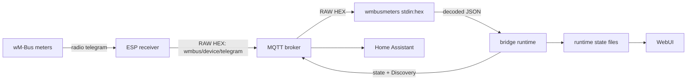

# Architecture

Technical description of **wMBus MQTT Bridge** for maintainers, contributors,
and upstream `wmbusmeters` developers who want to understand what this project
adds around `wmbusmeters`.

This is not an installation guide. User documentation lives in
[`README.en.md`](README.en.md) and the other language guides. Build, test, and
release mechanics live in [`DEVELOPMENT.md`](DEVELOPMENT.md).

## 1. System at a glance

The project moves wM-Bus decoding away from the radio receiver and onto the
Home Assistant host. An ESP receiver captures radio frames and publishes their
RAW hexadecimal representation to MQTT. The bridge passes those frames to an
unmodified, pinned `wmbusmeters` binary through `stdin:hex`, then turns the JSON
output into MQTT state, Home Assistant Discovery, and diagnostic state for the
WebUI.



### Responsibility boundary

| Component | Owns | Does not own |
|---|---|---|
| ESP receiver | RF reception, RAW HEX publication, optional reception diagnostics | meter drivers, AES keys, decoded values |
| MQTT broker | transport between receivers, bridge, and Home Assistant | interpretation of telegrams |
| `wmbusmeters` | frame parsing, decryption, driver selection, built-in and XMQ drivers, decoded field names and values | MQTT orchestration, Home Assistant entities, WebUI state |
| Bridge runtime | broker selection, `wmbusmeters` processes and config files, candidate workflow, state publication, Discovery, lifecycle | vendor-specific decode logic already owned by `wmbusmeters` |
| WebUI | configuration, comparison tools, and visibility into bridge state | automatic decisions about which driver or value is correct |
| Home Assistant | storing add-on options and creating entities from MQTT Discovery | wM-Bus decoding |

The most important rule is that **`wmbusmeters` remains the decoder**. This
project does not replace its built-in drivers, reinterpret manufacturer data,
or maintain a parallel decoder. A field shown by the bridge came from
`wmbusmeters`; if upstream emits no field, the bridge does not invent one.

## 2. What this project adds around wmbusmeters

The upstream program can already receive and decode wM-Bus telegrams. This
project supplies the surrounding application needed for a receiver fleet and
Home Assistant:

- MQTT RAW HEX input instead of a radio dongle attached to the decoder host;
- generation of `wmbusmeters.conf` and per-meter files from add-on options;
- server-side AES-key storage and delivery to `wmbusmeters`;
- continuous decoding for configured meters and continuous discovery of
  unconfigured meters;
- MQTT state and Home Assistant Discovery publication;
- a WebUI for LISTEN, ADD, client-side value filtering, driver comparison,
  diagnostics, and settings; the legacy SEARCH backend remains available but
  hidden from normal navigation;
- persistent operational state, reception statistics, error classification,
  soft reload, and restart handling;
- optional diagnostics from one or more ESP receivers.

This split keeps the ESP firmware independent of meter models. Adding a driver
or changing a key does not require reflashing a receiver. Decoder upgrades are
container upgrades and can be tested centrally against recorded telegrams.

### Why decode centrally

The alternative is to compile the decoder and meter drivers into every ESP.
That can be appropriate for a standalone receiver, but it couples radio
firmware to a large and changing decoder. This project makes a different
trade-off:

| Concern | Decoder on every ESP | This architecture |
|---|---|---|
| New or changed driver | rebuild and reflash receiver firmware | rebuild the central image; receivers stay unchanged |
| ESPHome/toolchain change | can break the embedded decoder build | cannot change server-side decode behavior |
| Keys and meter configuration | distributed across receiver nodes | stored once on the server |
| Flash/RAM usage | grows with decoder and driver set | receiver footprint stays independent of supported meters |
| Troubleshooting | RF reception and decoding fail inside one device | RAW reception, decoding, MQTT state, and HA Discovery are separately observable |

The cost is an always-on host and MQTT broker, plus one transport hop before
decoding. For a Home Assistant installation those services normally already
exist, so central ownership is the more maintainable boundary.

## 3. Contract with upstream wmbusmeters

### 3.1 Binary and driver catalog

The image builds `wmbusmeters` from the fixed `WMBUSMETERS_COMMIT` in the
[`Dockerfile`](../Dockerfile). A fixed commit makes the runtime reproducible and
lets CI compare known telegrams before the add-on version advances.

The WebUI driver catalog is generated at image build time from the decoder
itself:

1. run `wmbusmeters --listdrivers`;
2. fall back to the legacy `--listmeters` option for older pins;
3. merge that output with the XMQ drivers found under `drivers/src/*.xmq`;
4. write `/usr/share/wmbus-webui/assets/drivers.json`.

This deliberately preserves both built-in C++ drivers and XMQ drivers. The
Docker build fails if the built-in `izar` driver is absent from the generated
catalog, guarding against a silent option-name regression that would otherwise
hide upstream drivers from the WebUI.

### 3.2 Runtime invocation

Both long-running decoder paths receive the same MQTT payload. With
`filter_hex_only=true`, the bridge removes whitespace and an optional `0x`
prefix, then accepts only non-empty, even-length hexadecimal data. With the
filter disabled, the payload is passed through unchanged:

```text
MQTT payload -> optional cleanup/HEX validation -> wmbusmeters stdin:hex
```

The bridge creates native `wmbusmeters.d/meter-*` files. A configured file
contains the friendly name, lowercase meter ID, optional 32-character AES key,
and optional driver. Omitting the driver means upstream auto-detection.

Decoded output is consumed as line-oriented JSON. Non-JSON diagnostic lines are
also inspected for known operational failures, such as a missing or invalid AES
key causing upstream to permanently ignore a meter until the decoder process is
reloaded.

### 3.3 Driver selection is advisory to the user

Auto-detection belongs to `wmbusmeters`, but auto-detection is not proof that a
driver is semantically correct for every meter variant. Likewise, a driver that
decodes more fields is not automatically the correct driver.

The WebUI therefore offers **Compare drivers**, not automatic switching. It:

1. looks for a keyed frame in `status_candidate_raw.tsv`, then falls back to a
   matching recent frame in `status_recent_raw.tsv`;
2. obtains the upstream `Auto driver` name when available;
3. decodes the same frame with the saved/auto baseline and the user-selected
   driver;
4. displays field names and real values side by side.

The calls are short-lived `wmbusmeters --format=json stdin:hex` processes and do
not alter the live pipeline. The result remains a human verification aid:
plausible values must be checked against the physical meter or vendor
documentation.

### 3.4 Where decoder problems belong

When the same RAW telegram, driver, meter ID, and key produce a wrong or missing
field in the pinned `wmbusmeters` binary, the decoder is the relevant boundary.
The WebUI can generate an issue-report block containing the RAW frame and
`--analyze` output. When a configured meter with the same ID has a 32-character
key, that key is supplied to the analyzer. AES keys are never included in the
generated report, although decrypted analysis can naturally expose meter
readings.

Bridge-side issues are different: dropped MQTT frames, stale process state,
incorrect config generation, missing Discovery messages, or UI presentation
belong in this repository.

## 4. Life of a telegram

Every payload accepted by the configured input filter is delivered to two
independent `wmbusmeters` paths.
They solve different problems and intentionally see the same physical frame.

### 4.1 Configured meter path: DECODE

1. `mosquitto_sub` subscribes to `raw_topic` (default
   `wmbus/+/telegram`) and emits payload only.
2. The bridge applies the configured input filter and feeds accepted payloads
   to the main `wmbusmeters` instance.
3. That instance loads the user's generated meter files and emits JSON only for
   matching, decodable meters.
4. The bridge records the last JSON and reception statistics.
5. Home Assistant Discovery is published before the matching state message.
6. The full decoder JSON is published to
   `<state_prefix>/<meter_id>/state`.

The bridge selects one cumulative numeric field for its compact meter table,
but does not remove fields from the MQTT state payload. The WebUI's published
fields view reads the last complete decoder JSON.

### 4.2 Unconfigured meter path: LISTEN and preview

A second, always-on `wmbusmeters` instance runs with an empty meter directory.
It exists only to observe traffic and report candidate IDs, media, manufacturer,
encryption hints, and the upstream suggested driver. It continues running even
when configured meters exist.

When a candidate needs a value preview, the bridge creates a preview meter file
and runs a bounded, one-shot decoder for a matching RAW frame. Preview decoders
are rate-limited and concurrency-limited; the always-on LISTEN instance remains
pure listen and is not polluted with preview meter files.

Candidate preview states are explicit:

- `pending`;
- `decoded_value`;
- `decoded_without_numeric_value`;
- `no_decode_result`.

A candidate becomes a configured meter only after the user saves it. No
candidate or SEARCH temporary meter is allowed to publish Home Assistant
Discovery.

### 4.3 Counting the duplicated observation once

DECODE and LISTEN each observe the same transmission, normally about one second
apart. `status_seen.tsv` records both kinds, while statistics apply an
approximately two-second cross-kind de-duplication. Counts therefore stay
continuous when an ID moves from candidate to configured meter without doubling
every physical telegram.

## 5. Runtime topology

### 5.1 Home Assistant add-on

The Home Assistant image uses s6 with two services:

| Service | Process |
|---|---|
| `wmbus_mqtt_bridge` | `/usr/bin/run.sh` -> `/usr/bin/bridge.sh` |
| `wmbus_webui` | `/usr/bin/webui.py` on port 8099 through Ingress |

`run.sh` resolves `mqtt_mode`:

- `ha`: require the Supervisor MQTT service;
- `external`: use the configured host and credentials;
- `auto`: prefer an explicitly configured external host, otherwise check the
  Supervisor service and known broker add-on hostnames.

Broker probes distinguish unreachable hosts from rejected credentials. Startup
failures are written to `status_run_error.txt`; failures after the bridge has
started are written to `status_broker_error.txt`. Subscriber reconnect loops
back off so invalid credentials do not hammer the broker.

### 5.2 Standalone Docker

`docker/entrypoint.sh` creates a default `/config/options.json` when needed,
exports external MQTT settings, starts the WebUI and bridge, and remains PID 1.
Its TERM/INT handler stops the container. The WebUI restart action therefore
depends on a Docker restart policy; without one it acts as a stop.

### 5.3 Core process layout

`bridge.sh` sources numbered modules in dependency order:

| Module | Responsibility |
|---|---|
| `00-logging.sh` | log and event helpers |
| `01-utils.sh` | time, JSON, and general helpers |
| `02-config.sh` | option parsing |
| `03-tsv.sh` | shared locked atomic keyed-TSV upsert helper |
| `04-status.sh` | status, counters, and reception history |
| `05-raw.sh` | RAW validation and meter-ID normalization |
| `06-candidates.sh` | candidates and one-shot previews |
| `07-meters.sh` | configured meter files and decoded meter state |
| `08-discovery-helpers.sh` | Discovery field classification helpers |
| `09-discovery.sh` | Home Assistant Discovery and verification |
| `10-search.sh` | SEARCH mode |
| `11-listen.sh` | parallel pure-LISTEN process |
| `12-pipeline.sh` | MQTT publication and pipeline helpers |
| `13-esp.sh` | ESP, broker, and Home Assistant background subscribers |

The main script also owns a heartbeat ticker and the restart loop around the
DECODE pipeline. Background subscribers and LISTEN are long-lived workers, not
children that should be replaced on every meter change.

## 6. Configuration and lifecycle

### 6.1 Configuration ownership

`config.yaml` defines the add-on schema. In Home Assistant, Supervisor owns the
persistent options database and rewrites `/data/options.json` from it. WebUI
changes are therefore posted to `http://supervisor/addons/self/options`; a local
file write alone would disappear on restart. The meter driver field is a free
string because the valid driver set belongs to the pinned `wmbusmeters` build
and changes over time.

In standalone Docker there is no Supervisor, so the WebUI writes
`/config/options.json` directly. The Settings form is generated from the baked
`config.yaml` schema for scalar options instead of maintaining a second
hand-written option list; meters are managed by the separate add/edit/remove
flow. Secret fields are write-only in the browser; leaving one blank preserves
the current value.

### 6.2 Soft reload

Adding, editing, or removing a meter does not require a full add-on restart:

1. the WebUI persists options and touches `.reload_pipeline`;
2. the watcher stops only the DECODE pipeline;
3. the restart loop rereads options and regenerates meter files;
4. a new DECODE process starts after a short delay.

LISTEN, the heartbeat, and ESP/background subscribers survive this operation.
The watcher explicitly excludes their PIDs. Any new long-lived worker must be
added to the same exclusion model or it will silently disappear after a soft
reload.

A separate `.reload_listen` path remains debounced through request and pending
markers. Rapid requests collapse into one trailing LISTEN restart.

### 6.3 Full restart and factory reset

Core option changes require a full add-on/container restart. In Home Assistant,
the WebUI asks Supervisor to restart the add-on. In Docker it signals PID 1 and
relies on the container restart policy.

Factory reset first persists `meters=[]`, then asks the bridge ticker to clear
retained Discovery for removed IDs, wipe runtime/search state and preview files,
and soft-reload the empty meter configuration. The decoder binary and base
configuration directories remain intact.

## 7. MQTT and Home Assistant contract

| Purpose | Topic |
|---|---|
| Receiver input | `raw_topic`, default `wmbus/+/telegram` |
| Decoded state | `<state_prefix>/<meter_id>/state` |
| Numeric Discovery | `<discovery_prefix>/sensor/wmbus_<id>/<field>/config` |
| Status text | `<discovery_prefix>/sensor/wmbus_<id>/status/config` |
| Status problem | `<discovery_prefix>/binary_sensor/wmbus_<id>/status_problem/config` |
| Search results | `search_topic`, default `wmbus/search/candidates` |

The state payload is the decoded JSON from `wmbusmeters`. Metadata fields are
kept as attributes, while numeric fields receive Discovery sensors. The decoder
string field `status`, when present, receives a diagnostic text sensor and a
problem binary sensor.

Discovery behavior is designed around partial telegrams:

- configuration is published before state;
- each field's availability template checks whether that key exists in the
  latest state JSON;
- `expire_after` follows the observed transmit interval, with a one-hour floor;
- retained configs are removed when a meter is deleted or factory reset;
- the in-memory Discovery cache is reset by a pipeline restart, so the next
  telegram republishes configuration.

The bridge also checks whether it is merely publishing to MQTT or Home
Assistant is actually consuming the same broker and Discovery prefix. Signals
include HA's MQTT birth message, broker identity from `$SYS`, an optional canary
entity verified through the HA Core API, and the on-demand Discovery Doctor.
Absence of evidence is shown as unknown, not as a false success.

## 8. WebUI and state boundary

`webui.py` serves a small JSON API and static SPA. It does not attach to shell
process stdout. Instead, the bridge writes compact files under `/data` (or
`/config` in Docker) and the WebUI reads the current file-backed state. There is
no cross-file snapshot transaction.

The split has two effects:

- a quiet meter does not block the UI;
- the UI can distinguish an idle bridge from a dead bridge using
  `status_heartbeat.txt`.

The WebUI is read-only with respect to decoded pipeline state, but it has a
small control plane: persist options, create reload/reset request flags, request
Discovery Doctor, and invoke bounded diagnostic decodes such as driver
comparison. It never edits generated `wmbusmeters.d` files directly.

The dashboard follows an honest-witness rule: missing or stale inputs become
neutral/unknown, not green. Meter freshness adapts to each meter's observed
transmit interval. Long silence becomes "quiet" because a passive meter cannot
prove whether silence means failure. Reception windows, rather than RSSI, are
used for ESP coverage comparisons because RSSI is not comparable across radio
boards and antennas.

## 9. ESP integration

The only required receiver contract is a RAW topic whose payload is one
hexadecimal telegram. With the default topic, the `+` segment identifies the ESP
device. A background subscriber records last reception and count per device, so
basic receiver visibility works even when firmware diagnostics are disabled.

The companion firmware can additionally publish:

| Topic | Frequency / condition | Purpose |
|---|---|---|
| `wmbus/<dev>/health` | every 60 s | uptime, radio receive count, time since last frame, chip/mode |
| `wmbus/<dev>/meters` | every 60 s | target/highlight meter flags |
| `wmbus/<dev>/diag/summary` | diagnostic mode | short receive/drop summary |
| `wmbus/<dev>/diag/summary_15min` and `_60min` | diagnostic mode | longer windows |
| `wmbus/<dev>/diag/meter_snapshot` | diagnostic mode with highlighted meters | batched per-meter reception |
| `wmbus/<dev>/diag/meter/<id>/<mode>/window/<trigger>` | diagnostic mode | frequent per-meter reception window |

The bridge stores diagnostics as maps keyed by device, allowing multiple ESPs
to be compared without one overwriting another. These topics enrich the RAW
path; they are never required for decoding.

## 10. Design trade-offs and security

Server-side decoding intentionally chooses these costs:

- the host and MQTT broker must be available for readings to be decoded;
- RAW encrypted or plaintext telegrams transit the broker;
- an extra MQTT hop adds small latency;
- the central process must handle the aggregate frame rate of all receivers.

In exchange, the receiver firmware remains small and model-independent, meter
changes require no reflash, and AES keys stay on the server. A compromised ESP
does not reveal configured keys. MQTT credentials, AES keys, and Supervisor
tokens must still be protected as host secrets; generated issue reports never
include AES keys, but decrypted analysis can contain meter readings.

## 11. Development and release

Build topology, CI gates, versioning, and the boundary between the dev and stable
repositories are documented in [`DEVELOPMENT.md`](DEVELOPMENT.md). They are
intentionally separate from the runtime architecture so a reader can understand
the integration without first learning this repository's publication process.

## 12. wmbusmeters builds

The pinned decoder upgrade procedure, golden fixtures, driver-catalog contract,
and monthly upstream release check are documented in
[`DEVELOPMENT.md`](DEVELOPMENT.md#upgrading-wmbusmeters).

## Appendix A: runtime state reference

The table below is an implementation reference, not the recommended entry point
for understanding the system.

| File | Purpose |
|---|---|
| `status.json` | top-level pipeline status |
| `status_meters.tsv` | configured meters, selected display value, reception statistics |
| `status_candidates.tsv` | discovered but unconfigured meters and statistics |
| `status_seen.tsv` | append-ordered `id`, kind, and epoch reception history |
| `status_events.tsv` | rolling bridge/WebUI event log |
| `status_raw_count.txt`, `status_last_raw_seen.txt` | global RAW count and last frame time |
| `status_recent_raw.tsv` | rolling recent RAW frames used by previews/comparison |
| `status_candidate_analysis.tsv` | candidate encryption/type analysis |
| `status_candidate_raw.tsv` | last RAW frame keyed by candidate ID |
| `status_candidate_values.tsv` | selected preview value per candidate |
| `status_candidate_preview_state.tsv` | candidate preview state machine |
| `status_meter_last_json.tsv` | last full decoded JSON per configured meter |
| `status_meter_key_problem.tsv` | `key_missing` or `key_invalid` detected from decoder output |
| `status_heartbeat.txt` | bridge liveness independent of telegram traffic |
| `status_run_error.txt` | add-on wrapper startup failure classification |
| `status_broker_error.txt` | runtime broker failure classification |
| `status_ha_presence.txt` | latest observed HA MQTT birth state |
| `status_broker_info.txt` | broker brand/version from `$SYS` |
| `status_ha_verification.txt` | optional canary verification result |
| `status_discovery_doctor.json` | latest on-demand Discovery Doctor result |
| `status_discovery_published.flag` | session-wide Discovery publication flag |
| `status_wmbusmeters_version.txt` | runtime/build decoder version and commit |
| `status_official_meters_count.txt` | file-backed configured meter count |
| `status_rate_1m.json`, `status_rate_history.tsv` | receive rate and rolling history |
| `status_bridge_start.txt` | bridge start epoch |
| `status_esp_telegram_devices.tsv` | per-ESP RAW reception tracker |
| `status_esp_health.json`, `status_esp_meters.json` | per-ESP health and meter flags |
| `status_esp_diag.json` | latest ESP diagnostic summary |
| `status_esp_meter_snapshot.json`, `status_esp_meter_window.json` | per-ESP, per-meter reception windows |
| `search_candidates.tsv`, `search_matches.tsv`, `search_status.json` | SEARCH workflow state |
| `.reload_pipeline`, `.reload_listen*` | pipeline/LISTEN lifecycle requests |
| `.discovery_doctor_request`, `.factory_reset_request` | asynchronous WebUI-to-bridge requests |

Keyed updates performed through `_tsv_upsert` use a lock, temporary file, and
atomic rename. Other state files use their own append, tail, direct-write, or
temporary-rename patterns; there is no global transaction across files. Several
writers run in subshells, so counters and cross-process flags that must remain
authoritative are file-backed rather than shell-variable-only.

## Appendix B: invariants worth preserving

- `wmbusmeters`, not the bridge, owns decode semantics and upstream drivers.
- The build-generated WebUI catalog must include built-in and XMQ drivers.
- LISTEN stays a zero-meter, always-on process; previews are one-shot decoders.
- Candidate and SEARCH data must never create Home Assistant entities.
- Soft reload replaces DECODE without killing LISTEN, heartbeat, or background
  subscribers.
- Reception continuity spans candidate and configured-meter phases while one
  physical frame is counted once.
- Discovery configuration is published before its non-retained state.
- A missing field in a partial telegram must not leave an apparently current HA
  value.
- In Home Assistant, persistent option changes go through Supervisor.
- Missing diagnostic evidence is unknown, not healthy.
