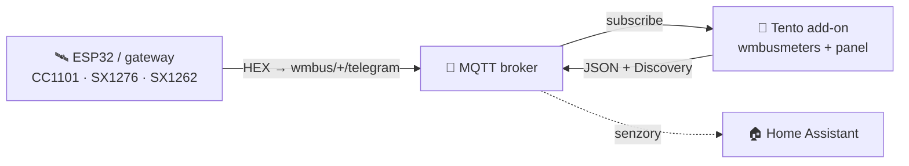
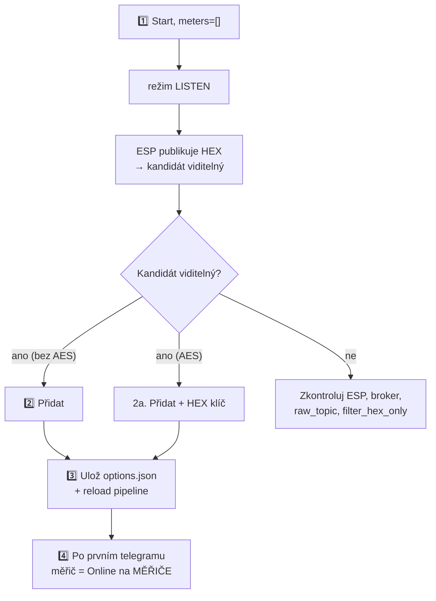

> 🌐 [EN](README.en.md) | [PL](README.pl.md) | [DE](README.de.md) | [**CS**](README.cs.md) | [SK](README.sk.md)

# wMBus MQTT Bridge — uživatelská příručka (CS)

> Příručka pro uživatele: instalace, přidání měřičů, čtení panelu, řešení potíží.
> **Jak to funguje uvnitř** (architektura, runtime soubory, soft-reload, kontrakt
> ESP diagnostiky) je v [`ARCHITECTURE.md`](ARCHITECTURE.md).

---

## Obsah

1. [Co to dělá](#1-co-to-dělá)
2. [Požadavky](#2-požadavky)
3. [Rychlý start — Home Assistant](#3-rychlý-start--home-assistant)
4. [Rychlý start — Docker standalone](#4-rychlý-start--docker-standalone)
5. [WebUI — co vidíš](#5-webui--co-vidíš)
6. [Typický postup: od prázdna k funkčnímu měřiči](#6-typický-postup-od-prázdna-k-funkčnímu-měřiči)
7. [Režim SEARCH — když je slyšet příliš mnoho cizích měřičů](#7-režim-search--když-je-slyšet-příliš-mnoho-cizích-měřičů)
8. [Možnosti konfigurace](#8-možnosti-konfigurace)
9. [Jazyk rozhraní](#9-jazyk-rozhraní)
10. [Řešení potíží](#10-řešení-potíží)
11. [Jak to funguje pod kapotou](#11-jak-to-funguje-pod-kapotou)
12. [Licence a upstream](#12-licence-a-upstream)

---

## 1. Co to dělá

> **Jednou větou:** dekóduje telegramy Wireless M-Bus (vodoměry, měřiče tepla,
> elektroměry) **bez lokálního USB donglu** — surové HEX rámce dodává libovolný
> externí přijímač (ESP32, gateway) přes MQTT.

- **Ty** umístíš rádiový přijímač tam, kde je signál (např. ESP32 s anténou).
- **Přijímač** publikuje surové HEX rámce na MQTT (`wmbus/<device>/telegram`).
- **Tento add-on** se připojí k brokeru, krmí `wmbusmeters`, dekóduje telegramy a
  publikuje výsledek zpět na MQTT + **Home Assistant Discovery**.

Výsledek: **tvé měřiče se objeví jako senzory v HA, bez jakéhokoli rádiového hardwaru na straně HA.**



> 🤝 Typicky se používá s firmwarem **[esphome-wmbus-bridge-rawonly](https://github.com/Kustonium/esphome-wmbus-bridge-rawonly)**
> (ESP32 + CC1101/SX1276/SX1262, publikuje RAW HEX). Oba projekty jsou nezávislé —
> add-on přijímá hex z libovolného zdroje publikujícího na `raw_topic`.

> 🌉 **Jako celek tvoří ESP (RF přijímač) a tento add-on (dekodér)
> distribuovaný _wM-Bus → Home Assistant gateway_** — rádio je tam, kde je
> signál, a dekódování (dešifrování, drivery, ~120 typů měřičů) běží na HA.
> Na rozdíl od monolitických wM-Bus gateway (rádio + dekodér v jedné krabičce)
> nepotřebuje lokální USB dongle a škáluje přidáváním levných ESP uzlů.
>
> **Každá polovina funguje i samostatně a jsou zaměnitelné:** ESP krmí libovolný MQTT backend (Node-RED, vlastní skript, vlastní dekodér) a add-on dekóduje hex z libovolného zdroje na `raw_topic` (tento ESP, rtl-wmbus, jiný gateway, replay nástroj) — spolupracují, ale ani jedna nezávisí na druhé.

---

## 2. Požadavky

- **MQTT broker** (Mosquitto, EMQX…) dosažitelný z HA / z hostitele.
- **Přijímač** publikující HEX rámce na `wmbus/<device>/telegram`.
- Home Assistant (režim add-onu) **nebo** Docker + compose (standalone).

> ⚠️ Neprovozuj paralelně oficiální add-on `wmbusmeters` — tento projekt má vlastní
> instanci a navzájem by se zdvojovaly.

> 🧱 **Hranice odpovědnosti.** Projekt poskytuje dva MQTT klienty — firmware ESP (rádio → MQTT) a tento add-on (MQTT → dekódování → HA); jeho rozsah končí u MQTT tématu. **Samotný broker — autentizace, ACL, TLS, síťová expozice a případný bridging broker-broker pro vzdálené/distribuované instalace (lokalita A → internet → lokalita B) — je odpovědností provozovatele.** Doporučeno: broker drž v LAN; pro vzdálený přístup použij tunel/VPN nebo bridging brokeru s TLS; nevystavuj port 1883 ani WebUI (8099) přímo do internetu. Pozn.: u měřičů s AES zůstává payload šifrován měřičem end-to-end, nezávisle na transportu brokeru.

> ⚠️ **Začátečník? Přečti si to, než něco vystavíš.** **Nepřesměrovávej** na domácím routeru port brokeru (1883) ani Home Assistant do internetu — vystavený broker může číst a zneužít kdokoli. Pro přístup zvenčí použij hotové bezpečné řešení: **Home Assistant Cloud (Nabu Casa)** nebo add-ony **Tailscale** / **Cloudflare Tunnel**. Nejsi si jistý? Nech vše v domácí síti — add-on ke svojí funkci internet nepotřebuje.

---

## 3. Rychlý start — Home Assistant

1. **Přidej repozitář:** Settings → Add-ons → Add-on Store → ⋮ → Repositories:
   ```
   https://github.com/Kustonium/homeassistant-wmbus-mqtt-bridge
   ```
2. **Nainstaluj** „wMBus MQTT Bridge", klikni **Start** (s výchozím `meters: []`
   add-on přejde do **režimu LISTEN** a jen naslouchá).
3. **Otevři WebUI** (Info → OPEN WEB UI).
4. Jdi na **PŘÍJEM / HLEDÁNÍ**, najdi svůj měřič mezi detekovanými kandidáty a klikni
   **Přidat** (modal: ID, ovladač, název, volitelný AES klíč). Po uložení se pipeline
   sama přenačte (bez restartu kontejneru).

Celý postup v [§6](#6-typický-postup-od-prázdna-k-funkčnímu-měřiči).

---

## 4. Rychlý start — Docker standalone

Pro vše mimo HA (DietPi, Ubuntu, Raspberry Pi OS, NAS…).

```bash
git clone https://github.com/Kustonium/homeassistant-wmbus-mqtt-bridge.git
mkdir -p /home/wmbus
cp -a homeassistant-wmbus-mqtt-bridge/docker/examples/* /home/wmbus/
cd /home/wmbus
docker compose up -d --build
docker compose logs -f wmbus
```

Konfigurace v `./config/options.json` (reference polí v [§8](#8-možnosti-konfigurace)):

```json
{
  "raw_topic": "wmbus/+/telegram",
  "discovery_enabled": true,
  "state_prefix": "wmbusmeters",
  "mqtt_mode": "external",
  "external_mqtt_host": "192.168.1.10",
  "external_mqtt_port": 1883,
  "external_mqtt_username": "user",
  "external_mqtt_password": "pass",
  "meters": []
}
```

Po úpravě: `docker compose restart wmbus`. WebUI: vystav port `8099` v
`docker-compose.yml` a otevři `http://<host-ip>:8099/`.

> 💡 V Dockeru globální tlačítko restartu nic neudělá (není Supervisor) — použij
> `docker restart <container>`.

---

## 5. WebUI — co vidíš

Dostupné v **5 jazycích** (EN/PL/DE/CS/SK) — přepínač vpravo nahoře.

| Záložka | K čemu |
|---|---|
| **PANEL** | Dashboard: pipeline ESP→MQTT→wmbusmeters→HA (klikatelné dlaždice) + statistiky. |
| **MĚŘIČE** | Tvé nakonfigurované měřiče: hodnota, poslední telegram, **PŘÍJEM**. |
| **PŘÍJEM / HLEDÁNÍ** | Detekovaní kandidáti + nakonfigurované „v éteru"; zde přidáš/odebereš měřiče. |
| **LOGY / ESP LOGY** | Runtime události a diagnostika ESP přijímačů. |
| **NASTAVENÍ / O PROJEKTU** | Aktivní konfigurace, info. |

### Sloupec PŘÍJEM (co znamenají odznaky)

Najeď na **ⓘ** u záhlaví PŘÍJEM — máš legendu. Stručně:

- **stav + sloupce** — zda měřič dochází: *online* / *opožděný* / **ticho**. Práh je
  **adaptivní** podle rytmu daného měřiče (jeho průměrného intervalu). Delší ticho je
  **neutrální** (šedé), ne červený alarm — měřič může být v noci / při nepřítomnosti /
  při slabé baterii tichý, takže nehlásíme planý poplach.
- **📡 ESP** — měřič je označený (highlight) na některém z ESP.
- **📶 název N% · počet** — % příjmu a počet telegramů **na daném ESP** (z volitelné
  diagnostiky). Při více ESP vidíš, který přijímač měřič slyší a jak dobře. Barva:
  zelená ≥90 · jantarová ≥50 · červená <50.

> Surové % a počet **nejsou** mírou citlivosti desky (kumulativní počet od bootu,
> různé uptime). Skutečná citlivost je **pokrytí** — které měřiče deska vůbec slyší.

### Přidávání / odebírání měřičů (PŘÍJEM)

- Kandidáti bez AES se dekódují automaticky — sloupec **Hodnota** ukazuje živý náhled
  bez konfigurace.
- **Přidat** uloží měřič a přenačte pipeline.
- **Porovnat** v modalu **Přidat** nebo **Driver…** dekóduje poslední telegram dvěma
  drivery bez uložení změn. Vyber driver v poli **Driver**, u šifrovaného měřiče
  zadej AES klíč a klikni na **Porovnat**. Levý sloupec je uložený driver nebo
  auto-detekce `wmbusmeters`, pravý sloupec je tebou vybraný driver. Zelené řádky
  jsou další pole, žluté řádky jiné hodnoty; více polí **neznamená** automaticky
  správně — ověř hodnoty na displeji měřiče.
- **Hlášení…** pro kandidáta záměrně nepoužívá AES klíč a nezobrazuje soukromé
  odečty. Pokud chceš vidět hodnoty před přidáním měřiče, použij **Přidat →
  Porovnat** a zadej AES klíč v tomto modalu.
- **Odebrat vybrané** — zaškrtni checkboxy a odeber více najednou (tlačítko nad tabulkou).

---

## 6. Typický postup: od prázdna k funkčnímu měřiči



1. **Start** s `meters: []` → režim LISTEN, log ukáže `No meters configured -> LISTEN MODE`.
2. **Přidej** kandidáta (bez AES — hned; AES — zadej 32znakový HEX klíč).
3. Uložení jde do `options.json` a DECODE pipeline se přenačte **bez plného restartu
   kontejneru**.
4. Po **dalším telegramu** tohoto měřiče (od desítek sekund po pár minut, podle měřiče)
   se objeví jako **Online** na MĚŘIČE a HA Discovery vytvoří entity jako `sensor.<id>_total_m3`.

Než přijde první telegram, dashboard ukazuje panel **„čeká na první telegram"**.
Plný restart add-onu je jen nouzová záloha.

**Nepodporovaný měřič?** Pokud se kandidát nikdy nedekóduje (neznámý driver /
„unknown format signature"), použijte tlačítko **Hlášení…** v jeho řádku:
add-on sestaví hotový blok hlášení pro upstream projekt wmbusmeters (surový
telegram + výstup `wmbusmeters --analyze`). Telegram obsahuje sériové číslo
měřiče; AES klíč není nikdy přiložen.

---

## 7. Režim SEARCH — když je slyšet příliš mnoho cizích měřičů

V bytovém domě přijímač zachytí desítky cizích měřičů. SEARCH najde ten tvůj
**porovnáním stavu m³ z tvého fyzického displeje** s dekódy všech kandidátů.

1. Otevři `#search`, zadej **aktuální stav** z displeje (např. `23.93`) a **toleranci**
   (výchozí `0.05` = 50 l; v domě nezvyšuj).
2. Zapni SEARCH. Add-on dekóduje kandidáty všemi ovladači a hledá shodu
   `total_m3 ≈ stav ± tolerance`.
3. Při shodě log ukáže `SEARCH MATCH: id=… driver=…` — přidej ten měřič z PŘÍJEM.
4. **Vypni `search_mode`** po dokončení (dočasné SEARCH měřiče nevytvářejí HA entity).

---

## 8. Možnosti konfigurace

Z [`config.yaml`](../config.yaml).

### MQTT — vstup / výstup

| Pole | Typ | Výchozí | Popis |
|---|---|---|---|
| `raw_topic` | str | `wmbus/+/telegram` | Topic se surovými HEX rámci. `+` = wildcard (název ESP v diagnostice) |
| `filter_hex_only` | bool | `true` | Ignoruj zprávy, které nevypadají jako HEX |
| `mqtt_mode` | enum | `auto` | `auto` / `ha` (vynutit HA) / `external` (vždy externí) |
| `external_mqtt_host/port/username/password` | str/int | — | Externí broker (při `external`) |

### Discovery a výstup

| Pole | Typ | Výchozí | Popis |
|---|---|---|---|
| `discovery_enabled` | bool | `true` | Publikuj HA Discovery |
| `discovery_prefix` | str | `homeassistant` | Prefix Discovery |
| `discovery_retain` | bool | `true` | Discovery jako retained |
| `state_prefix` | str | `wmbusmeters` | Prefix topicu s hodnotami |
| `state_retain` | bool | `false` | Retained stav |
| `verify_ha_entities` | bool | `false` | (Opt-in) zeptej se HA Core API, zda entity skutečně vznikly. Zapnutí udělí read-only přístup k HA Core API. |

Každá entita z Discovery má **availability template**: pokud v posledním
telegramu měřiče chybí dané pole (některé měřiče střídají krátké a plné rámce),
entita zobrazí `unavailable` místo zastaralé nebo falešné hodnoty — a
automaticky se obnoví s dalším telegramem, který pole obsahuje. Nezávisle na
tom automaticky laděné `expire_after` (cca 2× pozorovaný interval vysílání
měřiče, minimálně 1 h) označí entity jako `unavailable`, když měřič ztichne.

Kromě číselných měřicích senzorů každý měřič, který hlásí pole `status`, získá
také dvě **diagnostické** entity (v sekci *Diagnostika* zařízení): `sensor` se
surovým textem stavu a `binary_sensor` (`device_class: problem`), který se
zapne pokaždé, když je stav jiný než `OK`. Text se přebírá doslovně z
wmbusmeters, takže konkrétní příznaky závisí na ovladači — např. `elf2` dekóduje
celé bitové pole chyb měřiče tepla (`DIFFERENTIAL_TEMPERATURE_TOO_LOW`,
`TEMPORARY_ERROR`, …), zatímco starší ovladač `elf` hlásí jen obecný TPL stav.
Pro bohatší diagnostiku zvolte `elf2`.

### Režim SEARCH

| Pole | Typ | Výchozí | Popis |
|---|---|---|---|
| `search_mode` | bool | `false` | Zapíná SEARCH ([§7](#7-režim-search--když-je-slyšet-příliš-mnoho-cizích-měřičů)) |
| `search_expected_value_m3` | float | `0` | Očekávaný stav m³ |
| `search_tolerance_m3` | float | `0.05` | Tolerance porovnání — v domě nezvyšuj |
| `search_delta_mode` / `search_min_delta_m3` | bool/float | `false` / `0.001` | (Experimentální) porovnání delty |
| `search_topic` | str | `wmbus/search/candidates` | Topic výsledků SEARCH |

### Debug

| Pole | Typ | Výchozí | Popis |
|---|---|---|---|
| `loglevel` | enum | `normal` | `normal` / `verbose` / `debug` |
| `debug_every_n` | int | `0` | Extra diagnostika každý N-tý telegram |

> 💡 Všechny výše uvedené možnosti lze upravit i přímo ve WebUI v **Nastavení → Konfigurace** (s popisem u každé); klíčové možnosti se projeví po restartu doplňku.

### Měřiče — `meters[]`

| Pole | Typ | Povinné | Popis |
|---|---|---|---|
| `id` | str | ano | Tvůj štítek (název senzoru HA) |
| `meter_id` | str | ano | Sériové číslo měřiče (HEX, z LISTEN) |
| `type` | str | ano | **Název ovladače wmbusmeters** (např. `hydrodigit`, `amiplus`, `izarv2`) **nebo `auto`/`other`**. Volný řetězec — wmbusmeters ověří ovladač při dekódování (záměrně ne enum, aby nové ovladače nebyly odmítány). |
| `type_other` | str? | při `type=other` | Vlastní název ovladače |
| `key` | str? | při šifrování | 32znakový AES klíč (HEX) |

Běžné ovladače: voda — `multical21`, `iperl`, `hydrodigit`, `hydrus`, `mkradio3`,
`izarv2`; teplo — `kamheat`, `hydrocalm3`, `vario451`; elektřina — `amiplus`.

---

## 9. Jazyk rozhraní

5 jazyků (en/pl/de/cs/sk). Výběr: `?lang=cs` v URL → cookie `wmbus_lang` →
hlavička `Accept-Language` → výchozí `en`. Přepínač vpravo nahoře.

---

## 10. Řešení potíží

### „Telegramy dorazí na broker, ale v HA nejsou entity"

Spusť **Discovery Doctor** (pohled NASTAVENÍ): checklist jedním kliknutím
ověří připojení k brokeru, zda je MQTT Discovery zapnuté a retained, zda Home
Assistant skutečně naslouchá nakonfigurovanému `discovery_prefix` (přes
retained birth message HA) a zda na brokeru existují retained discovery
configy pro každý nakonfigurovaný měřič — s náhledem payloadu a tlačítkem
**Vynutit re-discovery**. Bez hrabání v logu a `mosquitto_sub`.

### „Chci začít znovu — odebrat všechny měřiče"

V zobrazení NASTAVENÍ tlačítko **Resetovat doplněk** odebere VŠECHNY
nakonfigurované měřiče, vymaže jejich entity v Home Assistantu (publikuje
prázdné retained discovery configy, takže entity zmizí) a vyčistí běhový stav
(kandidáti, seznam ignorovaných, statistiky). Doplněk se vrátí do stavu po
instalaci. Akce je nevratná a nejprve vyžaduje potvrzení.

### „Můj měřič šifruje telegramy — co teď?"

Většina fakturačních měřičů šifruje payload (kandidát má odznak **AES req.**).
Bez individuálního 128bitového AES klíče (32 hex znaků) je dekódování nemožné
— není to chyba. Kde klíč získat: **správce budovy / družstvo**, **dodavatel
média**, který měřič fakturuje, nebo **instalatér měřiče**. Měřič můžeš přidat
bez klíče a doplnit ho později tlačítkem **Driver…**. Pokud je klíč chybný
nebo chybí, wmbusmeters měřič tiše ignoruje — add-on to detekuje a u měřiče
ukáže červený status **🔑 AES klíč neplatný / chybí AES klíč**; po opravě
klíče se pipeline přenačte a dekódování se obnoví s dalším telegramem.

### „Nevidím žádné telegramy" (RAW count = 0)
1. Publikuje přijímač na `wmbus/<cokoli>/telegram`? Test: `mosquitto_sub -h <broker> -t 'wmbus/#' -v`.
2. Je bridge připojen a subscribed? Log: `mqtt: connected` + `subscribed to wmbus/+/telegram`.
3. Nezahazuje to `filter_hex_only`? Nastav `loglevel: verbose` a hledej `dropped (not HEX)` — pokud ESP posílá base64/JSON, změň formát.
4. Je broker dosažitelný? Zkontroluj chyby připojení (`mqtt_mode`).

### „Přidal jsem měřič, ale neobjevuje se v MĚŘIČE"
Objeví se až **po dalším telegramu** pro toto ID (desítky sekund až pár minut).
Pokud ne — zkontroluj `meter_id`, ovladač, AES klíč a logy.

### „Měřič po aktualizaci add-onu zmizí" (např. Diehl/Izar `izarv2`)
Opraveno v **1.5.33**. Dříve seznam povolených ovladačů neobsahoval novější (např.
`izarv2`), takže Supervisor odmítl uložení a měřič se při restartu ztratil.
**Aktualizuj add-on na ≥1.5.33**, měřič odeber a přidej znovu — zůstane.

### „Stav ukazuje «ticho», ne červené «offline»"
Tak je to záměrně (honest-witness): měřič je pasivní, delší ticho je tedy
nejednoznačné (noc/nepřítomnost/baterie) — ukazujeme neutrální stav, ne planý poplach.
Práh vychází z **rytmu** každého měřiče, ne z pevných 15/60 min.

### „Hodnota jen roste, není okamžitá"
Hlavní zobrazená hodnota je **stav měřiče** (`total_m3`,
`total_energy_consumption_kwh`). Vodoměry, které dávají jen `total_m3` (např.
`hydrodigit`, `itron`, `apator162`), nemají pole okamžitého průtoku — aktuální/periodickou
spotřebu spočítej v HA pomocníkem **Utility Meter** (denní/měsíční, přežije restarty)
nebo **Derivative** (m³/h). `total_m3` je publikováno jako `device_class: water` +
`state_class: total_increasing`, takže jde i do statistik vody/Energie HA.

### „HA neukazuje aktualizaci add-onu"
HA detekuje novou verzi jen když se změní `version:` v `config.yaml`. Vynucení:
Settings → System → ⋮ → Reload nebo `ha supervisor restart`.

### „Mám šifrovaný měřič — kde vzít AES klíč?"
Od dodavatele měřičů (správce budovy / dodavatel vody/tepla), z nálepky nebo
dokumentace měřiče. Bez klíče šifrované telegramy nedekóduješ.

### „Přidat měřič nic neudělalo" (Docker)
Adresář `./config/` musí být **zapisovatelný** (ne `:ro`). Po přidání by měl log
potvrdit zápis do `options.json`. V nouzi `docker restart <container>`.

---

## 11. Jak to funguje pod kapotou

Architektura, model procesů, runtime soubory v `/data`, soft-reload, kontrakt ESP
diagnostiky, model dashboardu a tok vydání dev→stable — vše v
**[`ARCHITECTURE.md`](ARCHITECTURE.md)** (reference pro maintainery/přispěvatele).

---

## 12. Licence a upstream

**GNU GPL-3.0.** Tento projekt obsahuje a upravuje kód z `wmbusmeters-ha-addon`
(GPL-3.0); celek — včetně `webui.py`, `i18n.py`, přepsaného `bridge.sh` — je
distribuován pod GPL-3.0.

- **wmbusmeters** — https://github.com/wmbusmeters/wmbusmeters (Fredrik Öhrström, GPL-3.0)
- **wmbusmeters-ha-addon** — https://github.com/wmbusmeters/wmbusmeters-ha-addon (GPL-3.0)

Fork vyvíjený **Kustonium**: MQTT vstup místo lokálního donglu, WebUI v 5 jazycích,
workflow LISTEN → ADD → SEARCH z UI.

---

Dotazy / chyby → [GitHub Issues](https://github.com/Kustonium/homeassistant-wmbus-mqtt-bridge/issues).
