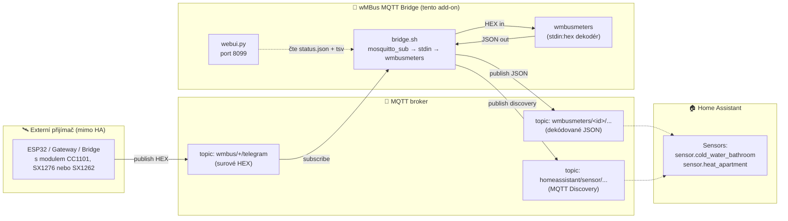
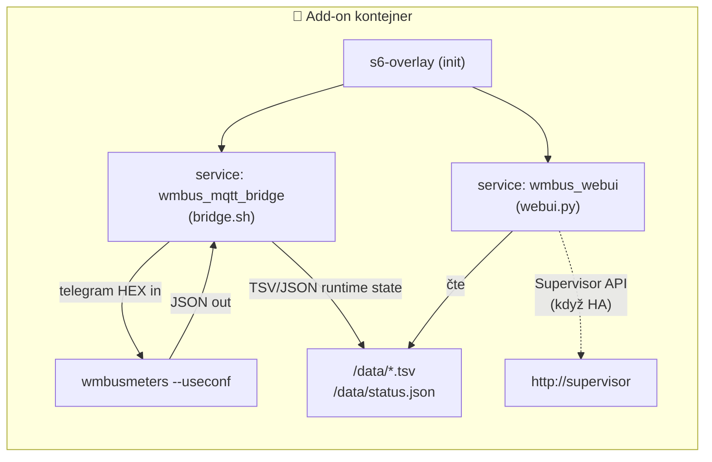
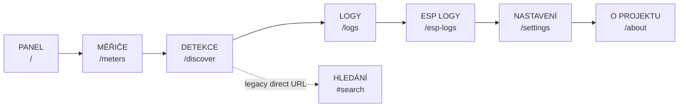
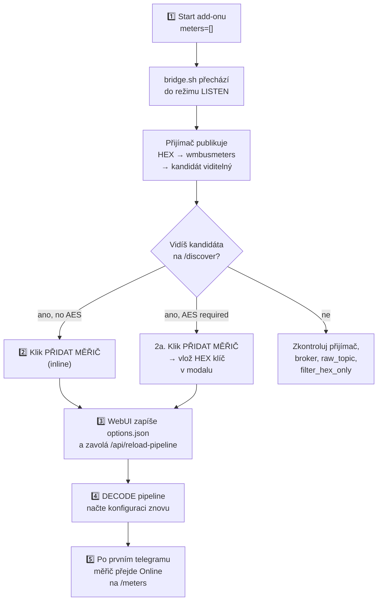
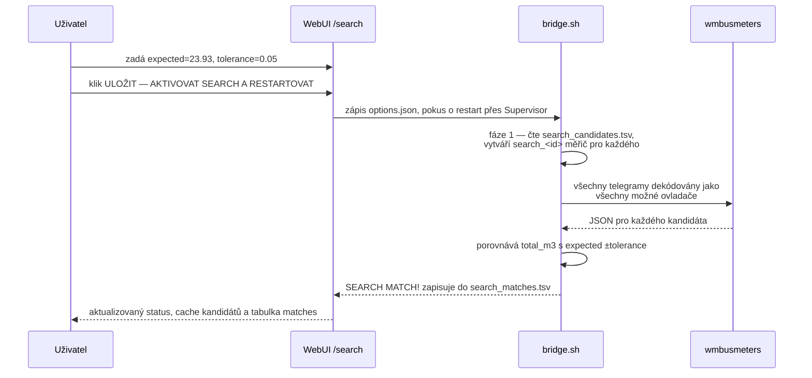
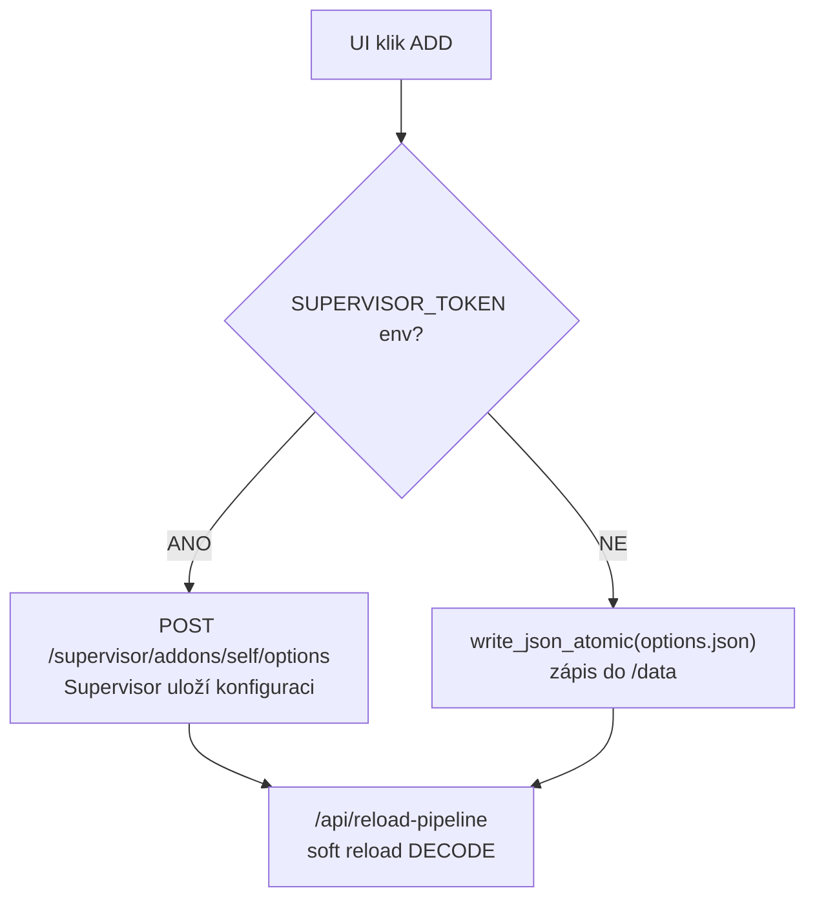
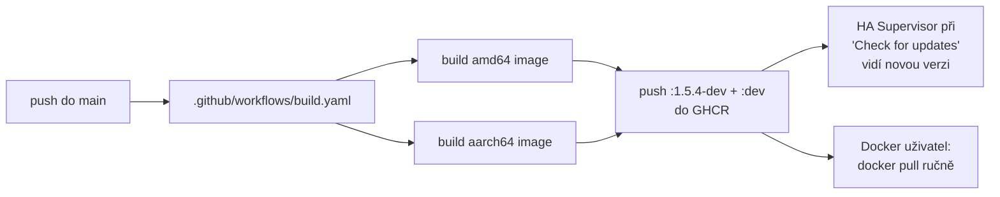

> 🌐 [EN](README.en.md) | [PL](README.pl.md) | [DE](README.de.md) | [**CS**](README.cs.md) | [SK](README.sk.md)

> 🤖 **Strojový překlad** — Tato dokumentace byla strojově přeložena z polštiny. Může obsahovat chyby.

# wMBus MQTT Bridge — kompletní dokumentace (CS)

> Aktuální k datu: **2026-05-29**  ·  Jazyk: **čeština**  ·  Stav: dev-channel Home Assistant add-onu
>
> Krátký dvojjazyčný přehled najdete v hlavním [README.md](../README.md). Tento dokument je úplná česká dokumentace projektu — od „co to je" po detaily architektury a runtime.

---

## Obsah

1. [TL;DR — co to dělá](#1-tldr--co-to-dělá)
2. [Architektura toku dat](#2-architektura-toku-dat)
3. [Rychlý start — Home Assistant](#3-rychlý-start--home-assistant)
4. [Rychlý start — Docker standalone](#4-rychlý-start--docker-standalone)
5. [WebUI — hlavní pohledy](#5-webui--hlavní-pohledy)
6. [Typický workflow: od prázdna k fungujícímu měřiči](#6-typický-workflow-od-prázdna-k-fungujícímu-měřiči)
7. [Režim SEARCH — když LISTEN slyší příliš mnoho cizích měřičů](#7-režim-search--když-listen-slyší-příliš-mnoho-cizích-měřičů)
8. [Kompletní reference konfigurace](#8-kompletní-reference-konfigurace)
9. [MQTT témata — co publikujeme, co konzumujeme](#9-mqtt-témata--co-publikujeme-co-konzumujeme)
10. [Runtime soubory v `/data/`](#10-runtime-soubory-v-data)
11. [Home Assistant vs Docker — rozdíly UX](#11-home-assistant-vs-docker--rozdíly-ux)
12. [Lokalizace UI](#12-lokalizace-ui)
13. [Řešení problémů](#13-řešení-problémů)
14. [Architektura kódu — pro vývojáře](#14-architektura-kódu--pro-vývojáře)
15. [Verzování a Docker image](#15-verzování-a-docker-image)
16. [Licence a upstream projekty](#16-licence-a-upstream-projekty)

---

## 1. TL;DR — co to dělá

> **V jedné větě:** Add-on dekóduje Wireless M-Bus telegramy (vodoměry, měřiče tepla, elektroměry) **bez lokálního USB donglu** — surové HEX telegramy mu dodává libovolný externí přijímač (ESP32, bridge, gateway) přes MQTT.

Standardně `wmbusmeters` vyžaduje radiový dongl připojený k hostiteli. Tento projekt to řeší jinak:

- **Ty** máš radiový přijímač daleko od Home Assistant (např. ESP32 na půdě s anténou).
- **Přijímač** publikuje surové HEX rámce do MQTT.
- **Tento add-on** se připojí k brokeru, krmí `wmbusmeters` přes `stdin:hex`, dekóduje JSON a publikuje výsledek zpět do MQTT + Home Assistant Discovery.

Výsledek: **Tvoje měřiče se objeví jako senzory v HA, bez jakéhokoli radiového hardwaru na straně HA.**

> 🤝 **Spolupráce s ESPHome firmwarem** — Tento add-on se typicky používá společně s [`esphome-wmbus-bridge-rawonly`](https://github.com/Kustonium/esphome-wmbus-bridge-rawonly), ESPHome komponentou běžící na ESP32 s rádiovým čipem **CC1101, SX1276 nebo SX1262**. ESP přijímá rádiové rámce a publikuje surové HEX do MQTT; tento add-on je dekóduje. Oba projekty jsou **nezávislé** — add-on přijímá HEX z libovolného zdroje publikujícího do nakonfigurovaného `raw_topic`.

---

## 2. Architektura toku dat

### Datová pipeline



### Mapa komponent uvnitř kontejneru



**Tři paralelně běžící procesy** spravované `s6-overlay`:

| Proces | Co dělá | Soubor |
|---|---|---|
| `bridge.sh` | Odebírá MQTT, krmí wmbusmeters HEXem, parsuje JSON, publikuje výsledky | [rootfs/usr/bin/bridge.sh](../rootfs/usr/bin/bridge.sh) |
| `wmbusmeters` | Dekodér telegramů (upstream binárka — Fredrik Öhrström) | `/usr/bin/wmbusmeters` |
| `webui.py` | HTTP server na portu 8099, správní panel | [rootfs/usr/bin/webui.py](../rootfs/usr/bin/webui.py) |

Tyto tři komponenty komunikují pouze přes **soubory v `/data/`** — žádné sockety uvnitř kontejneru. Díky tomu lze webui restartovat nezávisle na bridge a stav přežívá restarty.

> 🔗 **Na straně přijímače (ESP32 s rádiem)** — používáme sesterský projekt Kustonia: **[esphome-wmbus-bridge-rawonly](https://github.com/Kustonium/esphome-wmbus-bridge-rawonly)** — ESPHome firmware pro SX1262 / SX1276 / CC1101 publikující surové HEX na `wmbus/<device>/telegram`. V HA odpovídá výchozímu `raw_topic: wmbus/+/telegram`; v Dockeru zkontroluj vygenerovaný `/config/options.json`, protože `docker/entrypoint.sh` aktuálně vytváří `raw_topic: wmbus_bridge/+/telegram`. Přijímač má vlastní úplnou dokumentaci (EN/PL) — začni s [`START_HERE.md`](https://github.com/Kustonium/esphome-wmbus-bridge-rawonly/blob/main/docs/START_HERE.md).

---

## 3. Rychlý start — Home Assistant

### Krok 1 — přidej repozitář

V HA: **Settings → Add-ons → Add-on Store → ⋮ (menu) → Repositories**, přidej:

```
https://github.com/Kustonium/homeassistant-wmbus-mqtt-bridge
```

### Krok 2 — nainstaluj add-on

Ve storu najdi **wMBus MQTT Bridge Dev** (sekce „dev"), klikni **Install**.

> ⚠️ Neinstaluj oficiální `wmbusmeters` add-on paralelně — tento projekt má vlastní instanci wmbusmeters a duplikuje ji.

### Krok 3 — spusť s prázdným seznamem `meters` (režim LISTEN)

Klikni **Start**. Defaultně `meters: []` — add-on jde do režimu LISTEN a pouze poslouchá, nic ještě nekonfiguruje.

### Krok 4 — otevři WebUI

Na záložce **Info** add-onu klikni **OPEN WEB UI**. Přivítá tě dashboard:

```
┌────────────────────────────────────────────────────────────────┐
│ wMBus MQTT Bridge                              [EN PL DE CS SK]│
│ Panel | Měřiče | Detekce | Logy | ESP logy | Nastavení       │
├────────────────────────────────────────────────────────────────┤
│ Panel                                                          │
│ [Pipeline] [Statistiky]                                        │
│                                                                │
│ ESP -> MQTT -> wmbusmeters -> Home Assistant                   │
│                                                                │
│ Zatím žádné nakonfigurované měřiče                             │
│   Přejdi do Detekce a přidej první měřič                       │
│                                                                │
│ Poslední události                                              │
└────────────────────────────────────────────────────────────────┘
```

### Krok 5 — jdi na „Detekce" a přidej měřič

Na záložce **DETEKCE** uvidíš seznam kandidátů. **PŘIDAT MĚŘIČ** otevře modal s ID, ovladačem, názvem a volitelným AES klíčem. Po uložení WebUI zavolá `/api/reload-pipeline`, takže DECODE pipeline se načte znovu bez plného restartu kontejneru.

➡️ Plný popis tohoto workflowu v [§6 Typický workflow](#6-typický-workflow-od-prázdna-k-fungujícímu-měřiči).

---

## 4. Rychlý start — Docker standalone

Pro všechny mimo Home Assistant (DietPi, Ubuntu, Raspberry Pi OS, NAS atd.).

### Požadavky

- Docker + docker compose
- Funkční MQTT broker (Mosquitto, EMQX, …) dostupný z hostitele
- Radiový přijímač publikující HEX rámce do brokeru — např. [esphome-wmbus-bridge-rawonly](https://github.com/Kustonium/esphome-wmbus-bridge-rawonly) (publikuje na `wmbus/<device>/telegram`, kompatibilní out-of-the-box)

### Instalace

```bash
git clone https://github.com/Kustonium/homeassistant-wmbus-mqtt-bridge.git
mkdir -p /home/wmbus-test
cp -a homeassistant-wmbus-mqtt-bridge/docker/examples/* /home/wmbus-test/
cd /home/wmbus-test
docker compose up -d --build
docker compose logs -f wmbus
```

První logy by měly ukazovat:

```
[wmbus-bridge] mqtt: connected to 192.168.1.10:1883
[wmbus-bridge] No meters configured -> LISTEN MODE
```

### Konfigurace

Edituj `./config/options.json`. Úplná reference polí v [§8](#8-kompletní-reference-konfigurace). Minimální příklad:

```json
{
  "raw_topic": "wmbus/+/telegram",
  "loglevel": "normal",
  "discovery_enabled": true,
  "state_prefix": "wmbusmeters",
  "mqtt_mode": "external",
  "external_mqtt_host": "192.168.1.10",
  "external_mqtt_port": 1883,
  "external_mqtt_username": "user",
  "external_mqtt_password": "pass",
  "meters": []
}
```

Po editaci:

```bash
docker compose restart wmbus
```

### WebUI v Dockeru

Vystav port 8099 v `docker-compose.yml`:

```yaml
services:
  wmbus:
    ports:
      - "8099:8099"
```

Pak otevři `http://<host-ip>:8099/`.

> 💡 V režimu Docker UI stále zobrazuje globální restart tlačítko, ale `/api/restart-bridge` vyžaduje `SUPERVISOR_TOKEN`. Bez Supervisora restartuj kontejner ručně (`docker restart <container>`).

---

## 5. WebUI — hlavní pohledy

WebUI je dostupné v **5 jazycích** (EN/PL/DE/CS/SK) — přepínač v pravém horním rohu. Jazyk je detekován z (v pořadí): `?lang=`, cookie `wmbus_lang`, hlavička `Accept-Language`.

UI se aktualizuje přes SSE z `/api/events`; pokud live spojení není dostupné, frontend přejde na polling `/api/app`.

### Mapa záložek



### 5.1. Panel (`/`)

Horní blok má přepínač **Pipeline / Statistiky**. Pipeline ukazuje ESP → MQTT → wmbusmeters → Home Assistant s metrikami pro každý krok; Statistiky ukazuje rychlost telegramů, funnel a historii rate.

Níže dashboard zobrazuje pending/waiting panel, poslední dekódované měřiče nebo CTA do `/discover`, a poslední runtime události.

Pokud jsou měřiče uložené v `options.json`, ale ještě nebyly dekódované, dashboard ukáže „Waiting for first telegram". Viz [§6](#krok-3--reload-pipeline-a-čekání-na-telegram).

### 5.2. Měřiče (`/meters`)

Tabulka **dekódovaných** měřičů. Sloupce: ID, název, driver, hodnota, poslední telegram a příjem. Hlavní hodnota je aktuální okamžitá hodnota nebo stav měřiče (od verze 1.5.2-dev — viz [§13](#13-řešení-problémů)). Každý řádek má akci **DELETE**. Pending záznamy z `options.json` se mohou objevit pod tabulkou, dokud nedorazí první telegram.

### 5.3. Detekce (`/discover`)

Tabulka kandidátů z LISTEN módu. Pro každého vidíš: ID, ovladač, médium (💧/⚡/🔥/📡), šifrování (AES required / no AES / —), příjem (15m/60m), poslední telegram, **živý náhled hodnoty** a akce.

**Automatický náhled hodnoty (auto-dekódování).** Kandidáti, kteří **nevyžadují** klíč AES, jsou automaticky dekódováni paralelní instancí LISTEN — aktuální odečet se objeví ve sloupci **Hodnota (náhled)** bez nastavení jako měřič a bez klikání na náhled. Bridge vytváří dočasné `meter-preview-<id>` záznamy a zapisuje hodnoty do `status_candidate_values.tsv`; hodnota se ale objeví až po dalším dekódovaném telegramu. Kandidáti **vyžadující AES** zůstanou bez hodnoty, dokud nezadáš klíč.

**Akce** závisí na šifrovacím pillu:

| Pill | Tlačítka |
|---|---|
| 🟢 **no AES** nebo šedé **—** | `[PŘIDAT MĚŘIČ] [IGNOROVAT]` — ADD otevře modal a zapíše do `options.json` |
| 🔴 **AES required** | `[PŘIDAT MĚŘIČ] [IGNOROVAT]` — v modalu zadej 32znakový HEX klíč; bez klíče se hodnota neukáže |

Filtry médií nahoře: **Vše / Voda / Elektřina / Teplo / Ostatní**. Druhý odkaz `[Ignorovaní]` zobrazuje dříve ignorované kandidáty (s možností OBNOVIT).

### 5.4. Hledání (`#search`, legacy režim)

Servisní režim — používán když LISTEN vrátí desítky cizích měřičů (např. bytový dům) a nevíš, který je tvůj. Už není v hlavní navigaci, protože aktuální workflow používá filtr hodnot v `/discover`; obrazovka stále funguje přes přímý hash `#search`. Viz dedikovaná sekce [§7](#7-režim-search--když-listen-slyší-příliš-mnoho-cizích-měřičů).

UI má 3 (kontextové) banery:

- 🟢 **MATCH FOUND** — když je shoda nalezena
- 🟢 **SEARCH MODE ACTIVE** — běží, čeká na další telegramy
- 🟡 **SEARCH MODE — konfigurace** — před aktivací

Plus formulář konfigurace (m³ odečet + tolerance) a živý status z bridge.sh (KV: phase, cached, ignored, loaded, decoded, checked, matches, last candidate, last checked, last reason).

### 5.5. Logy (`/logs`)

Krátký proud runtime událostí z [`status_events.tsv`](#10-runtime-soubory-v-data) — RAW received, candidate detected, errors. Úplné logy jsou stále v záložce HA add-onu **Log**.

### 5.6. ESP logy (`/esp-logs`)

Diagnostika ESP přijímačů: zařízení detekovaná z `wmbus/+/telegram`, volitelný heartbeat `wmbus/+/diag/summary`, diagnostické události, boot a návrhy. `diag/boot` a jiné retained diagnostické události jsou logy; nejsou zdrojem aktivního stavu desky.

### 5.7. Nastavení (`/settings`)

Zobrazuje aktivní runtime konfiguraci (ze `status.json`):
- `raw_topic`, `state_prefix`, `discovery_prefix`
- `search_mode`, `search_expected_value_m3`, `search_tolerance_m3`
- `loglevel`, MQTT host, počet ignorovaných kandidátů

Níže zobrazuje snapshot `options.json`. Restart add-onu je globální tlačítko v horní liště WebUI; ignorování/obnovení kandidátů se dělá ze seznamu `/discover`.

### 5.8. O projektu (`/about`)

Krátký popis architektury a ASCII diagram.

---

## 6. Typický workflow: od prázdna k fungujícímu měřiči



### Krok 1 — první spuštění

`meters: []` v konfiguraci. Add-on startuje, připojí se k brokeru, čeká. V lozích:

```
[wmbus-bridge] mqtt: connected
[wmbus-bridge] No meters configured -> LISTEN MODE
[wmbus-bridge][INFO] === NEW METER CANDIDATE DETECTED ===
[wmbus-bridge][INFO] Received telegram from: 41553221
[wmbus-bridge][INFO] Suggested driver: mkradio3
```

WebUI → **Detekce** ukazuje 41553221 s ovladačem `mkradio3`.

### Krok 2 — přidej kandidáta

Pro měřič bez šifrování: v řádku **DETEKCE** klikni `PŘIDAT MĚŘIČ`. Pod kapotou:

1. POST `/add-meter` → `add_meter_to_options(meter_id, driver, "")` ve `webui.py`
2. Kontrola `SUPERVISOR_TOKEN`:
   - **Je** → POST na `http://supervisor/addons/self/options` s celým polem `meters[]` → Supervisor persistentně zapíše
   - **Není** → `write_json_atomic(/data/options.json, ...)` — přímý zápis souboru
3. Frontend zavolá `/api/reload-pipeline`; backend vytvoří `/data/.reload_pipeline` a watcher v `bridge.sh` restartuje jen DECODE pipeline.

Výsledek: měřič je v `options.json`, pipeline načte konfiguraci bez plného restartu kontejneru. Viditelný bude po dalším telegramu tohoto ID.

### Krok 3 — reload pipeline a čekání na telegram

WebUI rozlišuje dva stavy: `pending_restart=true`, když je `options.json` novější než `status_bridge_start.txt`, a „Waiting for first telegram", když je měřič uložený, ale ještě není v `status_meters.tsv`.

Typický stav po soft reloadu:

```
┌─────────────────────────────────────────────────────────────┐
│ ⏳ Waiting for first telegram (2)                            │
│ Měřiče jsou uložené, pipeline byla reloadována,              │
│ ale objeví se až po dalším telegramu.                        │
│ ┌─────────────────────────────────────────────┐             │
│ │ Meter ID   │ Driver       │ AES             │             │
│ │ 41553221   │ mkradio3     │ bez AES klíče   │             │
│ │ aabbccdd   │ amiplus      │ klíč nastaven   │             │
│ └─────────────────────────────────────────────┘             │
└─────────────────────────────────────────────────────────────┘
```

Plus šedé/přerušované „pending" karty v mřížce nakonfigurovaných měřičů s nápisem „Čeká / čeká na restart".

Mechanismus funguje porovnáním `options.json` ↔ `status_meters.tsv`. Záznam zmizí z pending automaticky, jakmile wmbusmeters dekóduje první telegram pro toto ID.

### Krok 4 — kdy restartovat add-on

Přidání měřiče z WebUI volá `/api/reload-pipeline` a obvykle nepotřebuje plný restart. Odebrání aktualizuje `options.json` a smaže řádek statusu v UI, ale frontend po něm nevolá `/api/reload-pipeline`; pipeline proto může používat starou konfiguraci do dalšího reloadu nebo restartu.

V režimu HA restartovací tlačítko volá `POST /restart-bridge` → `http://supervisor/addons/self/restart`. V Dockeru stejné tlačítko zasáhne API bez `SUPERVISOR_TOKEN` a kontejner nerestartuje; použij ručně `docker restart <container>`. Viz [§11](#11-home-assistant-vs-docker--rozdíly-ux).

### Krok 5 — hotovo

Po reloadu pipeline má wmbusmeters novou konfiguraci a čeká na další telegram. Když přijde:

1. JSON přistane v MQTT (`wmbusmeters/<id>/...`)
2. `bridge.sh` zapíše záznam do `status_meters.tsv`
3. WebUI při dalším refreshi (15s) zobrazí měřič jako **Online** místo „Pending"
4. HA Discovery automaticky vytvoří entity `sensor.<id>_total_m3` atd.

---

## 7. Režim SEARCH — když LISTEN slyší příliš mnoho cizích měřičů

V bytovém domě tvůj přijímač zachytí 30-50 telegramů od sousedů. LISTEN ukáže 30 kandidátů. Který je tvůj?

**SEARCH to řeší porovnáním m³ odečtu z displeje fyzického měřiče** s dekódy všech kandidátů.

### Fáze



### Konfigurace přes UI

Jdi na `/search`:

1. **Odečet měřiče** — zadej aktuální hodnotu z displeje, např. `23.93` nebo `23,93` (oba akceptovány)
2. **Tolerance m³** — výchozí `0.05` (50 litrů). V bytovém domě **nepoužívej `0.5`** — mnoho měřičů může mít podobné hodnoty
3. Klik **ULOŽIT — AKTIVOVAT SEARCH A RESTARTOVAT**

V HA backend zkusí restart add-onu přes Supervisor a po restartu přejde do SEARCH MODE. V Dockeru zapíše volby, ale bez `SUPERVISOR_TOKEN` kontejner automaticky nerestartuje. Po účinném restartu/reloadu čekej na další telegramy (typické intervaly: 30 s — 15 min v závislosti na měřiči).

### Výsledek

Když je shoda nalezena:

```
[wmbus-bridge][WARN] SEARCH MATCH: id=03534159 driver=hydrodigit
  media=water field=total_m3 value=23.932 m3
  expected=23.93 diff=0.002000 m3
[wmbus-bridge][WARN] SEARCH SUGGESTED CONFIG:
  {"id":"meter_03534159","meter_id":"03534159","type":"hydrodigit",
   "type_other":"","key":""}
```

Aktuální frontend `/search` ukazuje SEARCH formulář, `search_candidates` a `search_matches` jako jednoduché tabulky. V tomto pohledu nerenderuje tlačítka **PŘIDAT MĚŘIČ** ani **KOPÍROVAT KONFIG**; přidání měřiče probíhá z `/discover` přes add-meter modal.

### Po dokončení

- **Vypni `search_mode`** — vrací se k normální práci s `meters[]`
- Dočasné `search_*` měřiče nevytvářejí entity v HA
- Soubory `/data/search_candidates.tsv` a `/data/search_matches.tsv` lze smazat, aby další hledání začínalo s čistým stavem

---

## 8. Kompletní reference konfigurace

Z [`config.yaml`](../config.yaml):

### MQTT — vstup / výstup

| Pole | Typ | Výchozí | Popis |
|---|---|---|---|
| `raw_topic` | str | HA: `wmbus/+/telegram`; Docker/fallback: `wmbus_bridge/+/telegram` | Topic se surovým HEX z přijímače. `+` je MQTT wildcard — odpovídá jednomu segmentu a používá se jako jméno ESP v diagnostice |
| `filter_hex_only` | bool | `true` | Ignoruj MQTT zprávy, které nevypadají jako HEX (chrání před odpadem) |
| `mqtt_mode` | enum | `auto` | `auto` (HA broker je-li dostupný, jinak external), `ha` (vynuť HA), `external` (vždy externí) |
| `external_mqtt_host` | str? | `""` | Host externího brokeru (když `mqtt_mode=external`) |
| `external_mqtt_port` | int | `1883` | Port externího brokeru |
| `external_mqtt_username` | str? | `""` | Uživatel brokeru |
| `external_mqtt_password` | str? | `""` | Heslo brokeru |

### Discovery a výstup

| Pole | Typ | Výchozí | Popis |
|---|---|---|---|
| `discovery_enabled` | bool | `true` | Publikuje konfiguraci HA Discovery |
| `discovery_prefix` | str | `homeassistant` | Standardní HA Discovery prefix |
| `discovery_retain` | bool | `true` | Discovery zprávy jako retained |
| `state_prefix` | str | `wmbusmeters` | Topic prefix pro hodnoty měřičů |
| `state_retain` | bool | `false` | Retained pro state (obvykle nechcete, HA stejně stahuje) |

### Režim SEARCH

| Pole | Typ | Výchozí | Popis |
|---|---|---|---|
| `search_mode` | bool | `false` | Aktivuje SEARCH (viz [§7](#7-režim-search--když-listen-slyší-příliš-mnoho-cizích-měřičů)) |
| `search_expected_value_m3` | float | `0` | Očekávaný m³ odečet z fyzického měřiče |
| `search_tolerance_m3` | float | `0.05` | Tolerance shody — v bytovém domě nepoužívej >`0.05` |
| `search_delta_mode` | bool | `false` | (Experimentální) Porovnává deltu místo absolutní hodnoty |
| `search_min_delta_m3` | float | `0.001` | Práh delty v `search_delta_mode` |
| `search_topic` | str | `wmbus/search/candidates` | Volitelné MQTT téma pro výsledky search |

### Debug

| Pole | Typ | Výchozí | Popis |
|---|---|---|---|
| `loglevel` | enum | `normal` | `normal` / `verbose` / `debug` — verbose loguje každý přijatý RAW |
| `debug_every_n` | int | `0` | Loguj diagnostiku každý N-tý telegram (0 = vyp) |

### Měřiče — `meters[]`

Každý záznam je objekt:

| Pole | Typ | Povinné | Popis |
|---|---|---|---|
| `id` | str | ano | Tvůj štítek, použitý v MQTT topiku a názvu HA senzoru |
| `meter_id` | str | ano | 8-znakový HEX, sériové číslo měřiče (z LISTEN) |
| `type` | enum | ano | wmbusmeters ovladač — úplný seznam 100+ v [`config.yaml:75`](../config.yaml#L75) nebo `auto`/`other` |
| `type_other` | str? | jen když `type=other` | Vlastní jméno ovladače |
| `key` | str? | jen pro šifrované měřiče | 32-znakový HEX, AES klíč |

Nejčastější ovladače pro vodu a teplo: `multical21`, `iperl`, `flowiq2200`, `mkradio3`, `mkradio4`, `kamwater`, `hydrodigit`, `hydrus`. Elektřina: `amiplus`. Teplo: `kamheat`, `hydrocalm3`, `qcaloric`.

---

## 9. MQTT témata — co publikujeme, co konzumujeme

### Odebíráme (vstup)

```
<raw_topic>  →  např. wmbus/<receiver_id>/telegram
```

Payload: surové HEX z wM-Bus telegramu, ASCII. Každý znak `[0-9A-Fa-f]`, délka typicky 40-200 znaků. Bridge filtruje payloady neodpovídající HEX (když `filter_hex_only=true`).

Příklad publikace od přijímače:

```bash
mosquitto_pub -h broker -t 'wmbus/esp32-attic/telegram' \
  -m '244D8C0682185601A06D7AE3000000020FFCB39D000000000B6E000000'
```

### Publikujeme (výstup)

#### State (dekódované hodnoty)

```
<state_prefix>/<id>/state
```

Např. pro měřič `id=cold_water_bathroom`:

```
wmbusmeters/cold_water_bathroom/state
  →  {"id":"cold_water_bathroom","name":"...","media":"water","total_m3":123.456,"flow_m3h":0.0,"timestamp":"2026-05-17T10:00:00+02:00"}
```

Celý dekódovaný telegram je publikován jako JSON payload na jednom state topicu na měřič; HA vybírá jednotlivá pole z něj přes `value_template` v Discovery.

#### Home Assistant Discovery

```
<discovery_prefix>/sensor/<id>_<field>/config
```

Např.:

```
homeassistant/sensor/wmbus_cold_water_bathroom/total_m3/config
  →  {"name":"cold_water_bathroom total_m3",
      "state_topic":"wmbusmeters/cold_water_bathroom/state",
      "value_template":"{{ value_json.get('total_m3') | default(none) }}",
      "json_attributes_topic":"wmbusmeters/cold_water_bathroom/state",
      "expire_after":3600,
      "unit_of_measurement":"m³",
      "device_class":"water",
      "state_class":"total_increasing",
      "unique_id":"wmbus_cold_water_bathroom_total_m3",
      ...}
```

#### SEARCH (volitelně)

```
<search_topic>  →  např. wmbus/search/candidates
```

Kandidáti nalezení v LISTEN fázi režimu SEARCH jsou publikováni zde.

---

## 10. Runtime soubory v `/data/`

Všechny soubory sdílené mezi `bridge.sh` ↔ `webui.py` žijí v `/data/`:

| Soubor | Formát | Zapisuje | Čte | Obsah |
|---|---|---|---|---|
| `options.json` | JSON | Supervisor / `webui.py` (fallback) | `bridge.sh`, `webui.py` | Hlavní konfigurace add-onu |
| `status.json` | JSON | `bridge.sh` | `webui.py` | Snapshot stavu pipeline (MQTT connected, counts, config echo) |
| `status_meters.tsv` | TSV | `bridge.sh` | `webui.py` | Dekódované měřiče — jeden řádek na meter_id |
| `status_candidates.tsv` | TSV | `bridge.sh` | `webui.py` | LISTEN kandidáti |
| `status_candidate_analysis.tsv` | TSV | `bridge.sh` | `webui.py` | Analýza šifrování kandidátů |
| `status_events.tsv` | TSV | `bridge.sh`, `webui.py` | `webui.py` | Posledních 40 událostí (RAW received, errors, UI actions) |
| `status_seen.tsv` | TSV | `bridge.sh` | `bridge.sh` | Historie intervalů příjmu (pro seen_15m/seen_60m statistiky) |
| `status_ignored_candidates.tsv` | text | `webui.py` | `bridge.sh`, `webui.py` | Seznam ID ignorovaných uživatelem |
| `status_candidate_values.tsv` | TSV | `bridge.sh` | `webui.py` | Automaticky dekódované hodnoty LISTEN kandidátů |
| `status_candidate_raw.tsv` | TSV | `bridge.sh` | `bridge.sh` | Poslední RAW pro kandidáta pro analýzu šifrování |
| `status_raw_count.txt` | int | `bridge.sh` | `bridge.sh` | Počítadlo všech RAW telegramů této session |
| `status_last_raw_seen.txt` | ISO time | `bridge.sh` | `bridge.sh`, `webui.py` | Časové razítko posledního RAW |
| `status_recent_raw.tsv` | TSV | `bridge.sh` | (pro debug) | Kruhový buffer posledních N RAW HEX hodnot |
| `status_rate_1m.json` | JSON | `bridge.sh` | `webui.py` | Rychlost telegramů v aktuální/předchozí minutě |
| `status_rate_history.tsv` | TSV | `bridge.sh` | `webui.py` | Historie rychlosti pro grafy |
| `status_bridge_start.txt` | epoch | `bridge.sh` | `webui.py` | Čas startu bridge pro pending/reload |
| `status_esp_telegram_devices.tsv` | TSV | `bridge.sh` | `webui.py` | ESP detekovaná z `wmbus/+/telegram` |
| `status_esp_diag.json` | JSON | `bridge.sh` | `webui.py` | Poslední volitelný heartbeat `wmbus/+/diag/summary` |
| `status_esp_events.tsv` | TSV | `bridge.sh` | `webui.py` | Poslední ESP diagnostické události |
| `status_esp_suggestion.json` | JSON | `bridge.sh` | `webui.py` | ESP diagnostický návrh |
| `status_esp_boot.json` | JSON | `bridge.sh` | `webui.py` | Poslední ESP boot událost |
| `search_candidates.tsv` | TSV | `bridge.sh` | `bridge.sh` | Vodoměrné kandidáty pro SEARCH |
| `search_matches.tsv` | TSV | `bridge.sh` | `webui.py` | Shody nalezené v SEARCH |
| `search_status.json` | JSON | `bridge.sh` | `webui.py` | Živý SEARCH status (fáze, čísla) |

> ⚠️ Soubory v `/data/etc/` jsou **generovány při startu** — needituj ručně.

Tyto soubory přežívají restart kontejneru (mountovaný `/data` volume), ale `options.json` v HA je přepisován ze stavu Supervisora — ruční editace souboru nepřežijí restart v režimu HA.

---

## 11. Home Assistant vs Docker — rozdíly UX

Jedna kódová báze, dva módy běhu. Backend vrací `runtime` podle přítomnosti `SUPERVISOR_TOKEN` v prostředí (HA ho injektuje, když `hassio_api: true`) a API operace kontrolují token přímo bez samostatné funkce `is_supervisor_mode()`.

### Co funguje identicky

✅ Celé WebUI (Panel, Měřiče, Detekce, Hledání, Logy, Nastavení, O projektu)
✅ Lokalizace 5 jazyků
✅ Přidání kandidáta přes modal (rozdíl pouze v zápisu: API vs soubor)
✅ Pending panel
✅ Bridge.sh — dekódování, MQTT, Discovery
✅ Výběr okamžitých hodnot (current_power_kw místo total_kwh)

### Co se liší

| Akce | Home Assistant | Docker standalone |
|---|---|---|
| Přidání měřiče | POST `http://supervisor/addons/self/options` (perzistentní) + `/api/reload-pipeline` | `write_json_atomic(/data/options.json)` + `/api/reload-pipeline` |
| Po přidání | DECODE pipeline se reloaduje; měřič se objeví po dalším telegramu | Stejně |
| Odebrání měřiče | POST `/api/remove-meter`; žádné automatické frontend volání `/api/reload-pipeline` | Stejně |
| Plný restart add-onu | Tlačítko v horní liště (POST `/restart-bridge`) jako ruční/fallback akce | Stejné tlačítko zkusí `/api/restart-bridge`, ale bez Supervisora kontejner nerestartuje; spusť `docker restart <container>` ručně |
| Stažení nového image | HA Supervisor automaticky při „Update Available" | `docker pull ...` ručně |
| Perzistence změn | Supervisor (Supervisor DB) | `/data` volume |

### Proč tak

V Dockeru není Supervisor API. Backend `/api/restart-bridge` vrací chybu chybějícího `SUPERVISOR_TOKEN`; aktuální frontend nenahrazuje restart tlačítko textovou instrukcí.



---

## 12. Lokalizace UI

WebUI podporuje 5 jazyků:

| Kód | Jazyk | Pokrytí |
|---|---|---|
| `en` | English | 100% |
| `pl` | Polski | 100% |
| `de` | Deutsch | 100% |
| `cs` | Čeština | 100% |
| `sk` | Slovenčina | 100% |

### Jak je zvolen jazyk

Hierarchie (první shoda vyhrává):

1. **URL** — `?lang=pl` na konci adresy
2. **Cookie** — `wmbus_lang=pl` (nastavováno při kliknutí na přepínač)
3. **Hlavička** — `Accept-Language` od prohlížeče (např. `pl-PL, en;q=0.9`)
4. **Výchozí** — `en`

### Jak přepnout

Pravý horní roh každé stránky:

```
[EN]  PL   DE   CS   SK
```

Aktivní jazyk zvýrazněn. Klik = nastaví cookie a znovu načte stránku.

### Pro vývojáře

Všechny překlady jsou v jednom souboru — [rootfs/usr/bin/i18n.py](../rootfs/usr/bin/i18n.py). 153 klíčů × 5 jazyků. Přidání nového klíče:

1. Přidej do `I18N["en"]`, `I18N["pl"]`, … všech 5 slovníků
2. Použij ve `webui.py` jako `tr(lang, "tvuj_klic")`

Překlady jsou aplikovány přes přímá volání `tr()` — starý mechanismus `localize_html` (string replacement) je jen fallback.

---

## 13. Řešení problémů

### „Nevidím žádné telegramy" (RAW count = 0)

Zkontroluj postupně:

1. **Publikuje přijímač na správné téma?**
   - Tvoje konfigurace má `raw_topic: "wmbus/+/telegram"` — přijímač musí publikovat na `wmbus/<cokoli>/telegram`
   - Manuální test:
     ```bash
     mosquitto_sub -h <broker> -t 'wmbus/#' -v
     ```
2. **Je bridge odebráno?** Logy by měly obsahovat:
   ```
   [wmbus-bridge] mqtt: connected
   [wmbus-bridge] mqtt: subscribed to wmbus/+/telegram
   ```
3. **Neodmítá `filter_hex_only`?** Aktivuj `loglevel: verbose` a podívej se, jestli logy říkají `dropped (not HEX)`. Tvůj přijímač možná posílá base64 nebo JSON — v těchto případech vypni filter nebo změň formát.
4. **Je broker dosažitelný?** `mqtt_mode=auto` zkouší HA, pak external. Zkontroluj logy pro connection error.

### „Kandidát přidán, ale měřič se neobjevuje v Měřičích"

- Klik na **PŘIDAT MĚŘIČ** zapíše do `options.json` a frontend zavolá `/api/reload-pipeline`. To reloaduje DECODE pipeline bez plného restartu kontejneru.
- Měřič se v `/meters` objeví až po dalším telegramu tohoto ID — může to trvat od několika desítek sekund až do mnoha minut.
- Pokud se potom stále neobjeví, zkontroluj `meter_id`, ovladač, AES klíč a logy. Plný restart add-onu zůstává fallback v `/settings`.

### „Hodnota ukazuje číslo, které jen roste, ne okamžité"

Od verze **1.5.2-dev** UI preferuje okamžitá pole (`current_power_kw`, `volume_flow_m3h`, `_kw$`/`_w$`/`_m3h$`/`_l_h$`) před totals (`total_energy_consumption_kwh`).

Pro vodoměr bez `volume_flow_m3h` (např. mkradio3) — `total_m3` je jediné smysluplné pole a to se zobrazuje. Je to **stav měřiče** (jako na displeji vodoměru), ne kumulativní spotřeba — i když číslo roste, je aktuální pro dnešek.

Úplná logika výběru [v bridge.sh — `status_meter_seen`](../rootfs/usr/bin/bridge.sh).

### „HA neukazuje aktualizaci add-onu"

HA Supervisor detekuje novou verzi pouze když se `version:` v `config.yaml` změní. Tag image na GHCR je odvozen z `version:`. Viz [§15](#15-verzování-a-docker-image).

Vynucená kontrola: **Settings → System → ⋮ → Reload** nebo `ha supervisor restart` z CLI HA hostitele.

### „Mám šifrovaný měřič, ale nevím, odkud vzít AES klíč"

AES klíč dodává:
- **Dodavatel měřičů** (správce budovy, dodavatel vody/tepla)
- **Nálepka na měřiči** (zřídka)
- **Dokumentace měřiče** (pokud máš)

Bez klíče nedekóduješ šifrované telegramy. Některé měřiče používají tzv. „zero-key" (`00000000000000000000000000000000`) jako fasádové šifrování — někdy funguje.

### „Přidat měřič nic neudělalo" (v Dockeru)

Zkontroluj:
- Je adresář `./config/` **zapisovatelný** pro uživatele kontejneru (ne `:ro`)
- Je v logu `Meter added to options.json (file only — no SUPERVISOR_TOKEN)` — to znamená, že soubor byl uložen.
- Zkontroluj obsah `options.json` po kliknutí — měl by obsahovat nový záznam v `meters[]`. Po úspěšném přidání frontend volá `/api/reload-pipeline`; ruční `docker restart` je jen fallback, pokud pipeline přesto nenačte konfiguraci.

---

## 14. Architektura kódu — pro vývojáře

### Struktura repozitáře

```
.
├── config.yaml                  # Manifest HA add-onu: opce, schema, image
├── Dockerfile                   # Multi-stage: builder + docker + addon
├── repository.yaml              # Manifest HA repa
├── CHANGELOG.md
├── README.md
├── docs/                        # Úplná vícejazyčná dokumentace
│   ├── README.en.md
│   ├── README.pl.md
│   ├── README.de.md
│   ├── README.cs.md
│   └── README.sk.md
├── docker/                      # Soubory pouze pro Docker standalone
│   ├── entrypoint.sh
│   └── examples/                # docker-compose + příkladová config/
├── rootfs/                      # Kopírováno do / v HA image
│   ├── etc/services.d/          # s6-overlay service definice
│   │   ├── wmbus_mqtt_bridge/
│   │   └── wmbus_webui/
│   └── usr/
│       ├── bin/
│       │   ├── bridge.sh        # 2000+ řádků — hlavní smyčka, MQTT, decode
│       │   ├── i18n.py          # Překlady pro 5 jazyků
│       │   ├── run.sh           # Startup wrapper pro HA režim
│       │   └── webui.py         # 1300+ řádků — HTTP API server pro SPA
│       └── share/wmbus-webui/
│           └── assets/app.js    # 2200+ řádků — WebUI SPA
├── translations/                # Překlady HA add-on opcí (en.yaml, pl.yaml)
└── .github/workflows/           # CI: build-addon, shellcheck, yaml-lint
```

### Hlavní komponenty

#### `bridge.sh` (2000+ řádků)

Bash, jeden proces. Hlavní smyčka:

1. **Setup** — čtení `options.json`, generování `wmbusmeters.conf` v `/data/etc/`
2. **MQTT subscribe** — `mosquitto_sub` na `raw_topic`; každý telegram aktualizuje RAW počítadla, recent RAW a ESP detekci z `wmbus/+/telegram`
3. **HEX → wmbusmeters** — HEX payload jde přes `stdin:hex` do DECODE instance
4. **JSON/text parse** — `run_once()` zpracuje výstup `wmbusmeters` a zapíše měřiče, kandidáty a události
5. **Status update** — zápis do `status_meters.tsv`, `status_candidates.tsv`, `status_candidate_values.tsv`, `status_events.tsv`, `status.json`
6. **HA Discovery publish** — MQTT Discovery zprávy vypočítané pro každé nové pole
7. **Parallel LISTEN** — `start_listen_instance()` drží živou detekci kandidátů a automatický náhled hodnot
8. **SEARCH** — pokud aktivováno, dekóduje kandidáty z `search_candidates.tsv`

Klíčové funkce:
- `status_meter_seen()` ([řádek 441](../rootfs/usr/bin/bridge.sh#L441)) — zapisuje záznam do `status_meters.tsv`, vybírá value_key (okamžitý > kumulativní)
- `status_candidate_seen()` ([řádek 475](../rootfs/usr/bin/bridge.sh#L475)) — registruje LISTEN kandidáta
- `_store_candidate_value()` ([řádek 1692](../rootfs/usr/bin/bridge.sh#L1692)) — ukládá automaticky dekódované hodnoty kandidátů
- `parse_listen_candidates()` ([řádek 1729](../rootfs/usr/bin/bridge.sh#L1729)) — zpracovává paralelní LISTEN instanci
- `run_once()` ([řádek 1776](../rootfs/usr/bin/bridge.sh#L1776)) — hlavní cyklus DECODE
- `start_listen_instance()` ([řádek 1946](../rootfs/usr/bin/bridge.sh#L1946)) — udržuje always-on LISTEN pipeline

#### `webui.py` (1300+ řádků)

Python 3.12, `http.server.ThreadingHTTPServer`. Bez frameworku — JSON/SSE API a statická SPA. Hlavní sekce:

- **`add_meter_to_options()`** ([řádek 354](../rootfs/usr/bin/webui.py#L354)) — Supervisor API + file fallback
- **`state()`** ([řádek 585](../rootfs/usr/bin/webui.py#L585)) — čte runtime soubory pro API
- **`status_model()`** ([řádek 686](../rootfs/usr/bin/webui.py#L686)) — staví model dashboardu/pipeline
- **`_esp_payload()`** ([řádek 860](../rootfs/usr/bin/webui.py#L860)) — skládá ESP diagnostiku; aktivita je z `wmbus/+/telegram`, `wmbus/+/diag/summary` je volitelné
- HA vs Docker režim se detekuje přes přímé kontroly `SUPERVISOR_TOKEN` a pole `runtime` v API odpovědích; samostatná funkce `is_supervisor_mode()` neexistuje.
- **`Handler` (BaseHTTPRequestHandler)** — GET/POST routing, language detection, cookie handling

#### `app.js` (2200+ řádků)

Frontend SPA z `rootfs/usr/share/wmbus-webui/assets/app.js`. Renderuje dashboard, `/meters`, `/discover`, `/search`, `/logs`, `/esp-logs`, `/settings` a `/about`; čte `/api/app`, používá SSE z `/api/events`, obsluhuje add-meter modal a po uložení volá `/api/reload-pipeline`.

Lokalizace (`i18n.py`):
- `tr(lang, key)` — hlavní překladová funkce
- `localize_html(html, lang)` — legacy string-replacement (fallback)
- `detect_lang(headers, params)` — URL → cookie → Accept-Language → default

#### `wmbusmeters` (upstream)

Binárka kompilovaná z [upstream](https://github.com/wmbusmeters/wmbusmeters) v Dockerfile builder stage. Volaná s `stdin:hex` — čte HEX z stdin, dekóduje, publikuje JSON do MQTT.

> ⚙️ Patch v Dockerfile odstraňuje `-flto` z Makefile, protože aktuální Alpine toolchain má problémy s LTO.

### Lokální build

```bash
# HA image build (multi-arch):
docker buildx build \
  --build-arg BUILD_FROM=ghcr.io/home-assistant/amd64-base:3.20 \
  --target addon \
  -t wmbus-mqtt-bridge:local \
  .

# Docker standalone image build:
docker buildx build \
  --build-arg BUILD_FROM=ghcr.io/home-assistant/amd64-base:3.20 \
  --target docker \
  -t wmbus-bridge-docker:local \
  .
```

### Lokální testy webui.py

```bash
cd rootfs/usr/bin
WMBUS_BASE=/tmp/wmbus-test python webui.py
# Otevři http://localhost:8099/
```

S fake daty (smoke test):

```python
import os, tempfile, json, pathlib
base = tempfile.mkdtemp()
os.environ['WMBUS_BASE'] = base
p = pathlib.Path(base)
p.joinpath('options.json').write_text(json.dumps({
    'meters': [{'id':'test','meter_id':'12345678','type':'multical21','key':''}]
}))
p.joinpath('status_meters.tsv').write_text('')
import webui
print(webui.render_page('/discover', {}, 'pl'))
```

---

## 15. Verzování a Docker image

### Schéma verzování

`MAJOR.MINOR.PATCH-dev` — semver s `-dev` suffixem (vývojářský kanál).

| Část | Bumpuje při |
|---|---|
| MAJOR | Breaking change v konfiguraci / MQTT / discovery |
| MINOR | Nové funkce (např. lokalizace, pending panel, přidání přes modal) |
| PATCH | Bug fixes, drobné UX |
| `-dev` | Dokud jsme ve vývojářském kanále |

### GHCR image tagy

Každý build pushuje 2 tagy:

```
ghcr.io/kustonium/amd64-addon-wmbus_mqtt_bridge-dev:1.5.4-dev   ← verze
ghcr.io/kustonium/amd64-addon-wmbus_mqtt_bridge-dev:dev          ← rolling latest
```

Plus to samé pro `aarch64-addon-...`. HA Supervisor používá tag verze (z `image` + `version` v `config.yaml`).

### CI/CD workflow



Bump verze v `config.yaml` je **vyžadován**, aby HA detekoval aktualizaci — bez změny `version:` se HA nepodívá na GHCR, ani když byl image znovu sestaven.

---

## 16. Licence a upstream projekty

### Licence

**GNU General Public License v3.0 (GPL-3.0)**

Toto repo obsahuje a modifikuje kód z projektu `wmbusmeters-ha-addon` (GPL-3.0). Celý projekt — včetně forku, nových komponent (webui.py, i18n.py, bridge.sh rewrite, pending panel, přidání přes modal) — je distribuován pod GPL-3.0.

### Upstream

- **wmbusmeters** — https://github.com/wmbusmeters/wmbusmeters (Fredrik Öhrström, GPL-3.0)
  - wM-Bus telegram dekodér, kompilovaný ze zdrojáku v Dockerfile
- **wmbusmeters-ha-addon** — https://github.com/wmbusmeters/wmbusmeters-ha-addon (GPL-3.0)
  - Původní HA add-on, ze kterého fork startoval

### Atribuce

Projekt je fork vyvíjený **Kustoniem**. Hlavní rozdíl proti upstream: MQTT vstup místo lokálního donglu, WebUI v polštině/angličtině/němčině/češtině/slovenštině, plný LISTEN → ADD → SEARCH workflow přes UI.

---

**Konec dokumentace.** Otázky, bugy, návrhy → [GitHub Issues](https://github.com/Kustonium/homeassistant-wmbus-mqtt-bridge/issues).

📚 Dokument připravený Paige (BMad Method Technical Writer) pro Foszta · 2026-05-17
