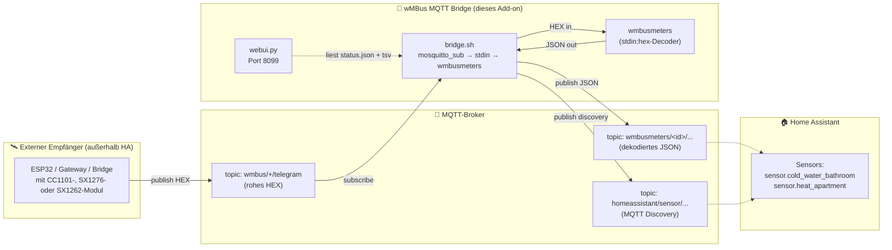
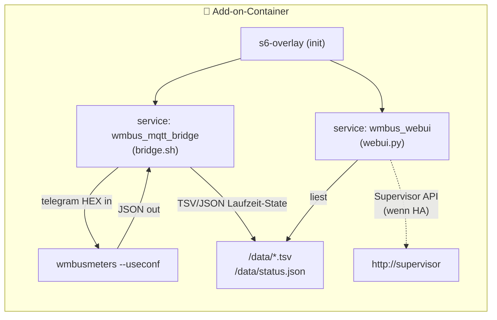
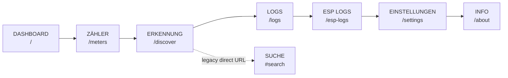
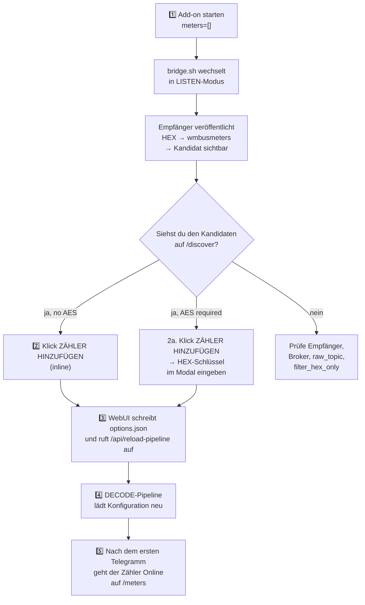
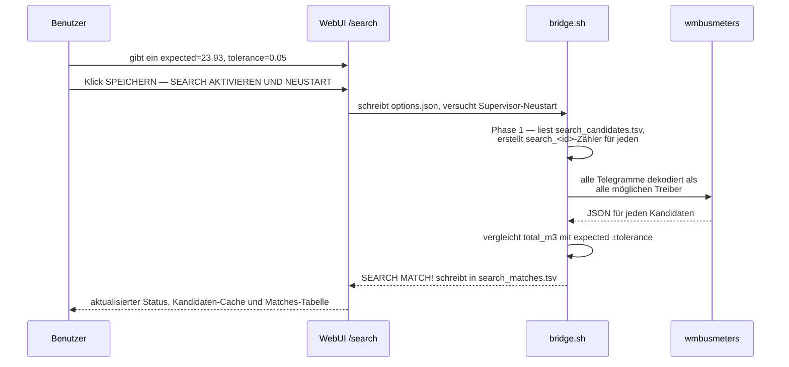
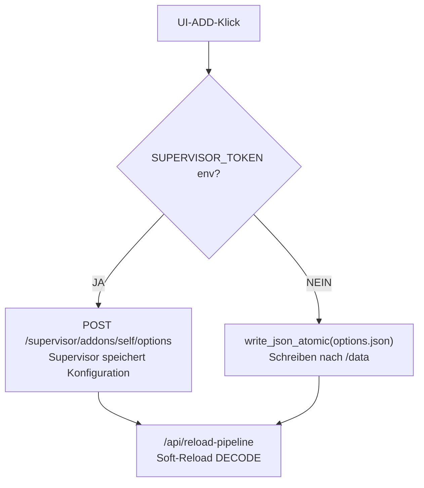
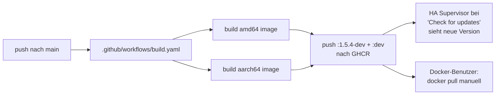

> 🌐 [EN](README.en.md) | [PL](README.pl.md) | [**DE**](README.de.md) | [CS](README.cs.md) | [SK](README.sk.md)

> 🤖 **Maschinelle Übersetzung** — Diese Dokumentation wurde maschinell aus dem Polnischen übersetzt. Sie kann Fehler enthalten.

# wMBus MQTT Bridge — vollständige Dokumentation (DE)

> Aktuell am: **2026-05-29**  ·  Sprache: **Deutsch**  ·  Status: Dev-Channel des Home Assistant Add-ons
>
> Eine kurze zweisprachige Übersicht findest du im Haupt-[README.md](../README.md). Dieses Dokument ist die vollständige deutsche Dokumentation — von „Was ist das?" bis zu Architektur- und Laufzeitdetails.

---

## Inhaltsverzeichnis

1. [TL;DR — was es tut](#1-tldr--was-es-tut)
2. [Datenfluss-Architektur](#2-datenfluss-architektur)
3. [Schnellstart — Home Assistant](#3-schnellstart--home-assistant)
4. [Schnellstart — Docker standalone](#4-schnellstart--docker-standalone)
5. [WebUI — Hauptansichten](#5-webui--hauptansichten)
6. [Typischer Workflow: von leer zum funktionierenden Zähler](#6-typischer-workflow-von-leer-zum-funktionierenden-zähler)
7. [SEARCH-Modus — wenn LISTEN zu viele fremde Zähler hört](#7-search-modus--wenn-listen-zu-viele-fremde-zähler-hört)
8. [Vollständige Konfigurationsreferenz](#8-vollständige-konfigurationsreferenz)
9. [MQTT-Topics — was wir veröffentlichen, was wir konsumieren](#9-mqtt-topics--was-wir-veröffentlichen-was-wir-konsumieren)
10. [Laufzeit-Dateien in `/data/`](#10-laufzeit-dateien-in-data)
11. [Home Assistant vs. Docker — UX-Unterschiede](#11-home-assistant-vs-docker--ux-unterschiede)
12. [UI-Lokalisierung](#12-ui-lokalisierung)
13. [Problemlösung](#13-problemlösung)
14. [Code-Architektur — für Entwickler](#14-code-architektur--für-entwickler)
15. [Versionierung und Docker-Images](#15-versionierung-und-docker-images)
16. [Lizenz und Upstream-Projekte](#16-lizenz-und-upstream-projekte)

---

## 1. TL;DR — was es tut

> **In einem Satz:** Das Add-on dekodiert Wireless-M-Bus-Telegramme (Wasserzähler, Wärmezähler, Stromzähler) **ohne lokalen USB-Dongle** — die rohen HEX-Telegramme liefert ihm ein beliebiger externer Empfänger (ESP32, Bridge, Gateway) über MQTT.

Standardmäßig benötigt `wmbusmeters` einen am Host angeschlossenen Funk-Dongle. Dieses Projekt löst es anders:

- **Du** hast einen Funkempfänger weit weg von Home Assistant (z. B. einen ESP32 auf dem Dachboden mit Antenne).
- **Der Empfänger** veröffentlicht rohe HEX-Frames an MQTT.
- **Dieses Add-on** abonniert diesen Broker, füttert `wmbusmeters` über `stdin:hex`, dekodiert JSON und veröffentlicht das Ergebnis zurück an MQTT + Home Assistant Discovery.

Ergebnis: **Deine Zähler erscheinen als Sensoren in HA, ohne Funkhardware auf der HA-Seite.**

> 🤝 **Zusammenspiel mit der ESPHome-Firmware** — Dieses Add-on wird typischerweise zusammen mit [`esphome-wmbus-bridge-rawonly`](https://github.com/Kustonium/esphome-wmbus-bridge-rawonly) verwendet, einer ESPHome-External-Component, die auf einem ESP32 mit einem **CC1101-, SX1276- oder SX1262**-Funkchip läuft. Der ESP empfängt die Funkframes und veröffentlicht rohes HEX über MQTT; dieses Add-on dekodiert sie. Beide Projekte sind **unabhängig** — das Add-on akzeptiert HEX aus jeder Quelle, die auf das konfigurierte `raw_topic` veröffentlicht.

---

## 2. Datenfluss-Architektur

### Daten-Pipeline



### Komponentenkarte innerhalb des Containers



**Drei parallel laufende Prozesse**, verwaltet von `s6-overlay`:

| Prozess | Was er macht | Datei |
|---|---|---|
| `bridge.sh` | Abonniert MQTT, füttert wmbusmeters mit HEX, parst JSON, veröffentlicht Ergebnisse | [rootfs/usr/bin/bridge.sh](../rootfs/usr/bin/bridge.sh) |
| `wmbusmeters` | Telegramm-Decoder (Upstream-Binary — Fredrik Öhrström) | `/usr/bin/wmbusmeters` |
| `webui.py` | HTTP-Server auf Port 8099, Verwaltungspanel | [rootfs/usr/bin/webui.py](../rootfs/usr/bin/webui.py) |

Die drei Komponenten kommunizieren nur über **Dateien in `/data/`** — keine Sockets innerhalb des Containers. Dadurch kann die WebUI unabhängig von der Bridge neu gestartet werden, und der Zustand bleibt über Neustarts erhalten.

> 🔗 **Auf der Empfängerseite (ESP32 mit Radio)** — wir verwenden Kustoniums Schwesterprojekt: **[esphome-wmbus-bridge-rawonly](https://github.com/Kustonium/esphome-wmbus-bridge-rawonly)** — ESPHome-Firmware für SX1262 / SX1276 / CC1101, die rohes HEX an `wmbus/<device>/telegram` veröffentlicht. In HA passt das zum Standard `raw_topic: wmbus/+/telegram`; in Docker prüfe die generierte `/config/options.json`, weil `docker/entrypoint.sh` aktuell `raw_topic: wmbus_bridge/+/telegram` erzeugt. Der Empfänger hat eine eigene vollständige Dokumentation (EN/PL) — beginne mit [`START_HERE.md`](https://github.com/Kustonium/esphome-wmbus-bridge-rawonly/blob/main/docs/START_HERE.md).

---

## 3. Schnellstart — Home Assistant

### Schritt 1 — Repository hinzufügen

In HA: **Settings → Add-ons → Add-on Store → ⋮ (Menü) → Repositories**, hinzufügen:

```
https://github.com/Kustonium/homeassistant-wmbus-mqtt-bridge
```

### Schritt 2 — Add-on installieren

Im Store **wMBus MQTT Bridge Dev** (Bereich „dev") suchen, **Install** klicken.

> ⚠️ Installiere nicht parallel das offizielle `wmbusmeters`-Add-on — dieses Projekt enthält seine eigene wmbusmeters-Instanz und dupliziert sie.

### Schritt 3 — mit leerer `meters`-Liste starten (LISTEN-Modus)

Klicke **Start**. Standardmäßig `meters: []` — das Add-on geht in den LISTEN-Modus und hört nur zu, konfiguriert noch nichts.

### Schritt 4 — WebUI öffnen

Im **Info**-Tab des Add-ons klicke **OPEN WEB UI**. Das Dashboard begrüßt dich:

```
┌────────────────────────────────────────────────────────────────┐
│ wMBus MQTT Bridge                              [EN PL DE CS SK]│
│ Dashboard | Zähler | Erkennung | Logs | ESP Logs | Einstell.  │
├────────────────────────────────────────────────────────────────┤
│ Dashboard                                                      │
│ [Pipeline] [Statistik]                                         │
│                                                                │
│ ESP -> MQTT -> wmbusmeters -> Home Assistant                   │
│                                                                │
│ Noch keine Zähler konfiguriert                                 │
│   Zur Erkennung gehen, um den ersten Zähler hinzuzufügen       │
│                                                                │
│ Letzte Ereignisse                                              │
└────────────────────────────────────────────────────────────────┘
```

### Schritt 5 — zu „Erkennung" gehen und Zähler hinzufügen

Im **ERKENNUNG**-Tab siehst du die Liste der Kandidaten. **ZÄHLER HINZUFÜGEN** öffnet ein Modal mit ID, Treiber, Name und optionalem AES-Schlüssel. Nach dem Speichern ruft die WebUI `/api/reload-pipeline` auf; die DECODE-Pipeline lädt neu, ohne den Container komplett neu zu starten.

➡️ Vollständige Beschreibung dieses Workflows in [§6 Typischer Workflow](#6-typischer-workflow-von-leer-zum-funktionierenden-zähler).

---

## 4. Schnellstart — Docker standalone

Für alle außerhalb von Home Assistant (DietPi, Ubuntu, Raspberry Pi OS, NAS usw.).

### Voraussetzungen

- Docker + docker compose
- Ein funktionierender MQTT-Broker (Mosquitto, EMQX, …), vom Host erreichbar
- Ein Funkempfänger, der HEX-Frames an den Broker veröffentlicht — z. B. [esphome-wmbus-bridge-rawonly](https://github.com/Kustonium/esphome-wmbus-bridge-rawonly) (veröffentlicht an `wmbus/<device>/telegram`, out-of-the-box kompatibel)

### Installation

```bash
git clone https://github.com/Kustonium/homeassistant-wmbus-mqtt-bridge.git
mkdir -p /home/wmbus-test
cp -a homeassistant-wmbus-mqtt-bridge/docker/examples/* /home/wmbus-test/
cd /home/wmbus-test
docker compose up -d --build
docker compose logs -f wmbus
```

Die ersten Logs sollten zeigen:

```
[wmbus-bridge] mqtt: connected to 192.168.1.10:1883
[wmbus-bridge] No meters configured -> LISTEN MODE
```

### Konfiguration

Bearbeite `./config/options.json`. Vollständige Feldreferenz in [§8](#8-vollständige-konfigurationsreferenz). Minimalbeispiel:

```json
{
  "raw_topic": "wmbus/+/telegram",
  "loglevel": "normal",
  "discovery_enabled": true,
  "state_prefix": "wmbusmeters",
  "mqtt_mode": "external",
  "external_mqtt_host": "192.168.1.10",
  "external_mqtt_port": 1883,
  "external_mqtt_username": "user",
  "external_mqtt_password": "pass",
  "meters": []
}
```

Nach dem Bearbeiten:

```bash
docker compose restart wmbus
```

### WebUI unter Docker

Port 8099 in `docker-compose.yml` freigeben:

```yaml
services:
  wmbus:
    ports:
      - "8099:8099"
```

Dann `http://<host-ip>:8099/` öffnen.

> 💡 Im Docker-Modus zeigt die UI weiterhin den globalen Restart-Button, aber `/api/restart-bridge` benötigt `SUPERVISOR_TOKEN`. Ohne Supervisor den Container manuell neu starten (`docker restart <container>`).

---

## 5. WebUI — Hauptansichten

Die WebUI ist in **5 Sprachen** verfügbar (EN/PL/DE/CS/SK) — Sprachumschalter oben rechts. Die Sprache wird in dieser Reihenfolge erkannt: `?lang=`, Cookie `wmbus_lang`, Header `Accept-Language`.

Die UI aktualisiert sich über SSE von `/api/events`; wenn die Live-Verbindung nicht verfügbar ist, nutzt das Frontend Polling von `/api/app`.

### Tab-Karte



### 5.1. Dashboard (`/`)

Der obere Block hat einen **Pipeline / Statistik**-Umschalter. Pipeline zeigt ESP → MQTT → wmbusmeters → Home Assistant mit Metriken je Stufe; Statistik zeigt Telegrammrate, Funnel und Rate-Historie.

Darunter zeigt das Dashboard Pending/Waiting-Panel, zuletzt dekodierte Zähler oder eine CTA nach `/discover`, sowie letzte Laufzeitereignisse.

Wenn Zähler in `options.json` gespeichert, aber noch nicht dekodiert sind, zeigt das Dashboard „Waiting for first telegram". Siehe [§6](#schritt-3--pipeline-neuladen-und-auf-telegramm-warten).

### 5.2. Zähler (`/meters`)

Tabelle **dekodierter** Zähler. Spalten: ID, Name, Treiber, Wert, letztes Telegramm und Empfang. Der Hauptwert ist der aktuelle Momentanwert oder der Zählerstand (seit Version 1.5.2-dev — siehe [§13](#13-problemlösung)). Jede Zeile hat eine **DELETE**-Aktion. Pending-Einträge aus `options.json` können unter der Tabelle erscheinen, bis das erste Telegramm eintrifft.

### 5.3. Erkennung (`/discover`)

Tabelle der LISTEN-Modus-Kandidaten. Für jeden siehst du: ID, Treiber, Medium (💧/⚡/🔥/📡), Verschlüsselung (AES required / no AES / —), Empfang (15m/60m), letztes Telegramm, eine **Live-Wertvorschau** und Aktionen.

**Automatische Wertvorschau (Auto-Dekodierung).** Kandidaten, die **keinen** AES-Schlüssel benötigen, werden von der parallelen LISTEN-Instanz automatisch dekodiert — ihr aktueller Messwert erscheint in der Spalte **Wert (Vorschau)**, ohne sie als Zähler einzurichten und ohne Preview-Klick. Die Bridge erzeugt temporäre `meter-preview-<id>`-Einträge und schreibt Werte nach `status_candidate_values.tsv`; ein Wert erscheint aber erst nach dem nächsten dekodierten Telegramm. **AES-pflichtige** Kandidaten bleiben ohne Wert, bis du einen Schlüssel angibst.

**Aktionen** hängen vom Verschlüsselungs-Pill ab:

| Pill | Schaltflächen |
|---|---|
| 🟢 **no AES** oder grau **—** | `[ZÄHLER HINZUFÜGEN] [IGNORIEREN]` — ADD öffnet das Modal und schreibt in `options.json` |
| 🔴 **AES required** | `[ZÄHLER HINZUFÜGEN] [IGNORIEREN]` — den 32-Zeichen-HEX-Schlüssel im Modal eintragen; ohne Schlüssel erscheint kein Wert |

Medienfilter oben: **Alle / Wasser / Strom / Wärme / Andere**. Der zweite Link `[Ignoriert]` zeigt zuvor ignorierte Kandidaten (mit WIEDERHERSTELLEN-Option).

### 5.4. Suche (`#search`, Legacy-Modus)

Servicemodus — wird verwendet, wenn LISTEN dutzende Nachbarn-Zähler zurückgibt (z. B. Mietshaus) und du nicht weißt, welcher deiner ist. Er ist nicht mehr in der Hauptnavigation, weil der aktuelle Workflow den Wertfilter in `/discover` nutzt; der Bildschirm funktioniert weiter über den direkten Hash `#search`. Siehe den eigenen Abschnitt [§7](#7-search-modus--wenn-listen-zu-viele-fremde-zähler-hört).

Die UI hat 3 (kontextuelle) Banner:

- 🟢 **MATCH FOUND** — wenn ein Treffer gefunden wurde
- 🟢 **SEARCH MODE ACTIVE** — läuft, wartet auf weitere Telegramme
- 🟡 **SEARCH MODE — Konfiguration** — vor dem Aktivieren

Plus ein Konfigurationsformular (m³-Stand + Toleranz) und Live-Status von bridge.sh (KV: phase, cached, ignored, loaded, decoded, checked, matches, last candidate, last checked, last reason).

### 5.5. Logs (`/logs`)

Kurzer Laufzeit-Ereignisstrom aus [`status_events.tsv`](#10-laufzeit-dateien-in-data) — RAW received, candidate detected, errors. Vollständige Logs sind weiterhin im HA-Add-on-**Log**-Tab.

### 5.6. ESP Logs (`/esp-logs`)

Diagnose der ESP-Empfänger: Geräte aus `wmbus/+/telegram`, optionaler Heartbeat `wmbus/+/diag/summary`, Diagnoseereignisse, Boot und Vorschläge. `diag/boot` und andere retained Diagnoseereignisse sind Logs; sie sind nicht die Quelle für den aktiven Board-Status.

### 5.7. Einstellungen (`/settings`)

Zeigt die aktive Laufzeitkonfiguration (aus `status.json`):
- `raw_topic`, `state_prefix`, `discovery_prefix`
- `search_mode`, `search_expected_value_m3`, `search_tolerance_m3`
- `loglevel`, MQTT-Host, Anzahl ignorierter Kandidaten

Darunter zeigt sie den `options.json`-Snapshot. Der Restart-Button ist global im oberen WebUI-Balken; Ignorieren/Wiederherstellen von Kandidaten erfolgt in der `/discover`-Liste.

### 5.8. Info (`/about`)

Kurze Architekturbeschreibung und ASCII-Diagramm.

---

## 6. Typischer Workflow: von leer zum funktionierenden Zähler



### Schritt 1 — erster Start

`meters: []` in der Konfiguration. Das Add-on startet, verbindet sich mit dem Broker, wartet. In den Logs:

```
[wmbus-bridge] mqtt: connected
[wmbus-bridge] No meters configured -> LISTEN MODE
[wmbus-bridge][INFO] === NEW METER CANDIDATE DETECTED ===
[wmbus-bridge][INFO] Received telegram from: 41553221
[wmbus-bridge][INFO] Suggested driver: mkradio3
```

WebUI → **Erkennung** zeigt 41553221 mit dem Treiber `mkradio3`.

### Schritt 2 — Kandidaten hinzufügen

Für einen Zähler ohne Verschlüsselung: in der **ERKENNUNG**-Zeile `ZÄHLER HINZUFÜGEN` klicken. Im Hintergrund:

1. POST `/add-meter` → `add_meter_to_options(meter_id, driver, "")` in `webui.py`
2. Prüfung von `SUPERVISOR_TOKEN`:
   - **Vorhanden** → POST an `http://supervisor/addons/self/options` mit dem gesamten `meters[]`-Array → Supervisor persistiert es
   - **Fehlt** → `write_json_atomic(/data/options.json, ...)` — direkter Dateischreibvorgang
3. Das Frontend ruft `/api/reload-pipeline` auf; der Backend-Endpunkt setzt `/data/.reload_pipeline`, und der Watcher in `bridge.sh` startet nur die DECODE-Pipeline neu.

Ergebnis: Der Zähler ist in `options.json`, die Pipeline lädt die Konfiguration ohne kompletten Container-Neustart neu. Sichtbar wird der Zähler nach dem nächsten Telegramm dieser ID.

### Schritt 3 — Pipeline neuladen und auf Telegramm warten

Die WebUI unterscheidet zwei Zustände: `pending_restart=true`, wenn `options.json` neuer als `status_bridge_start.txt` ist, und „Waiting for first telegram", wenn der Zähler gespeichert ist, aber noch nicht in `status_meters.tsv` steht.

Typischer Zustand nach erfolgreichem Soft-Reload:

```
┌─────────────────────────────────────────────────────────────┐
│ ⏳ Waiting for first telegram (2)                            │
│ Die Zähler sind gespeichert, die Pipeline wurde neu geladen, │
│ erscheinen aber erst nach dem nächsten Telegramm.            │
│ ┌─────────────────────────────────────────────┐             │
│ │ Meter ID   │ Driver       │ AES             │             │
│ │ 41553221   │ mkradio3     │ kein AES-Schl.  │             │
│ │ aabbccdd   │ amiplus      │ AES-Schl. ges.  │             │
│ └─────────────────────────────────────────────┘             │
└─────────────────────────────────────────────────────────────┘
```

Auf `/meters` können zusätzlich graue/gestrichelte Pending-Karten für konfigurierte, aber noch nicht dekodierte Zähler erscheinen.

Der Mechanismus funktioniert durch Vergleich von `options.json` ↔ `status_meters.tsv`. Ein Eintrag verschwindet aus Pending automatisch, sobald wmbusmeters das erste Telegramm für diese ID dekodiert.

### Schritt 4 — wann ein Add-on-Neustart nötig ist

Hinzufügen eines Zählers über die WebUI ruft `/api/reload-pipeline` auf und braucht normalerweise keinen kompletten Neustart. Entfernen aktualisiert `options.json` und löscht die Statuszeile in der UI, aber das Frontend ruft danach kein `/api/reload-pipeline` auf; die Pipeline kann daher bis zum nächsten Reload oder Neustart die alte Konfiguration nutzen.

Im HA-Modus ruft die Restart-Schaltfläche `POST /restart-bridge` → `http://supervisor/addons/self/restart` auf. Im Docker-Modus trifft derselbe Button die API ohne `SUPERVISOR_TOKEN` und startet den Container nicht neu; nutze manuell `docker restart <container>`. Siehe [§11](#11-home-assistant-vs-docker--ux-unterschiede).

### Schritt 5 — fertig

Nach dem Pipeline-Reload hat wmbusmeters die neue Konfiguration und wartet auf das nächste Telegramm. Wenn es eintrifft:

1. JSON landet in MQTT (`wmbusmeters/<id>/...`)
2. `bridge.sh` schreibt einen Eintrag in `status_meters.tsv`
3. WebUI beim nächsten Refresh (15s) zeigt den Zähler als **Online** statt „Pending"
4. HA Discovery erstellt automatisch Entitäten `sensor.<id>_total_m3` usw.

---

## 7. SEARCH-Modus — wenn LISTEN zu viele fremde Zähler hört

In einem Mehrfamilienhaus fängt dein Empfänger 30-50 Telegramme von Nachbarn. LISTEN zeigt 30 Kandidaten. Welcher ist deiner?

**SEARCH löst es, indem der m³-Stand vom Display des physischen Zählers** mit den Dekodierungen aller Kandidaten verglichen wird.

### Phasen



### Konfiguration über die UI

Gehe auf `/search`:

1. **Zählerstand** — gib den aktuellen Wert vom Display ein, z. B. `23.93` oder `23,93` (beide akzeptiert)
2. **Toleranz m³** — Standard `0.05` (50 Liter). In einem Mehrfamilienhaus **verwende nicht `0.5`** — viele Zähler können ähnliche Werte haben
3. Klick **SPEICHERN — SEARCH AKTIVIEREN UND NEUSTART**

In HA versucht das Backend einen Add-on-Neustart über Supervisor und geht danach in den SEARCH-Modus. In Docker schreibt es die Optionen, kann den Container aber ohne `SUPERVISOR_TOKEN` nicht automatisch neu starten. Warte nach einem wirksamen Neustart/Reload auf weitere Telegramme (typische Intervalle: 30 s — 15 min, je nach Zähler).

### Ergebnis

Wenn ein Treffer gefunden wird:

```
[wmbus-bridge][WARN] SEARCH MATCH: id=03534159 driver=hydrodigit
  media=water field=total_m3 value=23.932 m3
  expected=23.93 diff=0.002000 m3
[wmbus-bridge][WARN] SEARCH SUGGESTED CONFIG:
  {"id":"meter_03534159","meter_id":"03534159","type":"hydrodigit",
   "type_other":"","key":""}
```

Das aktuelle `/search`-Frontend zeigt das SEARCH-Formular, `search_candidates` und `search_matches` als einfache Tabellen. In diesem View werden keine Buttons **ZÄHLER HINZUFÜGEN** oder **KONFIG KOPIEREN** gerendert; das Hinzufügen eines Zählers erfolgt über `/discover` im Add-Meter-Modal.

### Nach dem Abschluss

- **Schalte `search_mode` aus** — kehrt zum Normalbetrieb mit `meters[]` zurück
- Temporäre `search_*`-Zähler erstellen keine HA-Entitäten
- Dateien `/data/search_candidates.tsv` und `/data/search_matches.tsv` können gelöscht werden, damit die nächste Suche mit einem sauberen Zustand startet

---

## 8. Vollständige Konfigurationsreferenz

Aus [`config.yaml`](../config.yaml):

### MQTT — Eingang / Ausgang

| Feld | Typ | Standard | Beschreibung |
|---|---|---|---|
| `raw_topic` | str | HA: `wmbus/+/telegram`; Docker/Fallback: `wmbus_bridge/+/telegram` | Topic mit rohem HEX vom Empfänger. `+` ist MQTT-Wildcard — passt auf ein Segment und wird als ESP-Name in der Diagnose genutzt |
| `filter_hex_only` | bool | `true` | MQTT-Nachrichten ignorieren, die nicht wie HEX aussehen (schützt vor Müll) |
| `mqtt_mode` | enum | `auto` | `auto` (HA-Broker wenn verfügbar, sonst extern), `ha` (HA erzwingen), `external` (immer extern) |
| `external_mqtt_host` | str? | `""` | Externer Broker-Host (wenn `mqtt_mode=external`) |
| `external_mqtt_port` | int | `1883` | Externer Broker-Port |
| `external_mqtt_username` | str? | `""` | Broker-Benutzername |
| `external_mqtt_password` | str? | `""` | Broker-Passwort |

### Discovery und Ausgang

| Feld | Typ | Standard | Beschreibung |
|---|---|---|---|
| `discovery_enabled` | bool | `true` | Veröffentlicht HA-Discovery-Konfiguration |
| `discovery_prefix` | str | `homeassistant` | Standard-HA-Discovery-Präfix |
| `discovery_retain` | bool | `true` | Discovery-Nachrichten als retained |
| `state_prefix` | str | `wmbusmeters` | Topic-Präfix für Zählerwerte |
| `state_retain` | bool | `false` | Retained für State (normalerweise nicht gewünscht, HA pullt sowieso) |

### SEARCH-Modus

| Feld | Typ | Standard | Beschreibung |
|---|---|---|---|
| `search_mode` | bool | `false` | Aktiviert SEARCH (siehe [§7](#7-search-modus--wenn-listen-zu-viele-fremde-zähler-hört)) |
| `search_expected_value_m3` | float | `0` | Erwarteter m³-Stand vom physischen Zähler |
| `search_tolerance_m3` | float | `0.05` | Treffertoleranz — im Mehrfamilienhaus nicht >`0.05` verwenden |
| `search_delta_mode` | bool | `false` | (Experimentell) Vergleicht Delta statt absoluten Wert |
| `search_min_delta_m3` | float | `0.001` | Delta-Schwellenwert für `search_delta_mode` |
| `search_topic` | str | `wmbus/search/candidates` | Optionales MQTT-Topic für Suchergebnisse |

### Debug

| Feld | Typ | Standard | Beschreibung |
|---|---|---|---|
| `loglevel` | enum | `normal` | `normal` / `verbose` / `debug` — verbose loggt jedes empfangene RAW |
| `debug_every_n` | int | `0` | Diagnostik jedes N-te Telegramm loggen (0 = aus) |

### Zähler — `meters[]`

Jeder Eintrag ist ein Objekt:

| Feld | Typ | Erforderlich | Beschreibung |
|---|---|---|---|
| `id` | str | ja | Dein Label, verwendet im MQTT-Topic und HA-Sensornamen |
| `meter_id` | str | ja | 8-Zeichen-HEX, Zähler-Seriennummer (aus LISTEN) |
| `type` | enum | ja | wmbusmeters-Treiber — vollständige Liste von 100+ in [`config.yaml:75`](../config.yaml#L75) oder `auto`/`other` |
| `type_other` | str? | nur wenn `type=other` | Benutzerdefinierter Treibername |
| `key` | str? | nur für verschlüsselte Zähler | 32-Zeichen-HEX, AES-Schlüssel |

Häufigste Treiber für Wasser und Wärme: `multical21`, `iperl`, `flowiq2200`, `mkradio3`, `mkradio4`, `kamwater`, `hydrodigit`, `hydrus`. Strom: `amiplus`. Wärme: `kamheat`, `hydrocalm3`, `qcaloric`.

---

## 9. MQTT-Topics — was wir veröffentlichen, was wir konsumieren

### Wir abonnieren (Eingang)

```
<raw_topic>  →  z. B. wmbus/<receiver_id>/telegram
```

Payload: rohes HEX aus dem wM-Bus-Telegramm, ASCII. Jedes Zeichen `[0-9A-Fa-f]`, Länge typischerweise 40-200 Zeichen. Die Bridge filtert Payloads aus, die nicht zu HEX passen (wenn `filter_hex_only=true`).

Beispiel-Publish vom Empfänger:

```bash
mosquitto_pub -h broker -t 'wmbus/esp32-attic/telegram' \
  -m '244D8C0682185601A06D7AE3000000020FFCB39D000000000B6E000000'
```

### Wir veröffentlichen (Ausgang)

#### State (dekodierte Werte)

```
<state_prefix>/<id>/state
```

Z. B. für einen Zähler `id=cold_water_bathroom`:

```
wmbusmeters/cold_water_bathroom/state
  →  {"id":"cold_water_bathroom","name":"...","media":"water","total_m3":123.456,"flow_m3h":0.0,"timestamp":"2026-05-17T10:00:00+02:00"}
```

Das gesamte dekodierte Telegramm wird als JSON-Payload auf einem einzigen state-Topic pro Zähler veröffentlicht; HA wählt einzelne Felder daraus über `value_template` in Discovery aus.

#### Home Assistant Discovery

```
<discovery_prefix>/sensor/<id>_<field>/config
```

Z. B.:

```
homeassistant/sensor/wmbus_cold_water_bathroom/total_m3/config
  →  {"name":"cold_water_bathroom total_m3",
      "state_topic":"wmbusmeters/cold_water_bathroom/state",
      "value_template":"{{ value_json.get('total_m3') | default(none) }}",
      "json_attributes_topic":"wmbusmeters/cold_water_bathroom/state",
      "expire_after":3600,
      "unit_of_measurement":"m³",
      "device_class":"water",
      "state_class":"total_increasing",
      "unique_id":"wmbus_cold_water_bathroom_total_m3",
      ...}
```

#### SEARCH (optional)

```
<search_topic>  →  z. B. wmbus/search/candidates
```

Kandidaten, die in der LISTEN-Phase des SEARCH-Modus gefunden wurden, werden hier veröffentlicht.

---

## 10. Laufzeit-Dateien in `/data/`

Alle Dateien, die zwischen `bridge.sh` ↔ `webui.py` geteilt werden, leben in `/data/`:

| Datei | Format | Schreibt | Liest | Inhalt |
|---|---|---|---|---|
| `options.json` | JSON | Supervisor / `webui.py` (Fallback) | `bridge.sh`, `webui.py` | Hauptkonfiguration des Add-ons |
| `status.json` | JSON | `bridge.sh` | `webui.py` | Pipeline-State-Snapshot (MQTT connected, counts, config echo) |
| `status_meters.tsv` | TSV | `bridge.sh` | `webui.py` | Dekodierte Zähler — eine Zeile pro meter_id |
| `status_candidates.tsv` | TSV | `bridge.sh` | `webui.py` | LISTEN-Kandidaten |
| `status_candidate_analysis.tsv` | TSV | `bridge.sh` | `webui.py` | Verschlüsselungsanalyse der Kandidaten |
| `status_events.tsv` | TSV | `bridge.sh`, `webui.py` | `webui.py` | Letzte 40 Ereignisse (RAW received, errors, UI actions) |
| `status_seen.tsv` | TSV | `bridge.sh` | `bridge.sh` | Empfangsintervall-Historie (für seen_15m/seen_60m-Statistiken) |
| `status_ignored_candidates.tsv` | text | `webui.py` | `bridge.sh`, `webui.py` | Liste der vom Benutzer ignorierten IDs |
| `status_candidate_values.tsv` | TSV | `bridge.sh` | `webui.py` | Automatisch dekodierte LISTEN-Kandidatenwerte |
| `status_candidate_raw.tsv` | TSV | `bridge.sh` | `bridge.sh` | Letzter RAW pro Kandidat für Verschlüsselungsanalyse |
| `status_raw_count.txt` | int | `bridge.sh` | `bridge.sh` | Zähler aller RAW-Telegramme dieser Sitzung |
| `status_last_raw_seen.txt` | ISO time | `bridge.sh` | `bridge.sh`, `webui.py` | Zeitstempel des letzten RAW |
| `status_recent_raw.tsv` | TSV | `bridge.sh` | (für Debug) | Ringpuffer der letzten N RAW-HEX-Werte |
| `status_rate_1m.json` | JSON | `bridge.sh` | `webui.py` | Telegrammrate der aktuellen/vorigen Minute |
| `status_rate_history.tsv` | TSV | `bridge.sh` | `webui.py` | Rate-Historie für Diagramme |
| `status_bridge_start.txt` | epoch | `bridge.sh` | `webui.py` | Startzeit der Bridge für Pending/Reload-Status |
| `status_esp_telegram_devices.tsv` | TSV | `bridge.sh` | `webui.py` | Aus `wmbus/+/telegram` erkannte ESP-Geräte |
| `status_esp_diag.json` | JSON | `bridge.sh` | `webui.py` | Optionaler letzter `wmbus/+/diag/summary`-Heartbeat |
| `status_esp_events.tsv` | TSV | `bridge.sh` | `webui.py` | Letzte ESP-Diagnoseereignisse |
| `status_esp_suggestion.json` | JSON | `bridge.sh` | `webui.py` | ESP-Diagnosevorschlag |
| `status_esp_boot.json` | JSON | `bridge.sh` | `webui.py` | Letztes ESP-Boot-Ereignis |
| `search_candidates.tsv` | TSV | `bridge.sh` | `bridge.sh` | Wasserzähler-Kandidaten für SEARCH |
| `search_matches.tsv` | TSV | `bridge.sh` | `webui.py` | In SEARCH gefundene Treffer |
| `search_status.json` | JSON | `bridge.sh` | `webui.py` | Live-SEARCH-Status (Phase, Zahlen) |

> ⚠️ Dateien in `/data/etc/` werden **beim Start generiert** — nicht manuell bearbeiten.

Diese Dateien überleben den Container-Neustart (gemountetes `/data`-Volume), aber `options.json` in HA wird vom Supervisor-Zustand überschrieben — manuelle Bearbeitungen der Datei überleben einen Neustart im HA-Modus nicht.

---

## 11. Home Assistant vs. Docker — UX-Unterschiede

Eine Codebasis, zwei Run-Modi. Das Backend liefert `runtime` anhand der `SUPERVISOR_TOKEN`-Umgebungsvariable (HA injiziert sie, wenn `hassio_api: true`), und API-Operationen prüfen diesen Token direkt ohne separate Funktion `is_supervisor_mode()`.

### Was identisch funktioniert

✅ Die gesamte WebUI (Dashboard, Zähler, Erkennung, Suche, Logs, Einstellungen, Info)
✅ 5-Sprachen-Lokalisierung
✅ Hinzufügen über Modal in der Kandidaten-Tabelle (Unterschied nur im Schreiben: API vs. Datei)
✅ Pending-Panel
✅ Bridge.sh — Dekodierung, MQTT, Discovery
✅ Auswahl von Momentanwerten (current_power_kw statt total_kwh)

### Was sich unterscheidet

| Aktion | Home Assistant | Docker standalone |
|---|---|---|
| Zähler hinzufügen | POST `http://supervisor/addons/self/options` (persistent) + `/api/reload-pipeline` | `write_json_atomic(/data/options.json)` + `/api/reload-pipeline` |
| Nach dem Hinzufügen | DECODE-Pipeline lädt neu; der Zähler erscheint nach dem nächsten Telegramm | Gleich |
| Zähler entfernen | POST `/api/remove-meter`; kein automatischer Frontend-Aufruf von `/api/reload-pipeline` | Gleich |
| Voller Add-on-Neustart | Button im oberen Balken (POST `/restart-bridge`) als manuelle/Fallback-Aktion | Derselbe Button versucht `/api/restart-bridge`, aber ohne Supervisor startet er den Container nicht neu; `docker restart <container>` manuell ausführen |
| Neues Image pullen | HA Supervisor automatisch bei „Update Available" | `docker pull ...` manuell |
| Persistenz der Änderungen | Supervisor (Supervisor-DB) | `/data`-Volume |

### Warum

Es gibt keine Supervisor-API in Docker. Das Backend `/api/restart-bridge` gibt einen Fehler wegen fehlendem `SUPERVISOR_TOKEN` zurück; das aktuelle Frontend ersetzt den Restart-Button nicht durch eine Textanweisung.



---

## 12. UI-Lokalisierung

Die WebUI unterstützt 5 Sprachen:

| Code | Sprache | Abdeckung |
|---|---|---|
| `en` | English | 100% |
| `pl` | Polski | 100% |
| `de` | Deutsch | 100% |
| `cs` | Čeština | 100% |
| `sk` | Slovenčina | 100% |

### Wie die Sprache gewählt wird

Hierarchie (erster Match gewinnt):

1. **URL** — `?lang=pl` am Ende der Adresse
2. **Cookie** — `wmbus_lang=pl` (gesetzt beim Klick auf den Umschalter)
3. **Header** — `Accept-Language` vom Browser (z. B. `pl-PL, en;q=0.9`)
4. **Standard** — `en`

### Wie umschalten

Oben rechts auf jeder Seite:

```
[EN]  PL   DE   CS   SK
```

Aktive Sprache hervorgehoben. Klick = setzt das Cookie und lädt die Seite neu.

### Für Entwickler

Alle Übersetzungen leben in einer einzigen Datei — [rootfs/usr/bin/i18n.py](../rootfs/usr/bin/i18n.py). 153 Schlüssel × 5 Sprachen. Hinzufügen eines neuen Schlüssels:

1. In `I18N["en"]`, `I18N["pl"]`, … alle 5 Wörterbücher hinzufügen
2. In `webui.py` als `tr(lang, "dein_schluessel")` verwenden

Übersetzungen werden durch direkte `tr()`-Aufrufe angewendet — der alte `localize_html`-Mechanismus (String-Ersetzung) ist nur ein Fallback.

---

## 13. Problemlösung

### „Ich sehe keine Telegramme" (RAW count = 0)

Prüfe der Reihe nach:

1. **Veröffentlicht der Empfänger im richtigen Topic?**
   - Deine Konfiguration hat `raw_topic: "wmbus/+/telegram"` — der Empfänger muss in `wmbus/<irgendetwas>/telegram` veröffentlichen
   - Manueller Test:
     ```bash
     mosquitto_sub -h <broker> -t 'wmbus/#' -v
     ```
2. **Ist die Bridge abonniert?** Die Logs sollten enthalten:
   ```
   [wmbus-bridge] mqtt: connected
   [wmbus-bridge] mqtt: subscribed to wmbus/+/telegram
   ```
3. **Verwirft `filter_hex_only` sie?** Aktiviere `loglevel: verbose` und prüfe, ob die Logs `dropped (not HEX)` sagen. Dein Empfänger sendet möglicherweise base64 oder JSON — in diesen Fällen den Filter deaktivieren oder das Format ändern.
4. **Ist der Broker erreichbar?** `mqtt_mode=auto` versucht zuerst HA, dann external. Prüfe die Logs auf Connection-Errors.

### „Kandidat hinzugefügt, aber der Zähler erscheint nicht in Zähler"

- Klick auf **ZÄHLER HINZUFÜGEN** schreibt in `options.json`; das Frontend ruft danach `/api/reload-pipeline` auf. Das lädt die DECODE-Pipeline ohne kompletten Container-Neustart neu.
- Der Zähler erscheint in `/meters` erst nach dem nächsten Telegramm dieser ID — das kann von einigen Dutzend Sekunden bis zu vielen Minuten dauern.
- Wenn er danach weiter fehlt, `meter_id`, Treiber, AES-Schlüssel und Logs prüfen. Ein voller Add-on-Neustart bleibt Fallback in `/settings`.

### „Der Wert zeigt eine Zahl, die nur wächst, nicht eine Momentanzahl"

Seit Version **1.5.2-dev** bevorzugt die UI Momentanwerte (`current_power_kw`, `volume_flow_m3h`, `_kw$`/`_w$`/`_m3h$`/`_l_h$`) gegenüber Totals (`total_energy_consumption_kwh`).

Für einen Wasserzähler ohne `volume_flow_m3h` (z. B. mkradio3) — `total_m3` ist das einzige sinnvolle Feld und das wird angezeigt. Es ist der **Zählerstand** (wie auf dem Display des Wasserzählers), nicht der kumulative Verbrauch — obwohl die Zahl wächst, ist sie aktuell für heute.

Die vollständige Auswahllogik [in bridge.sh — `status_meter_seen`](../rootfs/usr/bin/bridge.sh).

### „HA zeigt kein Add-on-Update"

HA Supervisor erkennt eine neue Version nur, wenn sich `version:` in `config.yaml` ändert. Das Image-Tag auf GHCR wird aus `version:` abgeleitet. Siehe [§15](#15-versionierung-und-docker-images).

Prüfung erzwingen: **Settings → System → ⋮ → Reload** oder `ha supervisor restart` von der HA-Host-CLI.

### „Ich habe einen verschlüsselten Zähler, aber ich weiß nicht, woher ich den AES-Schlüssel bekomme"

Der AES-Schlüssel wird bereitgestellt von:
- **Dem Zählerlieferanten** (Hausverwaltung, Wasser-/Wärmelieferant)
- **Einem Aufkleber auf dem Zähler** (selten)
- **Zählerdokumentation** (falls vorhanden)

Ohne Schlüssel kannst du verschlüsselte Telegramme nicht dekodieren. Manche Zähler verwenden einen sogenannten „zero-key" (`00000000000000000000000000000000`) als Fassaden-Verschlüsselung — funktioniert manchmal.

### „Zähler hinzufügen hat nichts gemacht" (unter Docker)

Prüfe:
- Ist das Verzeichnis `./config/` für den Container-Benutzer **schreibbar** (nicht `:ro`)
- Steht in den Logs `Meter added to options.json (file only — no SUPERVISOR_TOKEN)` — das bedeutet, die Datei wurde gespeichert.
- Prüfe den Inhalt von `options.json` nach dem Klick — sollte einen neuen Eintrag in `meters[]` enthalten. Nach erfolgreichem Hinzufügen ruft das Frontend `/api/reload-pipeline` auf; manueller `docker restart` ist nur ein Fallback, falls die Pipeline trotzdem nicht neu lädt.

---

## 14. Code-Architektur — für Entwickler

### Repository-Struktur

```
.
├── config.yaml                  # HA-Add-on-Manifest: Optionen, Schema, Image
├── Dockerfile                   # Multi-stage: builder + docker + addon
├── repository.yaml              # HA-Repo-Manifest
├── CHANGELOG.md
├── README.md
├── docs/                        # Vollständige mehrsprachige Dokumentation
│   ├── README.en.md
│   ├── README.pl.md
│   ├── README.de.md
│   ├── README.cs.md
│   └── README.sk.md
├── docker/                      # Dateien nur für Docker standalone
│   ├── entrypoint.sh
│   └── examples/                # docker-compose + Beispiel-config/
├── rootfs/                      # Kopiert nach / im HA-Image
│   ├── etc/services.d/          # s6-overlay-Service-Definitionen
│   │   ├── wmbus_mqtt_bridge/
│   │   └── wmbus_webui/
│   └── usr/
│       ├── bin/
│       │   ├── bridge.sh        # 2000+ Zeilen — Hauptschleife, MQTT, Decode
│       │   ├── i18n.py          # Übersetzungen für 5 Sprachen
│       │   ├── run.sh           # Startup-Wrapper für HA-Modus
│       │   └── webui.py         # 1300+ Zeilen — HTTP-API-Server für die SPA
│       └── share/wmbus-webui/
│           └── assets/app.js    # 2200+ Zeilen — WebUI-SPA
├── translations/                # HA-Add-on-Options-Übersetzungen (en.yaml, pl.yaml)
└── .github/workflows/           # CI: build-addon, shellcheck, yaml-lint
```

### Hauptkomponenten

#### `bridge.sh` (2000+ Zeilen)

Bash, ein Prozess. Hauptschleife:

1. **Setup** — `options.json` lesen, `wmbusmeters.conf` in `/data/etc/` generieren
2. **MQTT subscribe** — `mosquitto_sub` auf `raw_topic`; jedes Telegramm aktualisiert RAW-Zähler, Recent RAW und ESP-Erkennung aus `wmbus/+/telegram`
3. **HEX → wmbusmeters** — HEX-Payload geht über `stdin:hex` an die DECODE-Instanz
4. **JSON/Text parse** — `run_once()` verarbeitet `wmbusmeters`-Ausgabe und schreibt Zähler, Kandidaten und Events
5. **Status-Update** — Schreiben in `status_meters.tsv`, `status_candidates.tsv`, `status_candidate_values.tsv`, `status_events.tsv`, `status.json`
6. **HA Discovery publish** — MQTT-Discovery-Nachrichten für jedes neue Feld berechnet
7. **Parallel LISTEN** — `start_listen_instance()` hält Kandidatensuche und automatische Wertvorschau aktiv
8. **SEARCH** — wenn aktiviert, dekodiert Kandidaten aus `search_candidates.tsv`

Schlüsselfunktionen:
- `status_meter_seen()` ([Zeile 441](../rootfs/usr/bin/bridge.sh#L441)) — schreibt einen Eintrag in `status_meters.tsv`, wählt value_key (Momentanwert > kumulativ)
- `status_candidate_seen()` ([Zeile 475](../rootfs/usr/bin/bridge.sh#L475)) — registriert einen LISTEN-Kandidaten
- `_store_candidate_value()` ([Zeile 1692](../rootfs/usr/bin/bridge.sh#L1692)) — speichert automatisch dekodierte Kandidatenwerte
- `parse_listen_candidates()` ([Zeile 1729](../rootfs/usr/bin/bridge.sh#L1729)) — verarbeitet die parallele LISTEN-Instanz
- `run_once()` ([Zeile 1776](../rootfs/usr/bin/bridge.sh#L1776)) — Hauptzyklus DECODE
- `start_listen_instance()` ([Zeile 1946](../rootfs/usr/bin/bridge.sh#L1946)) — hält die always-on LISTEN-Pipeline

#### `webui.py` (1300+ Zeilen)

Python 3.12, `http.server.ThreadingHTTPServer`. Kein Framework — JSON/SSE-API und statische SPA. Hauptabschnitte:

- **`add_meter_to_options()`** ([Zeile 354](../rootfs/usr/bin/webui.py#L354)) — Supervisor API + File-Fallback
- **`state()`** ([Zeile 585](../rootfs/usr/bin/webui.py#L585)) — liest Runtime-Dateien für die API
- **`status_model()`** ([Zeile 686](../rootfs/usr/bin/webui.py#L686)) — baut das Dashboard-/Pipeline-Modell
- **`_esp_payload()`** ([Zeile 860](../rootfs/usr/bin/webui.py#L860)) — baut ESP-Diagnose; Aktivität kommt aus `wmbus/+/telegram`, `wmbus/+/diag/summary` ist optional
- HA- vs. Docker-Modus wird über direkte `SUPERVISOR_TOKEN`-Prüfungen und das Feld `runtime` in API-Antworten erkannt; eine separate Funktion `is_supervisor_mode()` gibt es nicht.
- **`Handler` (BaseHTTPRequestHandler)** — GET/POST-Routing, Spracherkennung, Cookie-Handling

#### `app.js` (2200+ Zeilen)

Frontend-SPA aus `rootfs/usr/share/wmbus-webui/assets/app.js`. Rendert Dashboard, `/meters`, `/discover`, `/search`, `/logs`, `/esp-logs`, `/settings` und `/about`; liest `/api/app`, nutzt SSE aus `/api/events`, bedient das Add-Meter-Modal und ruft nach dem Speichern `/api/reload-pipeline` auf.

Lokalisierung (`i18n.py`):
- `tr(lang, key)` — Hauptübersetzungsfunktion
- `localize_html(html, lang)` — Legacy-String-Ersetzung (Fallback)
- `detect_lang(headers, params)` — URL → Cookie → Accept-Language → default

#### `wmbusmeters` (upstream)

Binary, kompiliert aus [upstream](https://github.com/wmbusmeters/wmbusmeters) in der Dockerfile-Builder-Stage. Aufgerufen mit `stdin:hex` — liest HEX von stdin, dekodiert, veröffentlicht JSON an MQTT.

> ⚙️ Ein Patch im Dockerfile entfernt `-flto` aus dem Makefile, weil die aktuelle Alpine-Toolchain Probleme mit LTO hat.

### Lokaler Build

```bash
# HA-Image-Build (multi-arch):
docker buildx build \
  --build-arg BUILD_FROM=ghcr.io/home-assistant/amd64-base:3.20 \
  --target addon \
  -t wmbus-mqtt-bridge:local \
  .

# Docker-standalone-Image-Build:
docker buildx build \
  --build-arg BUILD_FROM=ghcr.io/home-assistant/amd64-base:3.20 \
  --target docker \
  -t wmbus-bridge-docker:local \
  .
```

### Lokale webui.py-Tests

```bash
cd rootfs/usr/bin
WMBUS_BASE=/tmp/wmbus-test python webui.py
# Öffne http://localhost:8099/
```

Mit Fake-Daten (smoke test):

```python
import os, tempfile, json, pathlib
base = tempfile.mkdtemp()
os.environ['WMBUS_BASE'] = base
p = pathlib.Path(base)
p.joinpath('options.json').write_text(json.dumps({
    'meters': [{'id':'test','meter_id':'12345678','type':'multical21','key':''}]
}))
p.joinpath('status_meters.tsv').write_text('')
import webui
print(webui.render_page('/discover', {}, 'pl'))
```

---

## 15. Versionierung und Docker-Images

### Versionsschema

`MAJOR.MINOR.PATCH-dev` — semver mit `-dev`-Suffix (Entwicklerkanal).

| Teil | Bumpt bei |
|---|---|
| MAJOR | Breaking Change in Konfiguration / MQTT / Discovery |
| MINOR | Neue Funktionen (z. B. Lokalisierung, Pending-Panel, Hinzufügen über Modal) |
| PATCH | Bug-Fixes, kleinere UX |
| `-dev` | Solange wir im Entwicklerkanal sind |

### GHCR-Image-Tags

Jeder Build pusht 2 Tags:

```
ghcr.io/kustonium/amd64-addon-wmbus_mqtt_bridge-dev:1.5.4-dev   ← Version
ghcr.io/kustonium/amd64-addon-wmbus_mqtt_bridge-dev:dev          ← Rolling Latest
```

Plus dasselbe für `aarch64-addon-...`. HA Supervisor verwendet das Versions-Tag (aus `image` + `version` in `config.yaml`).

### CI/CD-Workflow



Ein Versions-Bump in `config.yaml` ist **erforderlich**, damit HA ein Update erkennt — ohne Änderung von `version:` schaut HA nicht auf GHCR, selbst wenn das Image neu gebaut wurde.

---

## 16. Lizenz und Upstream-Projekte

### Lizenz

**GNU General Public License v3.0 (GPL-3.0)**

Dieses Repository enthält und modifiziert Code aus dem `wmbusmeters-ha-addon`-Projekt (GPL-3.0). Das gesamte Projekt — einschließlich des Forks, neuer Komponenten (webui.py, i18n.py, bridge.sh-Rewrite, Pending-Panel, Hinzufügen über Modal) — wird unter GPL-3.0 distribuiert.

### Upstream

- **wmbusmeters** — https://github.com/wmbusmeters/wmbusmeters (Fredrik Öhrström, GPL-3.0)
  - Der wM-Bus-Telegramm-Decoder, kompiliert aus dem Quellcode im Dockerfile
- **wmbusmeters-ha-addon** — https://github.com/wmbusmeters/wmbusmeters-ha-addon (GPL-3.0)
  - Das ursprüngliche HA-Add-on, mit dem der Fork gestartet ist

### Attribution

Das Projekt ist ein von **Kustonium** entwickelter Fork. Der Hauptunterschied zum Upstream: MQTT-Eingang statt eines lokalen Dongles, WebUI auf Polnisch/Englisch/Deutsch/Tschechisch/Slowakisch, vollständiger LISTEN → ADD → SEARCH-Workflow über die UI.

---

**Ende der Dokumentation.** Fragen, Bugs, Vorschläge → [GitHub Issues](https://github.com/Kustonium/homeassistant-wmbus-mqtt-bridge/issues).

📚 Dokument vorbereitet von Paige (BMad Method Technical Writer) für Foszt · 2026-05-17
