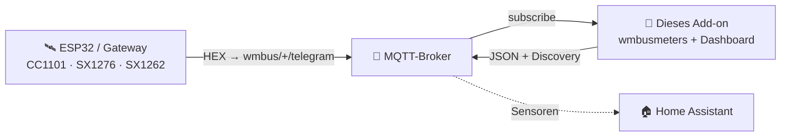
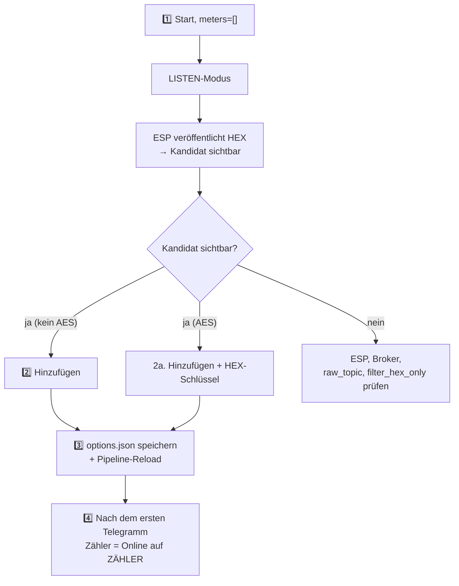

> 🌐 [EN](README.en.md) | [PL](README.pl.md) | [**DE**](README.de.md) | [CS](README.cs.md) | [SK](README.sk.md)

# wMBus MQTT Bridge — Benutzerhandbuch (DE)

> Ein benutzerorientierter Leitfaden: Installation, Zähler hinzufügen, Dashboard
> lesen, Fehlerbehebung. **Wie es intern funktioniert** (Architektur, Runtime-
> Dateien, Soft-Reload, ESP-Diagnosevertrag) steht in
> [`ARCHITECTURE.md`](ARCHITECTURE.md).

---

## Inhaltsverzeichnis

1. [Was es tut](#1-was-es-tut)
2. [Voraussetzungen](#2-voraussetzungen)
3. [Schnellstart — Home Assistant](#3-schnellstart--home-assistant)
4. [Schnellstart — Docker standalone](#4-schnellstart--docker-standalone)
5. [Die WebUI — was du siehst](#5-die-webui--was-du-siehst)
6. [Typischer Ablauf: von leer zu einem laufenden Zähler](#6-typischer-ablauf-von-leer-zu-einem-laufenden-zähler)
7. [SEARCH-Modus — wenn zu viele fremde Zähler zu hören sind](#7-search-modus--wenn-zu-viele-fremde-zähler-zu-hören-sind)
8. [Konfigurationsoptionen](#8-konfigurationsoptionen)
9. [Sprache der Oberfläche](#9-sprache-der-oberfläche)
10. [Fehlerbehebung](#10-fehlerbehebung)
11. [Wie es unter der Haube funktioniert](#11-wie-es-unter-der-haube-funktioniert)
12. [Lizenz und Upstream](#12-lizenz-und-upstream)

---

## 1. Was es tut

> **In einem Satz:** Es dekodiert Wireless-M-Bus-Telegramme (Wasser-, Wärme- und
> Stromzähler) **ohne lokalen USB-Dongle** — die rohen HEX-Frames liefert ein
> beliebiger externer Empfänger (ESP32, Gateway) über MQTT.

- **Du** platzierst den Funkempfänger dort, wo Empfang ist (z. B. ein ESP32 mit Antenne).
- **Der Empfänger** veröffentlicht rohe HEX-Frames per MQTT (`wmbus/<device>/telegram`).
- **Dieses Add-on** verbindet sich mit dem Broker, speist `wmbusmeters`, dekodiert
  die Telegramme und veröffentlicht das Ergebnis zurück nach MQTT + **Home Assistant Discovery**.

Ergebnis: **Deine Zähler erscheinen als Sensoren in HA, ganz ohne Funkhardware auf der HA-Seite.**



> 🤝 Üblicherweise mit der Firmware **[esphome-wmbus-bridge-rawonly](https://github.com/Kustonium/esphome-wmbus-bridge-rawonly)**
> verwendet (ESP32 + CC1101/SX1276/SX1262, veröffentlicht RAW HEX). Beide Projekte
> sind unabhängig — das Add-on nimmt Hex von jeder Quelle an, die auf `raw_topic` veröffentlicht.

> 🌉 **Als Ganzes bilden der ESP (RF-Empfänger) und dieses Add-on (Decoder)
> ein verteiltes _wM-Bus → Home-Assistant-Gateway_** — das Funkmodul steht dort,
> wo Empfang ist, das Dekodieren (Entschlüsselung, Treiber, ~120 Zählertypen)
> läuft auf HA. Anders als monolithische wM-Bus-Gateways (Funk + Decoder in
> einer Box) braucht es keinen lokalen USB-Dongle und skaliert durch das
> Hinzufügen günstiger ESP-Knoten.
>
> **Jede Hälfte läuft auch eigenständig und ist austauschbar:** der ESP speist ein beliebiges MQTT-Backend (Node-RED, ein eigenes Skript, ein eigener Decoder), und das Add-on dekodiert Hex aus beliebiger Quelle auf `raw_topic` (dieser ESP, rtl-wmbus, ein anderes Gateway, das Replay-Tool) — sie kooperieren, aber keine hängt von der anderen ab.

---

## 2. Voraussetzungen

- Ein **MQTT-Broker** (Mosquitto, EMQX…), erreichbar von HA / vom Host.
- Ein **Empfänger**, der HEX-Frames auf `wmbus/<device>/telegram` veröffentlicht.
- Home Assistant (Add-on-Modus) **oder** Docker + compose (standalone).

> ⚠️ Betreibe nicht parallel das offizielle `wmbusmeters`-Add-on — dieses Projekt
> hat seine eigene Instanz und sie würden sich doppeln.

> 🧱 **Verantwortungsgrenze.** Dieses Projekt liefert zwei MQTT-Clients — die ESP-Firmware (Funk → MQTT) und dieses Add-on (MQTT → Dekodierung → HA); sein Geltungsbereich endet am MQTT-Topic. **Der Broker selbst — Authentifizierung, ACLs, TLS, Netzwerk-Exposition und ein etwaiges Broker-zu-Broker-Bridging für entfernte/verteilte Setups (Standort A → Internet → Standort B) — liegt in der Verantwortung des Betreibers.** Empfohlen: Broker im LAN halten; für Fernzugriff Tunnel/VPN oder Broker-Bridging mit TLS nutzen; Port 1883 und die WebUI (8099) nicht direkt ins Internet stellen. Hinweis: bei AES-verschlüsselten Zählern bleibt die Nutzlast vom Zähler Ende-zu-Ende verschlüsselt, unabhängig vom Broker-Transport.

> ⚠️ **Neu hier? Lies das, bevor du etwas exponierst.** Leite den Broker-Port (1883) oder Home Assistant **nicht** über deinen Heimrouter ins Internet weiter — ein exponierter Broker kann von jedem gelesen und missbraucht werden. Für Zugriff von außen nutze eine fertige, sichere Option: **Home Assistant Cloud (Nabu Casa)** oder die Add-ons **Tailscale** / **Cloudflare Tunnel**. Unsicher? Lass alles im Heimnetz — das Add-on braucht keinen Internetzugang.

---

## 3. Schnellstart — Home Assistant

1. **Repository hinzufügen:** Settings → Add-ons → Add-on Store → ⋮ → Repositories:
   ```
   https://github.com/Kustonium/homeassistant-wmbus-mqtt-bridge
   ```
2. **Installiere** „wMBus MQTT Bridge", klicke **Start** (mit dem Default
   `meters: []` geht das Add-on in den **LISTEN-Modus** und hört nur zu).
3. **Öffne die WebUI** (Info → OPEN WEB UI).
4. Gehe zu **EMPFANG / SUCHE**, finde deinen Zähler unter den erkannten Kandidaten
   und klicke **Hinzufügen** (Modal: ID, Treiber, Name, optionaler AES-Schlüssel).
   Nach dem Speichern lädt sich die Pipeline selbst neu (kein Container-Neustart).

Vollständige Anleitung in [§6](#6-typischer-ablauf-von-leer-zu-einem-laufenden-zähler).

---

## 4. Schnellstart — Docker standalone

Für alles außerhalb von HA (DietPi, Ubuntu, Raspberry Pi OS, NAS…).

```bash
git clone https://github.com/Kustonium/homeassistant-wmbus-mqtt-bridge.git
mkdir -p /home/wmbus
cp -a homeassistant-wmbus-mqtt-bridge/docker/examples/* /home/wmbus/
cd /home/wmbus
docker compose up -d --build
docker compose logs -f wmbus
```

Konfiguration in `./config/options.json` (Feldreferenz in [§8](#8-konfigurationsoptionen)):

```json
{
  "raw_topic": "wmbus/+/telegram",
  "discovery_enabled": true,
  "state_prefix": "wmbusmeters",
  "mqtt_mode": "external",
  "external_mqtt_host": "192.168.1.10",
  "external_mqtt_port": 1883,
  "external_mqtt_username": "user",
  "external_mqtt_password": "pass",
  "meters": []
}
```

Nach dem Bearbeiten: `docker compose restart wmbus`. WebUI: Port `8099` in
`docker-compose.yml` freigeben und `http://<host-ip>:8099/` öffnen.

> 💡 In Docker tut der globale Neustart-Button nichts (kein Supervisor) — nutze
> `docker restart <container>`.

---

## 5. Die WebUI — was du siehst

Verfügbar in **5 Sprachen** (EN/PL/DE/CS/SK) — Umschalter oben rechts.

| Tab | Zweck |
|---|---|
| **PANEL** | Dashboard: die Pipeline ESP→MQTT→wmbusmeters→HA (klickbare Kacheln) + Statistik. |
| **ZÄHLER** | Deine konfigurierten Zähler: Wert, letztes Telegramm, **EMPFANG**. |
| **EMPFANG / SUCHE** | Erkannte Kandidaten + konfigurierte „on air"; hier Zähler hinzufügen/entfernen. |
| **LOGS / ESP-LOGS** | Runtime-Ereignisse und ESP-Empfänger-Diagnose. |
| **EINSTELLUNGEN / ÜBER** | Aktive Konfiguration, Info. |

### Die Spalte EMPFANG (was die Badges bedeuten)

Fahre mit der Maus über das **ⓘ** neben der EMPFANG-Überschrift für eine Legende. Kurz:

- **Status + Balken** — ob der Zähler ankommt: *online* / *überfällig* / **still**.
  Die Schwelle ist **adaptiv** zum eigenen Rhythmus des Zählers (sein Durchschnitts-
  intervall). Längere Stille ist **neutral** (grau), kein roter Alarm — ein Zähler
  kann nachts / bei Abwesenheit / bei schwacher Batterie still sein, wir schlagen
  also keinen Fehlalarm.
- **📡 ESP** — der Zähler ist auf einem der ESPs markiert (highlight).
- **📶 Name N% · Anzahl** — Empfang % und Telegramm-Anzahl **pro ESP** (aus der
  optionalen Diagnose). Bei mehreren ESPs siehst du, welcher Empfänger den Zähler
  hört und wie gut. Farbe: grün ≥90 · gelb ≥50 · rot <50.

> Rohwert % und Anzahl sind **kein** Maß für die Empfindlichkeit der Platine
> (kumulativer Zähler seit Boot, unterschiedliche Uptimes). Echte Empfindlichkeit
> ist **Abdeckung** — welche Zähler eine Platine überhaupt hört.

### Zähler hinzufügen / entfernen (EMPFANG)

- Kandidaten ohne AES werden automatisch dekodiert — die Spalte **Wert** zeigt eine
  Live-Vorschau ohne Konfiguration.
- **Hinzufügen** speichert den Zähler und lädt die Pipeline neu.
- **Vergleichen** im Modal **Hinzufügen** oder **Driver…** dekodiert das letzte
  Telegramm mit zwei Treibern, ohne Änderungen zu speichern. Wähle einen Treiber
  im Feld **Treiber**, gib bei verschlüsselten Zählern den AES-Schlüssel ein und
  klicke **Vergleichen**. Links steht der gespeicherte Treiber oder die
  Auto-Erkennung von `wmbusmeters`, rechts der ausgewählte Treiber. Grüne Zeilen
  sind zusätzliche Felder, gelbe Zeilen andere Werte; mehr Felder bedeuten **nicht**
  automatisch richtig — prüfe die Werte am Zählerdisplay.
- **Melden…** für einen Kandidaten verwendet absichtlich keinen AES-Schlüssel und
  zeigt keine privaten Zählerstände. Werte vor dem Hinzufügen siehst du über
  **Hinzufügen → Vergleichen** mit AES-Schlüssel in diesem Modal.
- **Ausgewählte entfernen** — Checkboxen markieren und mehrere auf einmal entfernen
  (Button über der Tabelle).

---

## 6. Typischer Ablauf: von leer zu einem laufenden Zähler



1. **Start** mit `meters: []` → LISTEN-Modus, Log zeigt `No meters configured -> LISTEN MODE`.
2. **Hinzufügen** eines Kandidaten (ohne AES — sofort; AES — den 32-Zeichen-HEX-Schlüssel eingeben).
3. Das Speichern landet in `options.json` und die DECODE-Pipeline lädt **ohne
   vollständigen Container-Neustart** neu.
4. Nach dem **nächsten Telegramm** dieses Zählers (von einigen Sekunden bis wenige
   Minuten, je nach Zähler) erscheint er als **Online** auf ZÄHLER, und HA Discovery
   erstellt Entitäten wie `sensor.<id>_total_m3`.

Bis das erste Telegramm eintrifft, zeigt das Dashboard ein Panel **„wartet auf das
erste Telegramm"**. Ein voller Add-on-Neustart ist nur ein Notfall-Fallback.

**Nicht unterstützter Zähler?** Wenn ein Kandidat nie dekodiert wird (unbekannter
Treiber / „unknown format signature"), nutzen Sie den Button **Meldung…** in
seiner Zeile: das Add-on erstellt einen fertigen Issue-Block für das
wmbusmeters-Upstream-Projekt (Roh-Telegramm + `wmbusmeters --analyze`-Ausgabe).
Das Telegramm enthält die Seriennummer des Zählers; der AES-Schlüssel wird nie
beigefügt.

---

## 7. SEARCH-Modus — wenn zu viele fremde Zähler zu hören sind

In einem Mehrfamilienhaus empfängt der Empfänger Dutzende fremder Zähler. SEARCH
findet deinen, indem es **den m³-Stand auf deiner physischen Anzeige** mit den
Dekodierungen aller Kandidaten vergleicht.

1. Öffne `#search`, gib den **aktuellen Stand** von der Anzeige ein (z. B. `23.93`)
   und eine **Toleranz** (Default `0.05` = 50 l; im Block nicht erhöhen).
2. Aktiviere SEARCH. Das Add-on dekodiert Kandidaten mit jedem Treiber und sucht
   eine Übereinstimmung `total_m3 ≈ Stand ± Toleranz`.
3. Bei einem Treffer zeigt das Log `SEARCH MATCH: id=… driver=…` — füge diesen Zähler
   aus EMPFANG hinzu.
4. **Schalte `search_mode` aus**, wenn fertig (temporäre SEARCH-Zähler erzeugen keine HA-Entitäten).

---

## 8. Konfigurationsoptionen

Aus [`config.yaml`](../config.yaml).

### MQTT — Eingang / Ausgang

| Feld | Typ | Default | Beschreibung |
|---|---|---|---|
| `raw_topic` | str | `wmbus/+/telegram` | Topic mit den rohen HEX-Frames. `+` = Wildcard (ESP-Name in der Diagnose) |
| `filter_hex_only` | bool | `true` | Nachrichten ignorieren, die nicht wie HEX aussehen |
| `mqtt_mode` | enum | `auto` | `auto` (Reihenfolge: `external_mqtt_host`, falls gesetzt → HA-Broker aus dem Supervisor-Dienst → Probe bekannter Broker-Add-ons `core-mosquitto`/`a0d7b954-emqx`, mit `external_mqtt_username/password`, falls angegeben) / `ha` (HA erzwingen) / `external` (immer extern) |
| `external_mqtt_host/port/username/password` | str/int | — | Externer Broker (bei `external`) |

### Discovery und Ausgabe

| Feld | Typ | Default | Beschreibung |
|---|---|---|---|
| `discovery_enabled` | bool | `true` | HA Discovery veröffentlichen |
| `discovery_prefix` | str | `homeassistant` | Discovery-Präfix |
| `discovery_retain` | bool | `true` | Discovery als retained |
| `state_prefix` | str | `wmbusmeters` | Präfix des Wert-Topics |
| `state_retain` | bool | `false` | Retained State |
| `verify_ha_entities` | bool | `false` | (Opt-in) die HA Core API fragen, ob die Entitäten tatsächlich erstellt wurden. Aktivierung gewährt Lesezugriff auf die HA Core API. |

Jede per Discovery angelegte Entität trägt ein **Availability-Template**: fehlt
ein Feld im letzten Telegramm des Zählers (manche Zähler senden abwechselnd
kurze und vollständige Rahmen), zeigt die Entität `unavailable` statt eines
veralteten oder falschen Werts — und erholt sich automatisch mit dem nächsten
Telegramm, das das Feld enthält. Unabhängig davon markiert ein automatisch
abgestimmtes `expire_after` (ca. 2× das beobachtete Sendeintervall des Zählers,
mindestens 1 h) Entitäten als `unavailable`, wenn der Zähler verstummt.

Über die numerischen Mess-Sensoren hinaus erhält jeder Zähler, der ein Feld
`status` meldet, zwei **Diagnose**-Entitäten (im Abschnitt *Diagnose* des
Geräts): einen `sensor` mit dem rohen Statustext und einen `binary_sensor`
(`device_class: problem`), der *an* ist, sobald der Status etwas anderes als
`OK` ist. Der Text wird unverändert von wmbusmeters übernommen, die konkreten
Flags hängen also vom Treiber ab — z. B. dekodiert `elf2` das vollständige
Fehler-Bitfeld des Wärmezählers (`DIFFERENTIAL_TEMPERATURE_TOO_LOW`,
`TEMPORARY_ERROR`, …), während der ältere Treiber `elf` nur den allgemeinen
TPL-Status meldet. Für die umfangreichere Diagnose `elf2` wählen.

### SEARCH-Modus

| Feld | Typ | Default | Beschreibung |
|---|---|---|---|
| `search_mode` | bool | `false` | Aktiviert SEARCH ([§7](#7-search-modus--wenn-zu-viele-fremde-zähler-zu-hören-sind)) |
| `search_expected_value_m3` | float | `0` | Erwarteter m³-Stand |
| `search_tolerance_m3` | float | `0.05` | Vergleichstoleranz — im Block nicht erhöhen |
| `search_delta_mode` / `search_min_delta_m3` | bool/float | `false` / `0.001` | (Experimentell) Delta-Vergleich |
| `search_topic` | str | `wmbus/search/candidates` | Topic der SEARCH-Ergebnisse |

### Debug

| Feld | Typ | Default | Beschreibung |
|---|---|---|---|
| `loglevel` | enum | `normal` | `normal` / `verbose` / `debug` |
| `debug_every_n` | int | `0` | Zusätzliche Diagnose alle N Telegramme |

> 💡 Alle obigen Optionen sind auch direkt in der WebUI unter **Einstellungen → Konfiguration** editierbar (mit einer Erklärung je Option); Kernoptionen wirken nach einem Add-on-Neustart.

### Zähler — `meters[]`

| Feld | Typ | Pflicht | Beschreibung |
|---|---|---|---|
| `id` | str | ja | Dein Label (der HA-Sensorname) |
| `meter_id` | str | ja | Die Seriennummer des Zählers (HEX, aus LISTEN) |
| `type` | str | ja | **Der wmbusmeters-Treibername** (z. B. `hydrodigit`, `amiplus`, `izarv2`) **oder `auto`/`other`**. Ein freier String — wmbusmeters validiert den Treiber beim Dekodieren (bewusst kein Enum, damit neue Treiber nie abgelehnt werden). |
| `type_other` | str? | bei `type=other` | Eigener Treibername |
| `key` | str? | bei verschlüsselt | 32-Zeichen-AES-Schlüssel (HEX) |

Häufige Treiber: Wasser — `multical21`, `iperl`, `hydrodigit`, `hydrus`, `mkradio3`,
`izarv2`; Wärme — `kamheat`, `hydrocalm3`, `vario451`; Strom — `amiplus`.

---

## 9. Sprache der Oberfläche

5 Sprachen (en/pl/de/cs/sk). Auswahl: `?lang=de` in der URL → Cookie `wmbus_lang`
→ `Accept-Language`-Header → Default `en`. Umschalter oben rechts.

---

## 10. Fehlerbehebung

### „Telegramme erreichen den Broker, aber keine Entitäten in HA"

Starten Sie den **Discovery Doctor** (Ansicht EINSTELLUNGEN): eine
Ein-Klick-Checkliste prüft die Broker-Verbindung, ob MQTT Discovery aktiviert
und retained ist, ob Home Assistant tatsächlich auf dem konfigurierten
`discovery_prefix` hört (über HAs retained Birth-Message) und ob retained
Discovery-Configs für jeden konfigurierten Zähler auf dem Broker existieren —
mit Payload-Vorschau und einem Button **Re-Discovery erzwingen**. Kein
Log-Graben, kein `mosquitto_sub`.

### „Ich möchte neu anfangen — alle Zähler entfernen"

In der Ansicht EINSTELLUNGEN entfernt **Add-on zurücksetzen** ALLE
konfigurierten Zähler, löscht ihre Home-Assistant-Entitäten (es werden leere
retained Discovery-Configs veröffentlicht, sodass die Entitäten verschwinden)
und setzt den Laufzeitzustand zurück (Kandidaten, Ignorierliste, Statistiken).
Das Add-on kehrt in den Zustand nach der Installation zurück. Die Aktion ist
unumkehrbar und fragt vorher nach Bestätigung.

### „Mein Zähler verschlüsselt seine Telegramme — was nun?"

Die meisten Abrechnungszähler verschlüsseln ihre Payload (der Kandidat zeigt
das Badge **AES req.**). Ohne den individuellen 128-Bit-AES-Schlüssel (32
Hex-Zeichen) ist keine Dekodierung möglich — das ist kein Fehler. Woher der
Schlüssel kommt: **Hausverwaltung / Genossenschaft**, der **Versorger**, der
den Zähler abrechnet, oder der **Installateur**. Sie können den Zähler ohne
Schlüssel hinzufügen und ihn später über den **Treiber…**-Button nachtragen.
Bei falschem oder fehlendem Schlüssel ignoriert wmbusmeters den Zähler
stillschweigend — das Add-on erkennt das und zeigt einen roten Status **🔑
AES-Schlüssel ungültig / AES-Schlüssel fehlt** an der Zählerzeile; nach der
Korrektur lädt die Pipeline neu und die Dekodierung läuft mit dem nächsten
Telegramm weiter.

### „Ich sehe keine Telegramme" (RAW count = 0)
1. Veröffentlicht der Empfänger auf `wmbus/<irgendetwas>/telegram`? Test: `mosquitto_sub -h <broker> -t 'wmbus/#' -v`.
2. Ist die Bridge verbunden und subscribed? Log: `mqtt: connected` + `subscribed to wmbus/+/telegram`.
3. Verwirft `filter_hex_only`? Setze `loglevel: verbose` und prüfe auf `dropped (not HEX)` — sendet der ESP base64/JSON, ändere das Format.
4. Ist der Broker erreichbar? Verbindungsfehler prüfen (`mqtt_mode`).

### „Ich habe einen Zähler hinzugefügt, er erscheint aber nicht unter ZÄHLER"
Er erscheint erst **nach dem nächsten Telegramm** für diese ID (einige Sekunden bis
wenige Minuten). Wenn nicht — `meter_id`, Treiber, AES-Schlüssel und Logs prüfen.

### „Ein Zähler verschwindet nach einem Add-on-Update" (z. B. Diehl/Izar `izarv2`)
Behoben in **1.5.33**. Zuvor fehlten in der Liste erlaubter Treiber neuere (z. B.
`izarv2`), also lehnte der Supervisor das Speichern ab und der Zähler ging beim
Neustart verloren. **Add-on auf ≥1.5.33 aktualisieren**, Zähler entfernen und neu
hinzufügen — er bleibt.

### „Der Status zeigt «still», nicht rotes «offline»"
Das ist beabsichtigt (Honest-Witness): ein Zähler ist passiv, längere Stille ist
also mehrdeutig (Nacht/Abwesenheit/Batterie) — wir zeigen einen neutralen Zustand,
keinen Fehlalarm. Die Schwelle ergibt sich aus dem **Rhythmus** jedes Zählers, nicht
aus festen 15/60 Min.

### „Der Wert wächst nur, er ist nicht momentan"
Der angezeigte Hauptwert ist der **Zählerstand** (`total_m3`,
`total_energy_consumption_kwh`). Wasserzähler, die nur `total_m3` liefern (z. B.
`hydrodigit`, `itron`, `apator162`), haben kein Momentan-Durchfluss-Feld — berechne
aktuellen/periodischen Verbrauch in HA mit einem **Utility-Meter**-Helfer (täglich/
monatlich, übersteht Neustarts) oder **Derivative** (m³/h). `total_m3` wird als
`device_class: water` + `state_class: total_increasing` veröffentlicht und fließt so
auch in die HA-Wasser-/Energie-Statistik.

### „HA zeigt kein Add-on-Update"
HA erkennt eine neue Version nur, wenn sich `version:` in `config.yaml` ändert.
Erzwingen: Settings → System → ⋮ → Reload oder `ha supervisor restart`.

### „Mein Zähler ist verschlüsselt — woher den AES-Schlüssel?"
Vom Zähleranbieter (Hausverwaltung / Wasser-/Wärmeversorger), einem Aufkleber oder
der Zählerdokumentation. Ohne Schlüssel lassen sich verschlüsselte Telegramme nicht dekodieren.

### „Zähler hinzufügen hat nichts getan" (Docker)
Das `./config/`-Verzeichnis muss **schreibbar** sein (nicht `:ro`). Nach dem
Hinzufügen sollte das Log das Schreiben in `options.json` bestätigen. Notfalls
`docker restart <container>`.

---

## 11. Wie es unter der Haube funktioniert

Architektur, Prozessmodell, die `/data`-Runtime-Dateien, Soft-Reload, der ESP-
Diagnosevertrag, das Dashboard-Modell und der dev→stable-Release-Ablauf — alles in
**[`ARCHITECTURE.md`](ARCHITECTURE.md)** (eine Referenz für Maintainer/Mitwirkende).

---

## 12. Lizenz und Upstream

**GNU GPL-3.0.** Dieses Projekt enthält und modifiziert Code aus
`wmbusmeters-ha-addon` (GPL-3.0); das Ganze — inkl. `webui.py`, `i18n.py`, dem neu
geschriebenen `bridge.sh` — wird unter GPL-3.0 verteilt.

- **wmbusmeters** — https://github.com/wmbusmeters/wmbusmeters (Fredrik Öhrström, GPL-3.0)
- **wmbusmeters-ha-addon** — https://github.com/wmbusmeters/wmbusmeters-ha-addon (GPL-3.0)

Ein von **Kustonium** entwickelter Fork: MQTT-Eingang statt lokalem Dongle, eine
WebUI in 5 Sprachen, der LISTEN → ADD → SEARCH-Workflow aus der UI.

---

Fragen / Fehler → [GitHub Issues](https://github.com/Kustonium/homeassistant-wmbus-mqtt-bridge/issues).
