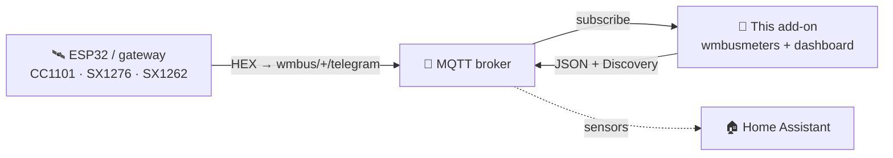
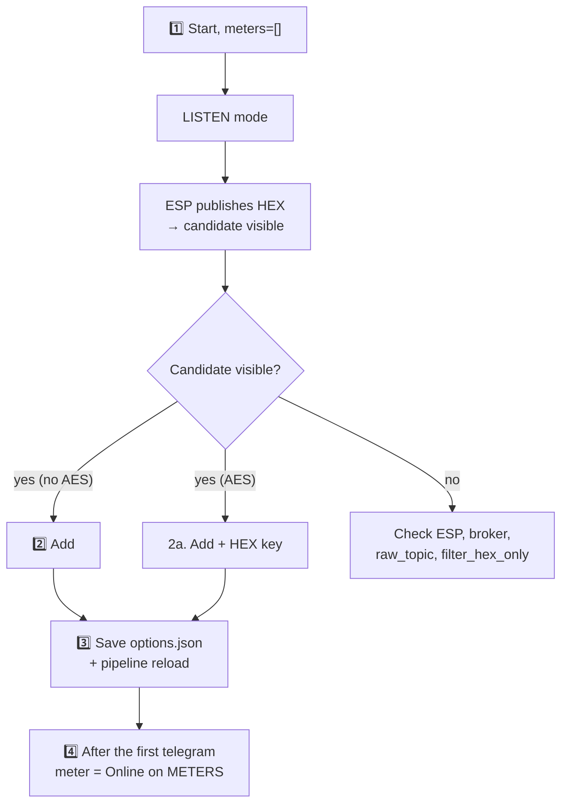

> 🌐 [**EN**](README.en.md) | [PL](README.pl.md) | [DE](README.de.md) | [CS](README.cs.md) | [SK](README.sk.md)

# wMBus MQTT Bridge — user guide (EN)

> A user-facing guide: install, add meters, read the dashboard, troubleshoot.
> **How it works internally** (architecture, runtime files, soft-reload, the ESP
> diagnostics contract) is in [`ARCHITECTURE.md`](ARCHITECTURE.md).

---

## Table of contents

1. [What it does](#1-what-it-does)
2. [Requirements](#2-requirements)
3. [Quick start — Home Assistant](#3-quick-start--home-assistant)
4. [Quick start — Docker standalone](#4-quick-start--docker-standalone)
5. [The WebUI — what you see](#5-the-webui--what-you-see)
6. [Typical workflow: from empty to a working meter](#6-typical-workflow-from-empty-to-a-working-meter)
7. [SEARCH mode — when you hear too many other meters](#7-search-mode--when-you-hear-too-many-other-meters)
8. [Configuration options](#8-configuration-options)
9. [Interface language](#9-interface-language)
10. [Troubleshooting](#10-troubleshooting)
11. [How it works under the hood](#11-how-it-works-under-the-hood)
12. [Licence and upstream](#12-licence-and-upstream)

---

## 1. What it does

> **In one sentence:** it decodes Wireless M-Bus telegrams (water, heat and
> electricity meters) **without a local USB dongle** — the raw HEX frames are
> delivered by any external receiver (ESP32, gateway) over MQTT.

- **You** put the radio receiver where there is signal (e.g. an ESP32 with an antenna).
- **The receiver** publishes raw HEX frames to MQTT (`wmbus/<device>/telegram`).
- **This add-on** connects to the broker, feeds `wmbusmeters`, decodes the
  telegrams and publishes the result back to MQTT + **Home Assistant Discovery**.

Result: **your meters show up as sensors in HA with no radio hardware on the HA side.**



> 🤝 Typically used with the **[esphome-wmbus-bridge-rawonly](https://github.com/Kustonium/esphome-wmbus-bridge-rawonly)**
> firmware (ESP32 + CC1101/SX1276/SX1262, publishes RAW HEX). The two projects are
> independent — the add-on accepts hex from any source publishing on `raw_topic`.

---

## 2. Requirements

- An **MQTT broker** (Mosquitto, EMQX…) reachable from HA / the host.
- A **receiver** publishing HEX frames to `wmbus/<device>/telegram`.
- Home Assistant (add-on mode) **or** Docker + compose (standalone).

> ⚠️ Do not run the official `wmbusmeters` add-on in parallel — this project has
> its own instance and they would duplicate each other.

---

## 3. Quick start — Home Assistant

1. **Add the repository:** Settings → Add-ons → Add-on Store → ⋮ → Repositories:
   ```
   https://github.com/Kustonium/homeassistant-wmbus-mqtt-bridge
   ```
2. **Install** "wMBus MQTT Bridge", click **Start** (with the default `meters: []`
   the add-on enters **LISTEN mode** and only listens).
3. **Open the WebUI** (Info → OPEN WEB UI).
4. Go to **RECEIVING / SEARCH**, find your meter among the detected candidates and
   click **Add** (modal: ID, driver, name, optional AES key). After saving, the
   pipeline reloads itself (no container restart).

Full walkthrough in [§6](#6-typical-workflow-from-empty-to-a-working-meter).

---

## 4. Quick start — Docker standalone

For everything outside HA (DietPi, Ubuntu, Raspberry Pi OS, NAS…).

```bash
git clone https://github.com/Kustonium/homeassistant-wmbus-mqtt-bridge.git
mkdir -p /home/wmbus
cp -a homeassistant-wmbus-mqtt-bridge/docker/examples/* /home/wmbus/
cd /home/wmbus
docker compose up -d --build
docker compose logs -f wmbus
```

Configuration in `./config/options.json` (field reference in [§8](#8-configuration-options)):

```json
{
  "raw_topic": "wmbus/+/telegram",
  "discovery_enabled": true,
  "state_prefix": "wmbusmeters",
  "mqtt_mode": "external",
  "external_mqtt_host": "192.168.1.10",
  "external_mqtt_port": 1883,
  "external_mqtt_username": "user",
  "external_mqtt_password": "pass",
  "meters": []
}
```

After editing: `docker compose restart wmbus`. WebUI: expose port `8099` in
`docker-compose.yml` and open `http://<host-ip>:8099/`.

> 💡 In Docker the global restart button does nothing (no Supervisor) — use
> `docker restart <container>`.

---

## 5. The WebUI — what you see

Available in **5 languages** (EN/PL/DE/CS/SK) — switcher in the top-right corner.

| Tab | Purpose |
|---|---|
| **PANEL** | Dashboard: the ESP→MQTT→wmbusmeters→HA pipeline (clickable tiles) + statistics. |
| **METERS** | Your configured meters: value, last telegram, **RECEPTION**. |
| **RECEIVING / SEARCH** | Detected candidates + configured-on-air; add/remove meters here. |
| **LOGS / ESP LOGS** | Runtime events and ESP receiver diagnostics. |
| **SETTINGS / ABOUT** | Active configuration, info. |

### The RECEPTION column (what the badges mean)

Hover the **ⓘ** next to the RECEPTION header for a legend. In short:

- **status + bars** — whether the meter is arriving: *online* / *overdue* / **quiet**.
  The threshold is **adaptive** to that meter's own rhythm (its average interval).
  Prolonged silence is **neutral** (grey), not a red alarm — a meter may be quiet
  at night / while you are away / on a weak battery, so we do not cry wolf.
- **📡 ESP** — the meter is flagged (highlighted) on one of the ESPs.
- **📶 name N% · count** — reception % and telegram count **per ESP** (from the
  optional diagnostics). With several ESPs you see which receiver hears the meter
  and how well. Colour: green ≥90 · amber ≥50 · red <50.

> The raw % and count are **not** a measure of board sensitivity (cumulative count
> since boot, different uptimes). Real sensitivity is **coverage** — which meters a
> board hears at all.

### Adding / removing meters (RECEIVING)

- Non-AES candidates auto-decode — the **Value** column shows a live preview without
  configuring them.
- **Add** stores the meter and reloads the pipeline.
- **Remove selected** — tick the checkboxes and remove several at once (button above
  the table).

---

## 6. Typical workflow: from empty to a working meter



1. **Start** with `meters: []` → LISTEN mode, log shows `No meters configured -> LISTEN MODE`.
2. **Add** a candidate (no AES — straight away; AES — enter the 32-char HEX key).
3. The save goes to `options.json` and the DECODE pipeline reloads **without a full
   container restart**.
4. After the **next telegram** from that meter (anywhere from tens of seconds to a
   few minutes, depending on the meter) it appears as **Online** on METERS, and HA
   Discovery creates entities like `sensor.<id>_total_m3`.

Until the first telegram arrives the dashboard shows a **"waiting for the first
telegram"** panel. A full add-on restart is only an emergency fallback.

---

## 7. SEARCH mode — when you hear too many other meters

In an apartment block the receiver picks up dozens of other meters. SEARCH finds
yours by **comparing the m³ reading on your physical display** against the decodes
of all candidates.

1. Open `#search`, enter the **current reading** from the display (e.g. `23.93`)
   and a **tolerance** (default `0.05` = 50 l; don't raise it in a block).
2. Enable SEARCH. The add-on decodes candidates with every driver and looks for a
   match `total_m3 ≈ reading ± tolerance`.
3. On a match the log shows `SEARCH MATCH: id=… driver=…` — add that meter from
   RECEIVING.
4. **Turn `search_mode` off** when done (temporary SEARCH meters create no HA entities).

---

## 8. Configuration options

From [`config.yaml`](../config.yaml).

### MQTT — input / output

| Field | Type | Default | Description |
|---|---|---|---|
| `raw_topic` | str | `wmbus/+/telegram` | Topic with the raw HEX frames. `+` = wildcard (ESP name in diagnostics) |
| `filter_hex_only` | bool | `true` | Ignore messages that do not look like HEX |
| `mqtt_mode` | enum | `auto` | `auto` / `ha` (force HA) / `external` (always external) |
| `external_mqtt_host/port/username/password` | str/int | — | External broker (when `external`) |

### Discovery and output

| Field | Type | Default | Description |
|---|---|---|---|
| `discovery_enabled` | bool | `true` | Publish HA Discovery |
| `discovery_prefix` | str | `homeassistant` | Discovery prefix |
| `discovery_retain` | bool | `true` | Discovery as retained |
| `state_prefix` | str | `wmbusmeters` | Value topic prefix |
| `state_retain` | bool | `false` | Retained state |
| `verify_ha_entities` | bool | `false` | (Opt-in) ask the HA Core API whether the entities were actually created. Enabling it grants read-only HA Core API access. |

### SEARCH mode

| Field | Type | Default | Description |
|---|---|---|---|
| `search_mode` | bool | `false` | Enables SEARCH ([§7](#7-search-mode--when-you-hear-too-many-other-meters)) |
| `search_expected_value_m3` | float | `0` | Expected m³ reading |
| `search_tolerance_m3` | float | `0.05` | Comparison tolerance — don't raise in a block |
| `search_delta_mode` / `search_min_delta_m3` | bool/float | `false` / `0.001` | (Experimental) delta comparison |
| `search_topic` | str | `wmbus/search/candidates` | SEARCH result topic |

### Debug

| Field | Type | Default | Description |
|---|---|---|---|
| `loglevel` | enum | `normal` | `normal` / `verbose` / `debug` |
| `debug_every_n` | int | `0` | Extra diagnostics every Nth telegram |

### Meters — `meters[]`

| Field | Type | Required | Description |
|---|---|---|---|
| `id` | str | yes | Your label (the HA sensor name) |
| `meter_id` | str | yes | The meter serial number (HEX, from LISTEN) |
| `type` | str | yes | **The wmbusmeters driver name** (e.g. `hydrodigit`, `amiplus`, `izarv2`) **or `auto`/`other`**. A free string — wmbusmeters validates the driver at decode time (deliberately not an enum, so new drivers are never rejected). |
| `type_other` | str? | when `type=other` | Custom driver name |
| `key` | str? | when encrypted | 32-char AES key (HEX) |

Common drivers: water — `multical21`, `iperl`, `hydrodigit`, `hydrus`, `mkradio3`,
`izarv2`; heat — `kamheat`, `hydrocalm3`, `vario451`; electricity — `amiplus`.

---

## 9. Interface language

5 languages (en/pl/de/cs/sk). Selection: `?lang=en` in the URL → cookie
`wmbus_lang` → `Accept-Language` header → default `en`. Switcher in the top-right.

---

## 10. Troubleshooting

### "I see no telegrams" (RAW count = 0)
1. Is the receiver publishing to `wmbus/<anything>/telegram`? Test: `mosquitto_sub -h <broker> -t 'wmbus/#' -v`.
2. Is the bridge connected and subscribed? Log: `mqtt: connected` + `subscribed to wmbus/+/telegram`.
3. Is `filter_hex_only` dropping them? Set `loglevel: verbose` and check for `dropped (not HEX)` — if the ESP sends base64/JSON, change the format.
4. Is the broker reachable? Check connection errors (`mqtt_mode`).

### "I added a meter but it does not show on METERS"
It appears only **after the next telegram** for that ID (tens of seconds to a few
minutes). If it still doesn't — check `meter_id`, the driver, the AES key and the logs.

### "A meter vanishes after an add-on upgrade" (e.g. Diehl/Izar `izarv2`)
Fixed in **1.5.33**. Earlier the allowed-driver list lacked newer drivers (e.g.
`izarv2`), so Supervisor rejected the save and the meter was lost on restart.
**Update the add-on to ≥1.5.33**, remove and re-add the meter — it will stick.

### "The status shows «quiet», not red «offline»"
That is intended (honest-witness): a meter is passive, so prolonged silence is
ambiguous (night/away/battery) — we show a neutral state, not a false alarm. The
threshold is derived from each meter's **rhythm**, not a fixed 15/60 min.

### "The value only ever grows, it isn't instantaneous"
The main value shown is the **meter total** (`total_m3`,
`total_energy_consumption_kwh`). Water meters that expose only `total_m3` (e.g.
`hydrodigit`, `itron`, `apator162`) have no instantaneous-flow field — compute
current/periodic consumption in HA with a **Utility Meter** helper (daily/monthly,
survives restarts) or **Derivative** (m³/h). `total_m3` is published as
`device_class: water` + `state_class: total_increasing`, so it also feeds the HA
water/Energy statistics.

### "HA doesn't show an add-on update"
HA detects a new version only when `version:` in `config.yaml` changes. Force a
check: Settings → System → ⋮ → Reload or `ha supervisor restart`.

### "My meter is encrypted — where do I get the AES key?"
From the meter provider (building manager / water/heat supplier), a sticker or the
meter documentation. Without the key you cannot decode encrypted telegrams.

### "Add meter did nothing" (Docker)
The `./config/` directory must be **writable** (not `:ro`). After adding, the log
should confirm the write to `options.json`. If needed, `docker restart <container>`.

---

## 11. How it works under the hood

Architecture, process model, the `/data` runtime files, soft-reload, the ESP
diagnostics contract, the dashboard model and the dev→stable release flow — all in
**[`ARCHITECTURE.md`](ARCHITECTURE.md)** (a maintainer/contributor reference).

---

## 12. Licence and upstream

**GNU GPL-3.0.** This project contains and modifies code from `wmbusmeters-ha-addon`
(GPL-3.0); the whole — including `webui.py`, `i18n.py`, the rewritten `bridge.sh` —
is distributed under GPL-3.0.

- **wmbusmeters** — https://github.com/wmbusmeters/wmbusmeters (Fredrik Öhrström, GPL-3.0)
- **wmbusmeters-ha-addon** — https://github.com/wmbusmeters/wmbusmeters-ha-addon (GPL-3.0)

A fork developed by **Kustonium**: MQTT input instead of a local dongle, a WebUI in
5 languages, the LISTEN → ADD → SEARCH workflow from the UI.

---

Questions / bugs → [GitHub Issues](https://github.com/Kustonium/homeassistant-wmbus-mqtt-bridge/issues).
