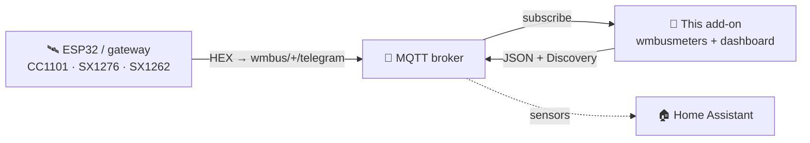
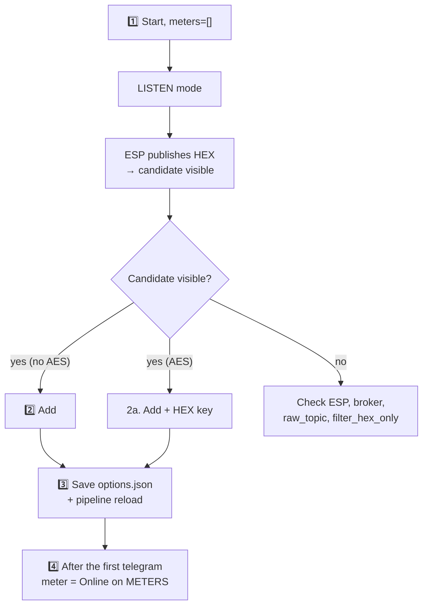

> 🌐 [**EN**](README.en.md) | [PL](README.pl.md) | [DE](README.de.md) | [CS](README.cs.md) | [SK](README.sk.md)

# wMBus MQTT Bridge — user guide (EN)

> A user-facing guide: install, add meters, read the dashboard, troubleshoot.
> **How it works internally** (architecture, runtime files, soft-reload, the ESP
> diagnostics contract) is in [`ARCHITECTURE.md`](ARCHITECTURE.md).

---

## Table of contents

1. [What it does](#1-what-it-does)
2. [Requirements](#2-requirements)
3. [Quick start — Home Assistant](#3-quick-start--home-assistant)
4. [Quick start — Docker standalone](#4-quick-start--docker-standalone)
5. [The WebUI — what you see](#5-the-webui--what-you-see)
6. [Typical workflow: from empty to a working meter](#6-typical-workflow-from-empty-to-a-working-meter)
7. [Filter by value — when you hear too many other meters](#7-filter-by-value--when-you-hear-too-many-other-meters)
8. [Configuration options](#8-configuration-options)
9. [Interface language](#9-interface-language)
10. [Troubleshooting](#10-troubleshooting)
11. [How it works under the hood](#11-how-it-works-under-the-hood)
12. [Licence and upstream](#12-licence-and-upstream)

---

## 1. What it does

> **In one sentence:** it decodes Wireless M-Bus telegrams (water, heat and
> electricity meters) **without a local USB dongle** — the raw HEX frames are
> delivered by any external receiver (ESP32, gateway) over MQTT.

- **You** put the radio receiver where there is signal (e.g. an ESP32 with an antenna).
- **The receiver** publishes raw HEX frames to MQTT (`wmbus/<device>/telegram`).
- **This add-on** connects to the broker, feeds `wmbusmeters`, decodes the
  telegrams and publishes the result back to MQTT + **Home Assistant Discovery**.

Result: **your meters show up as sensors in HA with no radio hardware on the HA side.**



> 🤝 Typically used with the **[esphome-wmbus-bridge-rawonly](https://github.com/Kustonium/esphome-wmbus-bridge-rawonly)**
> firmware (ESP32 + CC1101/SX1276/SX1262, publishes RAW HEX). The two projects are
> independent — the add-on accepts hex from any source publishing on `raw_topic`.

> 🌉 **As a whole, the ESP (RF receiver) and this add-on (decoder) form a
> distributed _wM-Bus → Home Assistant gateway_** — the radio sits where the
> signal is, while decoding (decryption and the driver set from the pinned
> `wmbusmeters` build) runs on HA.
> Unlike monolithic wM-Bus gateways (radio + decoder in one box) it needs no
> local USB dongle and scales by adding cheap ESP nodes.
>
> **Each half also runs standalone and is interchangeable:** the ESP feeds any MQTT backend (Node-RED, a custom script, your own decoder), and the add-on decodes hex from any source on `raw_topic` (this ESP, rtl-wmbus, another gateway, the replay tool) — they cooperate, but neither depends on the other.

---

## 2. Requirements

- An **MQTT broker** (Mosquitto, EMQX…) reachable from HA / the host.
- A **receiver** publishing HEX frames to `wmbus/<device>/telegram`.
- Home Assistant (add-on mode) **or** Docker + compose (standalone).

> ⚠️ Do not run the official `wmbusmeters` add-on in parallel — this project has
> its own instance and they would duplicate each other.

> 🧱 **Responsibility boundary.** This project ships two MQTT clients — the ESP firmware (radio → MQTT) and this add-on (MQTT → decode → HA); its scope ends at the MQTT topic. **The broker itself — authentication, ACLs, TLS, network exposure and any broker-to-broker bridging for remote/distributed setups (site A → internet → site B) — is the operator's responsibility.** Recommended: keep the broker on your LAN; for remote access use a tunnel/VPN or TLS broker bridging; do not expose port 1883 or the WebUI (8099) directly to the internet. Note: for AES-encrypted meters the payload stays encrypted by the meter end-to-end, independent of broker transport.

> ⚠️ **New to this? Read before exposing anything.** Do **not** forward your broker's port (1883) or Home Assistant to the internet on your home router — an exposed broker can be read and abused by anyone. To reach your system from outside, use a ready-made secure option: **Home Assistant Cloud (Nabu Casa)**, or the **Tailscale** / **Cloudflare Tunnel** add-ons. Not sure? Keep everything on your home network — the add-on does not need internet access to work.

---

## 3. Quick start — Home Assistant

1. **Add the repository:** Settings → Add-ons → Add-on Store → ⋮ → Repositories:
   ```
   https://github.com/Kustonium/homeassistant-wmbus-mqtt-bridge
   ```
2. **Install** "wMBus MQTT Bridge", click **Start** (with the default `meters: []`
   the add-on enters **LISTEN mode** and only listens).
3. **Open the WebUI** (Info → OPEN WEB UI).
4. Go to **RECEIVING / SEARCH**, find your meter among the detected candidates and
   click **Add** (modal: ID, driver, name, optional AES key). After saving, the
   pipeline reloads itself (no container restart).

Full walkthrough in [§6](#6-typical-workflow-from-empty-to-a-working-meter).

---

## 4. Quick start — Docker standalone

For everything outside HA (DietPi, Ubuntu, Raspberry Pi OS, NAS…).

```bash
git clone https://github.com/Kustonium/homeassistant-wmbus-mqtt-bridge.git
mkdir -p /home/wmbus
cp -a homeassistant-wmbus-mqtt-bridge/docker/examples/* /home/wmbus/
cd /home/wmbus
docker compose pull
docker compose up -d
docker compose logs -f wmbus
```

The `wmbus` image is multi-arch (amd64 + aarch64) — `pull` fetches the variant
matching your host automatically, no local build toolchain needed.

Configuration in `./config/options.json` (field reference in [§8](#8-configuration-options)):

```json
{
  "raw_topic": "wmbus/+/telegram",
  "discovery_enabled": true,
  "state_prefix": "wmbusmeters",
  "mqtt_mode": "external",
  "external_mqtt_host": "192.168.1.10",
  "external_mqtt_port": 1883,
  "external_mqtt_username": "user",
  "external_mqtt_password": "pass",
  "meters": []
}
```

After editing: `docker compose restart wmbus`. WebUI: expose port `8099` in
`docker-compose.yml` and open `http://<host-ip>:8099/`.

> 💡 In Docker the global **Restart** button works when the container has a
> restart policy (the example Compose file uses `restart: unless-stopped`).
> Without one, the button stops the container; start it again with
> `docker start <container>`.

---

## 5. The WebUI — what you see

Available in **5 languages** (EN/PL/DE/CS/SK) — switcher in the top-right corner.

| Tab | Purpose |
|---|---|
| **PANEL** | Dashboard: the ESP→MQTT→wmbusmeters→HA pipeline (clickable tiles) + statistics. |
| **METERS** | Your configured meters: value, last telegram, **RECEPTION**. |
| **RECEIVING / SEARCH** | Detected candidates + configured-on-air; add/remove meters and filter displayed values here. |
| **LOGS / ESP LOGS** | Runtime events and ESP receiver diagnostics. |
| **SETTINGS / ABOUT** | Active configuration, info. |

### The RECEPTION column (what the badges mean)

Hover the **ⓘ** next to the RECEPTION header for a legend. In short:

- **status + bars** — whether the meter is arriving: *online* / *overdue* / **quiet**.
  The threshold is **adaptive** to that meter's own rhythm (its average interval).
  Prolonged silence is **neutral** (grey), not a red alarm — a meter may be quiet
  at night / while you are away / on a weak battery, so we do not cry wolf.
- **📡 ESP** — the meter is flagged (highlighted) on one of the ESPs.
- **📶 name N% · count** — reception % and telegram count **per ESP** (from the
  optional diagnostics). With several ESPs you see which receiver hears the meter
  and how well. Colour: green ≥90 · amber ≥50 · red <50.

> The raw % and count are **not** a measure of board sensitivity (cumulative count
> since boot, different uptimes). Real sensitivity is **coverage** — which meters a
> board hears at all.

### Adding / removing meters (RECEIVING)

- Non-AES candidates auto-decode — the **Value** column shows a live preview without
  configuring them.
- **Add** stores the meter and reloads the pipeline.
- **Compare** in the **Add** or **Driver…** modal decodes the last telegram with two
  drivers without saving changes. Choose a driver in the **Driver** field, enter
  the AES key if the meter is encrypted, then click **Compare**. The left column is
  the saved driver or `wmbusmeters` auto-detection; the right column is the driver
  you selected. Green rows are extra fields, amber rows are different values; more
  fields do **not** automatically mean the driver is correct, so verify the values
  against the meter display.
- **Report…** uses a configured 32-character AES key for the same meter ID when
  one is available, so `wmbusmeters --analyze` can show decrypted details. The
  key itself is never included, but meter readings may be present — review the
  report before posting it publicly.
- **Remove selected** — tick the checkboxes and remove several at once (button above
  the table).

---

## 6. Typical workflow: from empty to a working meter



1. **Start** with `meters: []` → LISTEN mode, log shows `No meters configured -> LISTEN MODE`.
2. **Add** a candidate (no AES — straight away; AES — enter the 32-char HEX key).
3. The save goes to `options.json` and the DECODE pipeline reloads **without a full
   container restart**.
4. After the **next telegram** from that meter it appears as **Online** on METERS,
   and HA Discovery creates entities for the numeric fields emitted by
   `wmbusmeters`, for example `total_m3`. The final HA `entity_id` is assigned by
   Home Assistant and is not fixed by the bridge.

Until the first telegram arrives the dashboard shows a **"waiting for the first
telegram"** panel. A full add-on restart is only an emergency fallback.

**Unsupported meter?** If a candidate never decodes (unknown driver / "unknown
format signature"), use the **Report…** button in its row: the add-on builds a
ready-to-paste issue block for the upstream wmbusmeters project (raw telegram +
`wmbusmeters --analyze` output). The telegram contains the meter's serial
number. The AES key is never included; when a configured key is used for the
analysis, the decrypted output may include meter readings.

---

## 7. Filter by value — when you hear too many other meters

The current WebUI workflow is the **Filter by value** bar on RECEIVING / SEARCH:

1. Wait until configured meters or candidates have a numeric value in the
   **Value** column.
2. Enter the reading from the physical display and a tolerance (default `0.05`).
3. The browser keeps rows whose displayed value falls within that tolerance and
   hides rows with a different or missing value.

This filter only compares values already displayed by the WebUI. It does not
start additional decoders, try other drivers, or change the configuration. Use
**Compare** separately when you need to inspect two drivers on the same frame.

The older `search_mode` backend still exists for advanced use through the hidden
`#search` route. While enabled, LISTEN caches only candidates reported as
unencrypted water meters together with their one suggested driver. A subsequent
restart loads those cached candidates as temporary meters and checks numeric
fields whose names contain `m3` or `total_volume`. It does **not** try every
driver. Temporary SEARCH meters are excluded from Home Assistant Discovery.

---

## 8. Configuration options

From [`config.yaml`](../config.yaml).

### MQTT — input / output

| Field | Type | Default | Description |
|---|---|---|---|
| `raw_topic` | str | `wmbus/+/telegram` | Topic with the raw HEX frames. `+` = wildcard (ESP name in diagnostics) |
| `filter_hex_only` | bool | `true` | Ignore messages that do not look like HEX |
| `mqtt_mode` | enum | `auto` | `auto` (order: `external_mqtt_host` when set → HA broker from the Supervisor service → probe of known broker add-ons `core-mosquitto`/`a0d7b954-emqx`, using `external_mqtt_username/password` when provided) / `ha` (force HA) / `external` (always external) |
| `external_mqtt_host/port/username/password` | str/int | `""` / `1883` / `""` / `""` | External broker (when `external`) |

### Discovery and output

| Field | Type | Default | Description |
|---|---|---|---|
| `discovery_enabled` | bool | `true` | Publish HA Discovery |
| `discovery_prefix` | str | `homeassistant` | Discovery prefix |
| `discovery_retain` | bool | `true` | Discovery as retained |
| `state_prefix` | str | `wmbusmeters` | Value topic prefix |
| `state_retain` | bool | `false` | Retained state |
| `verify_ha_entities` | bool | `false` | In HA add-on mode, use the add-on's declared read-only HA Core API access to verify a canary entity. Docker has no Supervisor token, so verification is unavailable there. |

Every discovered entity carries an **availability template**: when a field is
missing from the meter's latest telegram (some meters alternate between short
and full frames), the entity shows `unavailable` instead of a stale or false
value, and recovers automatically with the next telegram that contains the
field. Independently, an auto-tuned `expire_after` (about 2× the meter's
observed transmit interval, minimum 1 h) marks entities `unavailable` when the
meter goes silent.

Beyond the numeric measurement sensors, each meter that reports a `status`
field also gets two **diagnostic** entities (in the device's *Diagnostics*
section): a `sensor` with the raw status text and a `binary_sensor`
(`device_class: problem`) that turns *on* whenever the status is anything other
than `OK`. The text is passed through verbatim from `wmbusmeters`, so its exact
content depends on the selected upstream driver.

### Legacy SEARCH mode

| Field | Type | Default | Description |
|---|---|---|---|
| `search_mode` | bool | `false` | Enables the hidden legacy SEARCH backend described in [§7](#7-filter-by-value--when-you-hear-too-many-other-meters) |
| `search_expected_value_m3` | float | `0` | Expected m³ reading |
| `search_tolerance_m3` | float | `0.05` | Comparison tolerance — don't raise in a block |
| `search_delta_mode` / `search_min_delta_m3` | bool/float | `false` / `0.001` | (Experimental) delta comparison |
| `search_topic` | str | `wmbus/search/candidates` | Non-retained SEARCH result topic |

### Debug

| Field | Type | Default | Description |
|---|---|---|---|
| `loglevel` | enum | `normal` | `normal` / `verbose` / `debug` |
| `debug_every_n` | int | `0` | Extra diagnostics every Nth telegram |

### Meters — `meters[]`

| Field | Type | Required | Description |
|---|---|---|---|
| `id` | str | yes | Your meter label, used in MQTT Discovery names and generated configuration |
| `meter_id` | str | yes | The meter serial number (HEX, from LISTEN) |
| `type` | str | yes | **The wmbusmeters driver name** (e.g. `hydrodigit`, `amiplus`, `izarv2`) **or `auto`/`other`**. A free string — wmbusmeters validates the driver at decode time (deliberately not an enum, so new drivers are never rejected). |
| `type_other` | str? | when `type=other` | Custom driver name |
| `key` | str? | when encrypted | 32-char AES key (HEX) |

The WebUI driver list is generated from the pinned `wmbusmeters` build and its
XMQ sources. Use that catalog instead of a manually maintained list in this guide.

---

## 9. Interface language

5 languages (en/pl/de/cs/sk). Selection: `?lang=en` in the URL → cookie
`wmbus_lang` → `Accept-Language` header → default `en`. Switcher in the top-right.

---

## 10. Troubleshooting

### "Telegrams reach the broker but no entities appear in HA"

Run the **Discovery Doctor** (SETTINGS view): a one-click checklist that
shows the current bridge MQTT state, whether Discovery is enabled and retained,
and how many retained sensor configs exist for each configured meter, including
a sample payload. A received HA birth message is positive evidence that HA uses
that broker and prefix; its absence is inconclusive because the message is not
always retained. Optional canary verification through the HA Core API provides
the stronger check. The dialog also has a **Force re-discovery** button.

### "I want to start over — remove all meters"

In the SETTINGS view, **Reset add-on** removes ALL configured meters, clears
their Home Assistant entities (it publishes empty retained discovery configs so
the entities disappear) and wipes runtime state (candidates, the ignored list
and statistics). The add-on returns to its post-install state. The action is
irreversible and asks for confirmation first.

### "I want to change options without leaving the WebUI"

The SETTINGS view has an editable **Configuration** form for scalar options from
the add-on schema, each with an explanation of what it does. Meters are managed
separately in RECEIVING / SEARCH. Save writes the options through the Supervisor
API in HA add-on mode and directly to
`/config/options.json` in standalone Docker. The MQTT password is write-only
(leave it blank to keep the current value). Core options take effect after a
full add-on/container restart.

### "My meter encrypts its telegrams — what now?"

When LISTEN explicitly reports encryption, the candidate shows an **AES req.**
badge. Without the meter's individual 128-bit AES key (32 hex chars) its payload
cannot be decoded. Where to get the key: your **building
manager / housing association**, the **utility company** that bills the meter,
or the **meter installer**. You can add the meter without the key and enter it
later via the **Driver…** button. When `wmbusmeters` emits a recognized missing-
or invalid-key warning, the bridge records it and shows the corresponding red
status on the meter row. After fixing the key, the pipeline reloads and waits
for the next telegram.

### "I see no telegrams" (RAW count = 0)
1. Is the receiver publishing to `wmbus/<anything>/telegram`? Test: `mosquitto_sub -h <broker> -t 'wmbus/#' -v`.
2. Check the actual startup lines: `MQTT: <host>:<port> topic=<raw_topic>` and `MQTT broker ready`.
3. With `filter_hex_only: true`, non-HEX or odd-length payloads are discarded silently before the RAW counter. If the ESP sends base64/JSON, change the sender format or disable this filter deliberately.
4. Is the broker reachable? Check connection errors (`mqtt_mode`).

### "I added a meter but it does not show on METERS"
It appears only **after the next telegram** for that ID (tens of seconds to a few
minutes). If it still doesn't — check `meter_id`, the driver, the AES key and the logs.

### "A driver is missing from the meter form"
The current schema stores `type` as a free string; it has no fixed allowed-driver
enum. The WebUI catalog is generated from built-in and XMQ drivers in the pinned
`wmbusmeters` build, and the image build fails if the built-in `izar` driver is
missing. Check the active options and select the driver again from that catalog.

### "The status shows «quiet», not red «offline»"
That is intended (honest-witness): a meter is passive, so prolonged silence is
ambiguous (night/away/battery) — we show a neutral state, not a false alarm. The
threshold is derived from each meter's **rhythm**, not a fixed 15/60 min.

### "The value only ever grows, it isn't instantaneous"
The main value shown is the **meter total** (`total_m3`,
`total_energy_consumption_kwh`). If the decoder JSON exposes `total_m3` but no
instantaneous-flow field, the bridge does not synthesize one. Compute
current/periodic consumption in HA with a **Utility Meter** helper (daily/monthly,
survives restarts) or **Derivative** (m³/h). `total_m3` is published as
`device_class: water` + `state_class: total_increasing`, so it also feeds the HA
water/Energy statistics.

### "My meter is encrypted — where do I get the AES key?"
From the meter provider (building manager / water/heat supplier), a sticker or the
meter documentation. Without the key you cannot decode encrypted telegrams.

### "Add meter did nothing" (Docker)
The `./config/` directory must be **writable** (not `:ro`). After adding, the log
should confirm the write to `options.json`. If needed, `docker restart <container>`.

---

## 11. How it works under the hood

**Why decode on the server, not on the ESP?** Projects that embed the decoder
in the ESP firmware keep hitting the same classes of problems: every new meter
model means a firmware update, every ESPHome/toolchain release can break the
embedded decoder's build, and the whole device fleet ends up pinned to an old
ESPHome just to keep one component compiling. Here the ESP carries no decoder
at all, so:

- adding or changing a meter is a WebUI edit — **never a reflash**;
- ESPHome updates cannot break decoding — there is no decoder on the chip to break;
- AES keys stay on the server — the ESP never sees key material;
- the firmware is identical for everyone and its footprint does not grow with meters.

The honest cost: you need an always-on host and an MQTT broker — which a Home
Assistant installation already has. The full rationale, including the
failure-class table, is in
[`ARCHITECTURE.md`](ARCHITECTURE.md#why-decode-centrally).

The `wmbusmeters` integration boundary, telegram flow, process model, runtime
files, soft reload, ESP contract, and dashboard state are described in
**[`ARCHITECTURE.md`](ARCHITECTURE.md)**. Build, CI, decoder upgrades, and the
boundary between the dev and stable repositories are in
**[`DEVELOPMENT.md`](DEVELOPMENT.md)**.

---

## 12. Licence and upstream

**GNU GPL-3.0.** This project contains and modifies code from `wmbusmeters-ha-addon`
(GPL-3.0); the whole — including `webui.py`, `i18n.py`, the rewritten `bridge.sh` —
is distributed under GPL-3.0.

- **wmbusmeters** — https://github.com/wmbusmeters/wmbusmeters (Fredrik Öhrström, GPL-3.0)
- **wmbusmeters-ha-addon** — https://github.com/wmbusmeters/wmbusmeters-ha-addon (GPL-3.0)

A fork developed by **Kustonium**: MQTT input instead of a local dongle, a WebUI in
5 languages, LISTEN/ADD, value filtering, and driver comparison.

---

Questions / bugs → [GitHub Issues](https://github.com/Kustonium/homeassistant-wmbus-mqtt-bridge/issues).
