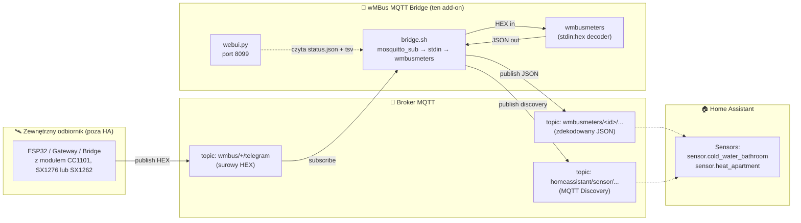
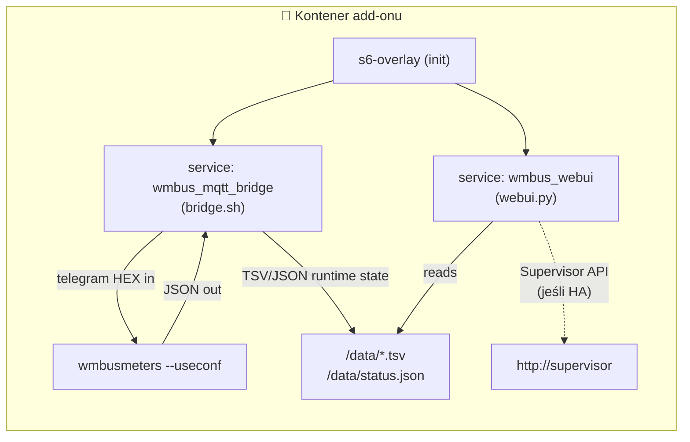
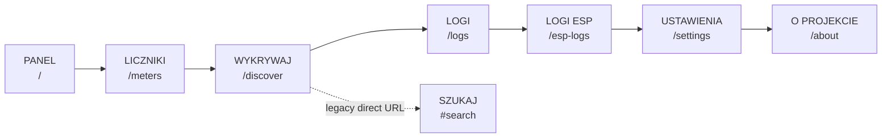
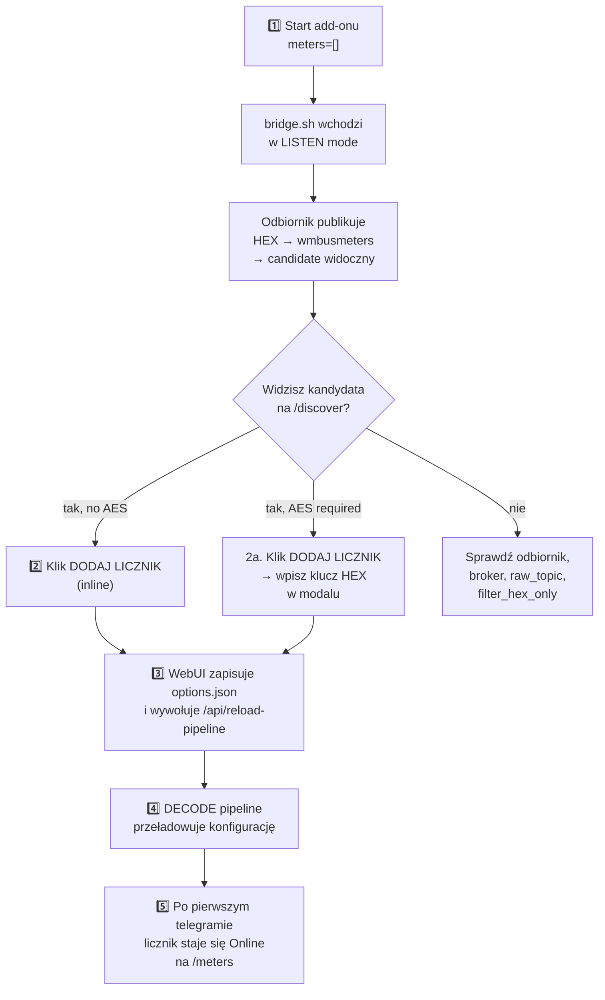
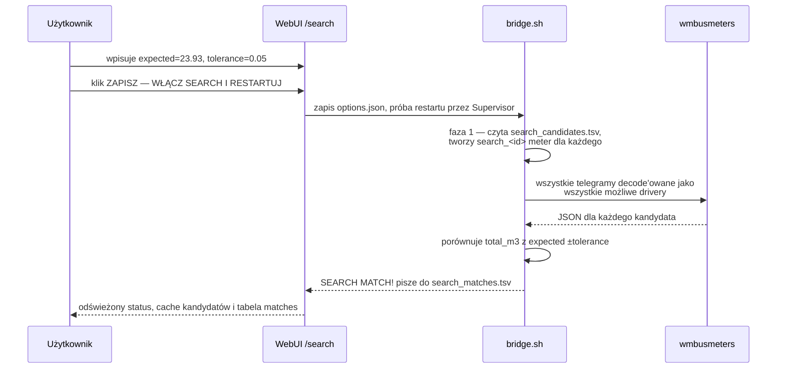
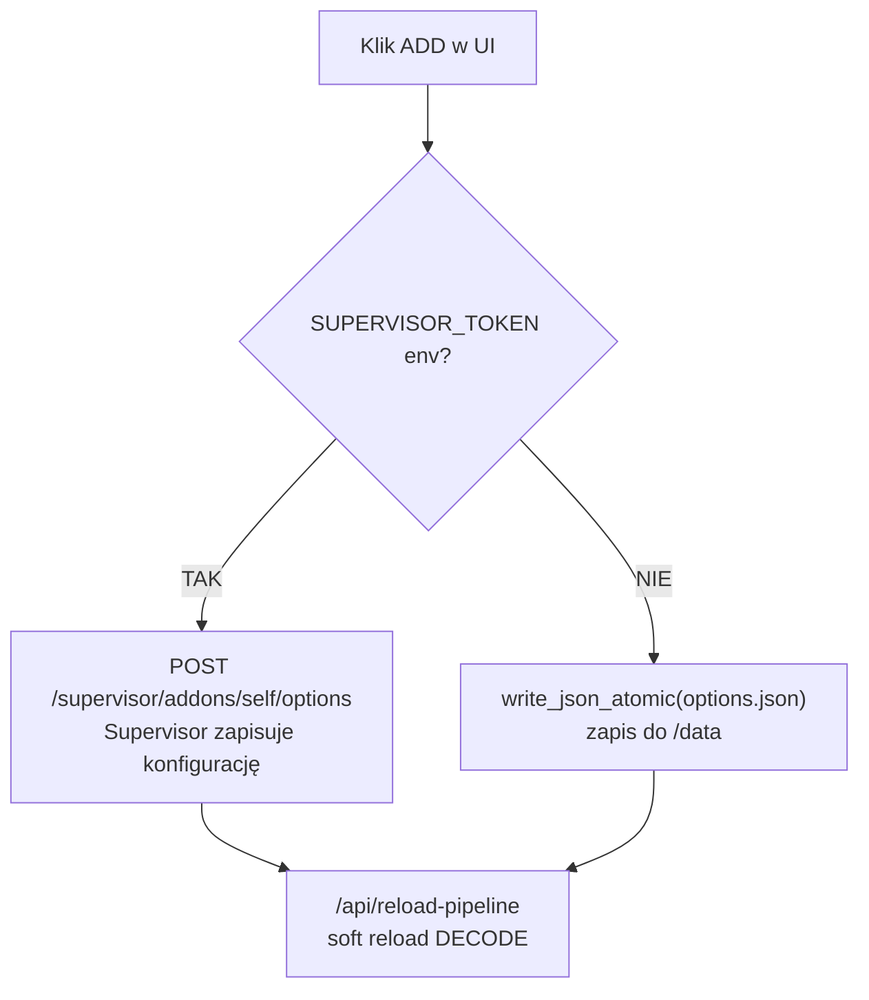
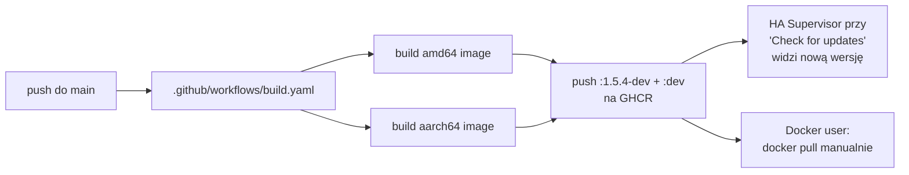

> 🌐 [EN](README.en.md) | [**PL**](README.pl.md) | [DE](README.de.md) | [CS](README.cs.md) | [SK](README.sk.md)

# wMBus MQTT Bridge — pełna dokumentacja PL

> Aktualne na dzień: **2026-05-29**  ·  Język: **polski**  ·  Status: dev-channel add-onu Home Assistant
>
> Skrócony, dwujęzyczny opis znajdziesz w głównym [README.md](../README.md). Ten dokument jest pełną, polską dokumentacją projektu — od „co to jest" po szczegóły architektury i runtime.

---

## Spis treści

1. [TL;DR — co to robi](#1-tldr--co-to-robi)
2. [Architektura przepływu danych](#2-architektura-przepływu-danych)
3. [Szybki start — Home Assistant](#3-szybki-start--home-assistant)
4. [Szybki start — Docker standalone](#4-szybki-start--docker-standalone)
5. [WebUI — główne widoki po polsku](#5-webui--główne-widoki-po-polsku)
6. [Typowy workflow: od pustki do działającego licznika](#6-typowy-workflow-od-pustki-do-działającego-licznika)
7. [Tryb SEARCH — gdy LISTEN słyszy za dużo cudzych liczników](#7-tryb-search--gdy-listen-słyszy-za-dużo-cudzych-liczników)
8. [Pełna lista opcji konfiguracji](#8-pełna-lista-opcji-konfiguracji)
9. [Tematy MQTT — co publikujemy, co konsumujemy](#9-tematy-mqtt--co-publikujemy-co-konsumujemy)
10. [Pliki runtime w `/data/`](#10-pliki-runtime-w-data)
11. [Home Assistant vs Docker — różnice UX](#11-home-assistant-vs-docker--różnice-ux)
12. [Lokalizacja interfejsu](#12-lokalizacja-interfejsu)
13. [Rozwiązywanie problemów](#13-rozwiązywanie-problemów)
14. [Architektura kodu — dla developerów](#14-architektura-kodu--dla-developerów)
15. [Wersjonowanie i obrazy Docker](#15-wersjonowanie-i-obrazy-docker)
16. [Licencja i projekty bazowe](#16-licencja-i-projekty-bazowe)

---

## 1. TL;DR — co to robi

> **W jednym zdaniu:** Add-on dekoduje telegramy Wireless M-Bus (wodomierze, liczniki ciepła, prądu) **bez lokalnego dongla USB** — telegramy w surowej formie HEX dostarcza Ci dowolny zewnętrzny odbiornik (ESP32, bridge, gateway) przez MQTT.

Standardowo `wmbusmeters` wymaga radio dongla podłączonego do hosta. Ten projekt rozwiązuje to inaczej:

- **Ty** masz odbiornik radiowy daleko od Home Assistant (np. ESP32 na strychu z anteną).
- **Odbiornik** publikuje surowe ramki HEX do MQTT.
- **Ten add-on** podpina się do tego brokera, dokarmia `wmbusmeters` przez `stdin:hex`, dekoduje JSON i publikuje wynik z powrotem do MQTT + Home Assistant Discovery.

Efekt: **Twoje liczniki pojawiają się jako sensory w HA, bez żadnego sprzętu radiowego po stronie HA.**

> 🤝 **Współpraca z firmware ESPHome** — Add-on jest typowo używany razem z [`esphome-wmbus-bridge-rawonly`](https://github.com/Kustonium/esphome-wmbus-bridge-rawonly), zewnętrznym komponentem ESPHome działającym na ESP32 z układem radiowym **CC1101, SX1276 lub SX1262**. ESP odbiera fale radiowe, publikuje surowe ramki HEX do MQTT, a ten add-on je dekoduje. Oba projekty są **niezależne** — add-on przyjmuje hex z dowolnego źródła publikującego na skonfigurowany `raw_topic`.

---

## 2. Architektura przepływu danych

### Pipeline danych



### Mapa komponentów wewnątrz kontenera



**Trzy procesy uruchomione równolegle** zarządzane przez `s6-overlay`:

| Proces | Co robi | Plik |
|---|---|---|
| `bridge.sh` | Subskrybuje MQTT, dokarmia wmbusmeters HEX-em, parsuje JSON, publikuje wyniki | [rootfs/usr/bin/bridge.sh](../rootfs/usr/bin/bridge.sh) |
| `wmbusmeters` | Dekoder telegramów (binarka, upstream — Fredrik Öhrström) | `/usr/bin/wmbusmeters` |
| `webui.py` | Serwer HTTP na porcie 8099, panel zarządzania | [rootfs/usr/bin/webui.py](../rootfs/usr/bin/webui.py) |

Te trzy komponenty komunikują się tylko przez **pliki w `/data/`** — żadnych socketów wewnątrz kontenera. Dzięki temu webui może być restartowane niezależnie od bridge'a, a stan jest perystentny przez restarty.

> 🔗 **Po stronie odbiornika (ESP32 z radiem)** — używamy siostrzanego projektu Kustoniem: **[esphome-wmbus-bridge-rawonly](https://github.com/Kustonium/esphome-wmbus-bridge-rawonly)** — firmware ESPHome dla SX1262 / SX1276 / CC1101 publikujący RAW HEX na `wmbus/<device>/telegram`. W HA pasuje do domyślnego `raw_topic: wmbus/+/telegram`; w Dockerze sprawdź wygenerowany `/config/options.json`, bo `docker/entrypoint.sh` tworzy obecnie `raw_topic: wmbus_bridge/+/telegram`. Receiver ma własną pełną dokumentację (EN/PL) — zacznij od [`START_HERE_PL.md`](https://github.com/Kustonium/esphome-wmbus-bridge-rawonly/blob/main/docs/START_HERE_PL.md).

---

## 3. Szybki start — Home Assistant

### Krok 1 — dodaj repozytorium

W HA: **Settings → Add-ons → Add-on Store → ⋮ (menu) → Repositories**, dodaj:

```
https://github.com/Kustonium/homeassistant-wmbus-mqtt-bridge
```

### Krok 2 — zainstaluj add-on

W store znajdź **wMBus MQTT Bridge Dev** (sekcja „dev"), kliknij **Install**.

> ⚠️ Nie instaluj oficjalnego add-onu `wmbusmeters` równolegle — ten projekt ma własną instancję wmbusmeters i je dubluje.

### Krok 3 — uruchom z pustą listą `meters` (tryb LISTEN)

Kliknij **Start**. Domyślnie `meters: []` — add-on wchodzi w tryb LISTEN i tylko nasłuchuje, niczego jeszcze nie konfiguruje.

### Krok 4 — otwórz WebUI

W zakładce **Info** add-onu kliknij **OPEN WEB UI**. Powita Cię dashboard:

```
┌────────────────────────────────────────────────────────────────┐
│ wMBus MQTT Bridge                              [EN PL DE CS SK]│
│ Panel | Liczniki | Wykrywaj | Logi | Logi ESP | Ustawienia    │
├────────────────────────────────────────────────────────────────┤
│ Panel                                                          │
│ [Pipeline] [Statystyki]                                        │
│                                                                │
│ ESP -> MQTT -> wmbusmeters -> Home Assistant                   │
│                                                                │
│ Brak skonfigurowanych liczników                                │
│   Przejdź do Wykrywaj, aby dodać pierwszy licznik              │
│                                                                │
│ Ostatnie zdarzenia                                             │
└────────────────────────────────────────────────────────────────┘
```

### Krok 5 — przejdź do „Wykrywaj" i dodaj licznik

W zakładce **WYKRYWAJ** zobaczysz listę kandydatów. Przycisk **DODAJ LICZNIK** otwiera modal z ID, driverem, nazwą i opcjonalnym kluczem AES. Po zapisie WebUI wywołuje `/api/reload-pipeline`, więc pipeline DECODE przeładowuje się bez pełnego restartu kontenera.

➡️ Pełny opis tego workflow w [§6 Typowy workflow](#6-typowy-workflow-od-pustki-do-działającego-licznika).

---

## 4. Szybki start — Docker standalone

Dla wszystkich poza Home Assistant (DietPi, Ubuntu, Raspberry Pi OS, NAS itp.).

### Wymagania

- Docker + docker compose
- Działający broker MQTT (Mosquitto, EMQX, …) dostępny z hosta
- Odbiornik radiowy publikujący ramki HEX do brokera — np. [esphome-wmbus-bridge-rawonly](https://github.com/Kustonium/esphome-wmbus-bridge-rawonly) (publikuje na `wmbus/<device>/telegram`, kompatybilne out-of-the-box)

### Instalacja

```bash
git clone https://github.com/Kustonium/homeassistant-wmbus-mqtt-bridge.git
mkdir -p /home/wmbus-test
cp -a homeassistant-wmbus-mqtt-bridge/docker/examples/* /home/wmbus-test/
cd /home/wmbus-test
docker compose up -d --build
docker compose logs -f wmbus
```

Pierwsze logi powinny pokazać:

```
[wmbus-bridge] mqtt: connected to 192.168.1.10:1883
[wmbus-bridge] No meters configured -> LISTEN MODE
```

### Konfiguracja

Edytuj `./config/options.json`. Pełna referencja pól w [§8](#8-pełna-lista-opcji-konfiguracji). Przykład minimalny:

```json
{
  "raw_topic": "wmbus/+/telegram",
  "loglevel": "normal",
  "discovery_enabled": true,
  "state_prefix": "wmbusmeters",
  "mqtt_mode": "external",
  "external_mqtt_host": "192.168.1.10",
  "external_mqtt_port": 1883,
  "external_mqtt_username": "user",
  "external_mqtt_password": "pass",
  "meters": []
}
```

Po edycji:

```bash
docker compose restart wmbus
```

### WebUI w Dockerze

Wystaw port 8099 w `docker-compose.yml`:

```yaml
services:
  wmbus:
    ports:
      - "8099:8099"
```

Następnie otwórz `http://<host-ip>:8099/`.

> 💡 W trybie Docker UI nadal pokazuje globalny przycisk restartu, ale `/api/restart-bridge` wymaga `SUPERVISOR_TOKEN`. Bez Supervisora restart kontenera wykonaj ręcznie (`docker restart <container>`).

---

## 5. WebUI — główne widoki po polsku

WebUI jest dostępny w **5 językach** (EN/PL/DE/CS/SK) — przełącznik w prawym górnym rogu. Język wykrywany jest z (w kolejności): `?lang=`, cookie `wmbus_lang`, nagłówek `Accept-Language`.

Stan UI aktualizuje się przez SSE z `/api/events`; gdy połączenie live nie działa, frontend wraca do cyklicznego pobierania `/api/app`.

### Mapa zakładek



### 5.1. Panel (`/`) — dashboard

Górny blok ma przełącznik **Pipeline / Statystyki**. Widok Pipeline pokazuje przepływ ESP → MQTT → wmbusmeters → Home Assistant oraz metryki dla każdego etapu; widok Statystyki pokazuje tempo telegramów, funnel i historię rate.

Poniżej dashboard pokazuje pending/waiting panel, ostatnie zdekodowane liczniki albo CTA do `/discover`, oraz ostatnie zdarzenia runtime.

Jeśli masz liczniki zapisane w `options.json`, ale jeszcze bez pierwszego zdekodowanego telegramu, dashboard pokazuje panel „czeka na pierwszy telegram". Patrz [§6](#krok-3--przeładowanie-pipeline-i-oczekiwanie-na-telegram).

### 5.2. Liczniki (`/meters`)

Tabela **zdekodowanych** liczników. Kolumny: ID, nazwa, driver, wartość, ostatni telegram i odbiór. Wartość główna to aktualna wartość chwilowa lub stan licznika (od wersji 1.5.2-dev — patrz [§13](#13-rozwiązywanie-problemów)). Wiersz ma akcję **DELETE**. Pod tabelą mogą pojawić się pending wpisy z `options.json`, które czekają na pierwszy telegram.

### 5.3. Wykrywaj (`/discover`)

Tabela kandydatów z LISTEN mode. Dla każdego widoczne: ID, driver, media (💧/⚡/🔥/📡), szyfrowanie (AES required / no AES / —), odbiór (15m/60m), ostatni telegram, **podgląd wartości na żywo** oraz akcje.

**Automatyczny podgląd wartości (auto-dekodowanie).** Kandydaci, którzy **nie** wymagają klucza AES, są dekodowani automatycznie przez równoległą instancję LISTEN — ich bieżący odczyt pojawia się w kolumnie **Wartość (podgląd)** bez konfigurowania ich jako licznika i bez kliknięcia podglądu. Bridge tworzy tymczasowe `meter-preview-<id>` dla znanych kandydatów i uzupełnia `status_candidate_values.tsv`, ale wartość pojawia się dopiero po następnym zdekodowanym telegramie. Kandydaci **wymagający AES** pozostają bez wartości, dopóki nie podasz klucza.

**Akcje** zależą od pillu szyfrowania:

| Pill | Przyciski |
|---|---|
| 🟢 **no AES** lub szare **—** | `[DODAJ LICZNIK] [IGNORUJ]` — ADD otwiera modal i zapisuje do `options.json` |
| 🔴 **AES required** | `[DODAJ LICZNIK] [IGNORUJ]` — w modalu wpisz 32-znakowy klucz HEX; bez klucza kandydat nie pokaże wartości |

Filtry mediów na górze: **Wszystkie / Woda / Prąd / Ciepło / Inne**. Drugi link `[Ignorowani]` pokazuje wcześniej zignorowanych kandydatów (z opcją PRZYWRÓĆ).

### 5.4. Szukaj (`#search`, tryb legacy)

Tryb serwisowy — używany gdy LISTEN zwraca dziesiątki cudzych liczników (np. blok mieszkalny) i nie wiesz który jest Twój. Nie jest już w głównej nawigacji, bo bieżący workflow używa filtrowania wartości w `/discover`; ekran nadal działa pod bezpośrednim hashem `#search`. Patrz dedykowana sekcja [§7](#7-tryb-search--gdy-listen-słyszy-za-dużo-cudzych-liczników).

UI ma 3 banery (kontekstowe):

- 🟢 **MATCH FOUND** — gdy znaleziono dopasowanie
- 🟢 **SEARCH MODE ACTIVE** — kiedy działa, czeka na kolejne telegramy
- 🟡 **SEARCH MODE — konfiguracja** — przed włączeniem

Plus formularz konfiguracji (wskazanie m³ + tolerancja) i live status z bridge.sh (KV: phase, cached, ignored, loaded, decoded, checked, matches, last candidate, last checked, last reason).

### 5.5. Logi (`/logs`)

Krótki strumień zdarzeń runtime z [`status_events.tsv`](#10-pliki-runtime-w-data) — RAW received, candidate detected, errors. Pełne logi i tak są w zakładce **Log** add-onu HA.

### 5.6. Logi ESP (`/esp-logs`)

Diagnostyka odbiorników ESP: urządzenia wykryte z `wmbus/+/telegram`, opcjonalny heartbeat `wmbus/+/diag/summary`, zdarzenia diagnostyczne, boot i sugestie. `diag/boot` oraz inne retained zdarzenia są logami; nie są źródłem aktywnego statusu płytki.

### 5.7. Ustawienia (`/settings`)

Pokazuje aktywną konfigurację runtime (z `status.json`):
- `raw_topic`, `state_prefix`, `discovery_prefix`
- `search_mode`, `search_expected_value_m3`, `search_tolerance_m3`
- `loglevel`, MQTT host, ignored candidates count

Poniżej pokazuje snapshot `options.json`. Restart dodatku jest globalnym przyciskiem w górnym pasku WebUI; ignorowanie/przywracanie kandydatów odbywa się z listy `/discover`.

### 5.8. O projekcie (`/about`)

Krótki opis architektury i diagram ASCII.

---

## 6. Typowy workflow: od pustki do działającego licznika



### Krok 1 — pierwsze uruchomienie

`meters: []` w konfiguracji. Add-on startuje, łączy się z brokerem, czeka. W logach:

```
[wmbus-bridge] mqtt: connected
[wmbus-bridge] No meters configured -> LISTEN MODE
[wmbus-bridge][INFO] === NEW METER CANDIDATE DETECTED ===
[wmbus-bridge][INFO] Received telegram from: 41553221
[wmbus-bridge][INFO] Suggested driver: mkradio3
```

WebUI → **Wykrywaj** pokazuje 41553221 z drivera `mkradio3`.

### Krok 2 — dodaj kandydata

Dla licznika bez szyfrowania: w wierszu **WYKRYWAJ** klik `DODAJ LICZNIK`. Pod spodem:

1. POST `/add-meter` → `add_meter_to_options(meter_id, driver, "")` w `webui.py`
2. Sprawdzenie `SUPERVISOR_TOKEN`:
   - **Jest** → POST do `http://supervisor/addons/self/options` z całą tablicą `meters[]` → Supervisor zapisuje persistently
   - **Nie ma** → `write_json_atomic(/data/options.json, ...)` — bezpośredni zapis pliku
3. Frontend wywołuje `/api/reload-pipeline`; backend dotyka `/data/.reload_pipeline`, a watcher w `bridge.sh` restartuje sam pipeline DECODE.

Wynik: licznik jest w `options.json`, pipeline przeładowuje konfigurację bez pełnego restartu kontenera. Widoczny wynik pojawi się dopiero po następnym telegramie tego licznika.

### Krok 3 — przeładowanie pipeline i oczekiwanie na telegram

WebUI rozróżnia dwie sytuacje:

- `pending_restart=true` — `options.json` jest nowszy niż `status_bridge_start.txt`; wtedy w UI może pojawić się przycisk restartu dodatku.
- licznik jest w `options.json`, ale nie ma go jeszcze w `status_meters.tsv`; wtedy dashboard pokazuje sekcję „Waiting for first telegram".

```
┌─────────────────────────────────────────────────────────────┐
│ ⏳ Waiting for first telegram (2)                            │
│ Liczniki są zapisane, pipeline został przeładowany,          │
│ ale wmbusmeters pokaże je dopiero po następnym telegramie.   │
│ ┌─────────────────────────────────────────────┐             │
│ │ Meter ID   │ Driver       │ AES             │             │
│ │ 41553221   │ mkradio3     │ bez klucza AES  │             │
│ │ aabbccdd   │ amiplus      │ klucz ustawiony │             │
│ └─────────────────────────────────────────────┘             │
└─────────────────────────────────────────────────────────────┘
```

Na `/meters` mogą też pojawić się szare/przerywane karty „pending" dla liczników zapisanych w konfiguracji, ale jeszcze nieobecnych w `status_meters.tsv`.

Mechanizm działa porównując `options.json` ↔ `status_meters.tsv`. Wpis znika z pending automatycznie, gdy wmbusmeters zdekoduje pierwszy telegram dla tego ID.

### Krok 4 — kiedy użyć restartu dodatku

Dodanie licznika z WebUI wywołuje `/api/reload-pipeline` i normalnie nie wymaga pełnego restartu. Usunięcie licznika aktualizuje `options.json` i czyści wiersz statusu w UI, ale frontend nie wywołuje po nim `/api/reload-pipeline`, więc pipeline może używać starej konfiguracji do kolejnego reloadu lub restartu.

W trybie HA przycisk restartu wywołuje `POST /restart-bridge` → `http://supervisor/addons/self/restart`. W trybie Docker ten sam przycisk trafia w API bez `SUPERVISOR_TOKEN` i nie restartuje kontenera; użyj ręcznego `docker restart <container>`. Patrz [§11](#11-home-assistant-vs-docker--różnice-ux).

### Krok 5 — gotowe

Po przeładowaniu pipeline wmbusmeters ma nową konfigurację i czeka na kolejny telegram. Gdy ten przyjdzie:

1. JSON ląduje w MQTT (`wmbusmeters/<id>/...`)
2. `bridge.sh` zapisuje wpis do `status_meters.tsv`
3. WebUI przy następnym odświeżeniu (15s) pokazuje licznik jako **Online** zamiast „Pending"
4. HA Discovery automatycznie tworzy encje `sensor.<id>_total_m3` itp.

---

## 7. Tryb SEARCH — gdy LISTEN słyszy za dużo cudzych liczników

W bloku mieszkalnym Twój odbiornik łapie 30-50 telegramów od sąsiadów. LISTEN pokaże 30 kandydatów. Który jest Twój?

**SEARCH rozwiązuje to porównując wskazanie m³ z wyświetlacza fizycznego licznika** z dekodami wszystkich kandydatów.

### Etapy działania



### Konfiguracja przez UI

Wejdź na `/search`:

1. **Wskazanie licznika** — wpisz aktualny stan z wyświetlacza, np. `23.93` lub `23,93` (oba akceptowane)
2. **Tolerancja m³** — domyślnie `0.05` (50 litrów). W bloku **nie używaj `0.5`** — wiele liczników może mieć podobny stan
3. Klik **ZAPISZ — WŁĄCZ SEARCH I RESTARTUJ**

W HA backend próbuje zrestartować add-on przez Supervisor i po restarcie wchodzi w SEARCH MODE. W Dockerze zapisuje opcje, ale bez `SUPERVISOR_TOKEN` nie wykona restartu kontenera automatycznie. Czekaj na kolejne telegramy po skutecznym restarcie/reloadzie (typowe interwały: 30 s — 15 min w zależności od licznika).

### Wynik

Gdy znajdzie dopasowanie:

```
[wmbus-bridge][WARN] SEARCH MATCH: id=03534159 driver=hydrodigit
  media=water field=total_m3 value=23.932 m3
  expected=23.93 diff=0.002000 m3
[wmbus-bridge][WARN] SEARCH SUGGESTED CONFIG:
  {"id":"meter_03534159","meter_id":"03534159","type":"hydrodigit",
   "type_other":"","key":""}
```

Obecny frontend `/search` pokazuje formularz SEARCH, `search_candidates` i `search_matches` jako proste tabele. Nie renderuje przycisków **DODAJ LICZNIK** ani **KOPIUJ KONFIG** w tym widoku; dodanie licznika odbywa się z `/discover` przez modal dodawania.

### Po zakończeniu

- **Wyłącz `search_mode`** — wraca do normalnej pracy z `meters[]`
- Tymczasowe `search_*` liczniki nie tworzą encji w HA
- Pliki `/data/search_candidates.tsv` i `/data/search_matches.tsv` można usunąć, żeby kolejne wyszukiwanie startowało z czystym stanem

---

## 8. Pełna lista opcji konfiguracji

Z [`config.yaml`](../config.yaml):

### MQTT — wejście / wyjście

| Pole | Typ | Domyślnie | Opis |
|---|---|---|---|
| `raw_topic` | str | HA: `wmbus/+/telegram`; Docker/fallback: `wmbus_bridge/+/telegram` | Topic z surowymi HEX-ami od odbiornika. `+` to wildcard MQTT — pasuje do jednego segmentu i jest używany jako nazwa ESP w diagnostyce |
| `filter_hex_only` | bool | `true` | Ignoruj wiadomości MQTT które nie wyglądają jak HEX (chroni przed śmieciami) |
| `mqtt_mode` | enum | `auto` | `auto` (HA broker jeśli jest, inaczej external), `ha` (wymuś HA), `external` (zawsze zewnętrzny) |
| `external_mqtt_host` | str? | `""` | Host brokera zewnętrznego (gdy `mqtt_mode=external`) |
| `external_mqtt_port` | int | `1883` | Port brokera zewnętrznego |
| `external_mqtt_username` | str? | `""` | Login do brokera |
| `external_mqtt_password` | str? | `""` | Hasło do brokera |

### Discovery i wyjście

| Pole | Typ | Domyślnie | Opis |
|---|---|---|---|
| `discovery_enabled` | bool | `true` | Publikuje konfigurację HA Discovery |
| `discovery_prefix` | str | `homeassistant` | Standardowy prefix HA Discovery |
| `discovery_retain` | bool | `true` | Wiadomości discovery jako retained |
| `state_prefix` | str | `wmbusmeters` | Prefix tematu z wartościami liczników |
| `state_retain` | bool | `false` | Retained dla stanu (zwykle nie chcesz, bo HA i tak pobiera) |

### Tryb SEARCH

| Pole | Typ | Domyślnie | Opis |
|---|---|---|---|
| `search_mode` | bool | `false` | Włącza SEARCH (patrz [§7](#7-tryb-search--gdy-listen-słyszy-za-dużo-cudzych-liczników)) |
| `search_expected_value_m3` | float | `0` | Oczekiwane wskazanie m³ z fizycznego licznika |
| `search_tolerance_m3` | float | `0.05` | Tolerancja porównania — w bloku nie używaj >`0.05` |
| `search_delta_mode` | bool | `false` | (Eksperymentalne) Porównuje deltę zamiast wartości absolutnej |
| `search_min_delta_m3` | float | `0.001` | Próg delty w `search_delta_mode` |
| `search_topic` | str | `wmbus/search/candidates` | Opcjonalny topic MQTT dla wyników search |

### Debug

| Pole | Typ | Domyślnie | Opis |
|---|---|---|---|
| `loglevel` | enum | `normal` | `normal` / `verbose` / `debug` — verbose loguje każdy odebrany RAW |
| `debug_every_n` | int | `0` | Co N-ty telegram dodatkowo loguj diagnostykę (0 = wyłącz) |

### Liczniki — `meters[]`

Każdy wpis to obiekt:

| Pole | Typ | Wymagane | Opis |
|---|---|---|---|
| `id` | str | tak | Twoja etykieta, używana w temacie MQTT i nazwie sensora HA |
| `meter_id` | str | tak | 8-znakowy HEX, numer seryjny licznika (z LISTEN) |
| `type` | enum | tak | Driver wmbusmeters — pełna lista 100+ w [`config.yaml:75`](../config.yaml#L75) lub `auto`/`other` |
| `type_other` | str? | tylko gdy `type=other` | Niestandardowa nazwa drivera |
| `key` | str? | tylko dla szyfrowanych | 32-znakowy HEX, klucz AES |

Najczęstsze drivery do wody i ciepła: `multical21`, `iperl`, `flowiq2200`, `mkradio3`, `mkradio4`, `kamwater`, `hydrodigit`, `hydrus`. Prąd: `amiplus`. Ciepło: `kamheat`, `hydrocalm3`, `qcaloric`.

---

## 9. Tematy MQTT — co publikujemy, co konsumujemy

### Subskrybujemy (input)

```
<raw_topic>  →  np. wmbus/<receiver_id>/telegram
```

Payload: surowy HEX z telegramu wM-Bus, ASCII. Każdy znak `[0-9A-Fa-f]`, długość zwykle 40-200 znaków. Bridge filtruje payloady niepasujące do HEX (gdy `filter_hex_only=true`).

Przykład publikacji od odbiornika:

```bash
mosquitto_pub -h broker -t 'wmbus/esp32-strych/telegram' \
  -m '244D8C0682185601A06D7AE3000000020FFCB39D000000000B6E000000'
```

### Publikujemy (output)

#### State (zdekodowane wartości)

```
<state_prefix>/<id>/state
```

Np. dla licznika `id=woda_zimna_lazienka`:

```
wmbusmeters/woda_zimna_lazienka/state
  →  {"id":"woda_zimna_lazienka","name":"...","media":"water","total_m3":123.456,"flow_m3h":0.0,"timestamp":"2026-05-17T10:00:00+02:00"}
```

Cały zdekodowany telegram jest publikowany jako payload JSON na jednym temacie state na licznik; HA wybiera poszczególne pola z niego przez `value_template` w Discovery.

#### Home Assistant Discovery

```
<discovery_prefix>/sensor/<id>_<field>/config
```

Np.:

```
homeassistant/sensor/wmbus_woda_zimna_lazienka/total_m3/config
  →  {"name":"woda_zimna_lazienka total_m3",
      "state_topic":"wmbusmeters/woda_zimna_lazienka/state",
      "value_template":"{{ value_json.get('total_m3') | default(none) }}",
      "json_attributes_topic":"wmbusmeters/woda_zimna_lazienka/state",
      "expire_after":3600,
      "unit_of_measurement":"m³",
      "device_class":"water",
      "state_class":"total_increasing",
      "unique_id":"wmbus_woda_zimna_lazienka_total_m3",
      ...}
```

#### SEARCH (opcjonalnie)

```
<search_topic>  →  np. wmbus/search/candidates
```

Publikowane są kandydaci znalezieni w fazie LISTEN trybu SEARCH.

---

## 10. Pliki runtime w `/data/`

Wszystkie pliki współdzielone przez `bridge.sh` ↔ `webui.py` żyją w `/data/`:

| Plik | Format | Zapisuje | Czyta | Zawartość |
|---|---|---|---|---|
| `options.json` | JSON | Supervisor / `webui.py` (fallback) | `bridge.sh`, `webui.py` | Główna konfiguracja add-onu |
| `status.json` | JSON | `bridge.sh` | `webui.py` | Snapshot stanu pipeline'u (MQTT connected, counts, config echo) |
| `status_meters.tsv` | TSV | `bridge.sh` | `webui.py` | Zdekodowane liczniki — jeden wiersz na meter_id |
| `status_candidates.tsv` | TSV | `bridge.sh` | `webui.py` | Kandydaci z LISTEN |
| `status_candidate_analysis.tsv` | TSV | `bridge.sh` | `webui.py` | Analiza szyfrowania kandydatów |
| `status_events.tsv` | TSV | `bridge.sh`, `webui.py` | `webui.py` | Ostatnie 40 eventów (RAW received, errors, UI actions) |
| `status_seen.tsv` | TSV | `bridge.sh` | `bridge.sh` | Historia interwałów odbioru (do statystyk seen_15m/seen_60m) |
| `status_ignored_candidates.tsv` | text | `webui.py` | `bridge.sh`, `webui.py` | Lista ID zignorowanych przez użytkownika |
| `status_candidate_values.tsv` | TSV | `bridge.sh` | `webui.py` | Automatycznie zdekodowane wartości kandydatów LISTEN |
| `status_candidate_raw.tsv` | TSV | `bridge.sh` | `bridge.sh` | Ostatni RAW przypisany do kandydata, używany do analizy szyfrowania |
| `status_raw_count.txt` | int | `bridge.sh` | `bridge.sh` | Licznik wszystkich RAW telegramów sesji |
| `status_last_raw_seen.txt` | ISO time | `bridge.sh` | `bridge.sh`, `webui.py` | Timestamp ostatniego RAW |
| `status_recent_raw.tsv` | TSV | `bridge.sh` | (do debug) | Krąg ostatnich N RAW HEX-ów |
| `status_rate_1m.json` | JSON | `bridge.sh` | `webui.py` | Licznik telegramów w bieżącej i poprzedniej minucie |
| `status_rate_history.tsv` | TSV | `bridge.sh` | `webui.py` | Historia rate dla wykresu/sparkline |
| `status_bridge_start.txt` | epoch | `bridge.sh` | `webui.py` | Czas startu bridge, używany m.in. do pending/reload |
| `status_esp_telegram_devices.tsv` | TSV | `bridge.sh` | `webui.py` | ESP wykryte z topicu `wmbus/+/telegram` |
| `status_esp_diag.json` | JSON | `bridge.sh` | `webui.py` | Ostatni opcjonalny heartbeat `wmbus/+/diag/summary` |
| `status_esp_events.tsv` | TSV | `bridge.sh` | `webui.py` | Ostatnie zdarzenia diagnostyczne ESP |
| `status_esp_suggestion.json` | JSON | `bridge.sh` | `webui.py` | Sugestie diagnostyczne ESP |
| `status_esp_boot.json` | JSON | `bridge.sh` | `webui.py` | Ostatni event boot ESP |
| `search_candidates.tsv` | TSV | `bridge.sh` | `bridge.sh` | Kandydaci wodne dla SEARCH |
| `search_matches.tsv` | TSV | `bridge.sh` | `webui.py` | Znalezione dopasowania w SEARCH |
| `search_status.json` | JSON | `bridge.sh` | `webui.py` | Live status SEARCH (faza, liczby) |

> ⚠️ Pliki w `/data/etc/` są **generowane przy starcie** — nie edytuj ręcznie.

Te pliki przeżywają restart kontenera (montowany volume `/data`), ale `options.json` w HA jest nadpisywany ze stanu Supervisora — zmiany ręczne w pliku nie przeżyją restartu w trybie HA.

---

## 11. Home Assistant vs Docker — różnice UX

Jedna baza kodu, dwa tryby uruchomienia. Backend wystawia `runtime` na podstawie obecności `SUPERVISOR_TOKEN` w środowisku (HA wstrzykuje go gdy `hassio_api: true`), a operacje API sprawdzają ten token bez osobnej funkcji `is_supervisor_mode()`.

### Co działa identycznie

✅ Cały WebUI (Dashboard, Liczniki, Wykrywaj, Szukaj, Logi, Ustawienia, O projekcie)
✅ Lokalizacja 5 języków
✅ Dodanie kandydata przez modal (różnica tylko w zapisie: API vs file)
✅ Pending panel
✅ Bridge.sh — dekodowanie, MQTT, Discovery
✅ Wybór chwilowych wartości (current_power_kw zamiast total_kwh)

### Co się różni

| Akcja | Home Assistant | Docker standalone |
|---|---|---|
| Dodanie licznika | POST `http://supervisor/addons/self/options` (persystentne) + `/api/reload-pipeline` | `write_json_atomic(/data/options.json)` + `/api/reload-pipeline` |
| Po dodaniu licznika | Pipeline DECODE przeładowuje się bez pełnego restartu; licznik pojawia się po następnym telegramie | Tak samo |
| Usunięcie licznika | POST `/api/remove-meter`; brak automatycznego `/api/reload-pipeline` po stronie frontendu | Tak samo |
| Pełny restart dodatku | Przycisk w górnym pasku (POST `/restart-bridge`) jako akcja awaryjna/ręczna | Ten sam przycisk próbuje `/api/restart-bridge`, ale bez Supervisora nie restartuje kontenera; wykonaj `docker restart <container>` ręcznie |
| Pull nowego obrazu | HA Supervisor auto przy „Update Available" | `docker pull ...` ręcznie |
| Persystencja zmian | Supervisor (DB Supervisora) | Volume `/data` |

### Dlaczego tak

W Dockerze nie ma Supervisor API. Backend `/api/restart-bridge` zwraca błąd braku `SUPERVISOR_TOKEN`; obecny frontend nie zastępuje przycisku restartu instrukcją tekstową.



---

## 12. Lokalizacja interfejsu

WebUI wspiera 5 języków:

| Kod | Język | Pokrycie |
|---|---|---|
| `en` | English | 100% |
| `pl` | Polski | 100% |
| `de` | Deutsch | 100% |
| `cs` | Čeština | 100% |
| `sk` | Slovenčina | 100% |

### Jak wybierany jest język

Hierarchia (pierwszy match wygrywa):

1. **URL** — `?lang=pl` na końcu adresu
2. **Cookie** — `wmbus_lang=pl` (ustawiane przy kliknięciu w przełącznik)
3. **Nagłówek** — `Accept-Language` od przeglądarki (np. `pl-PL, en;q=0.9`)
4. **Domyślnie** — `en`

### Jak przełączyć

Prawy górny róg każdej strony:

```
[EN]  PL   DE   CS   SK
```

Aktywny język podświetlony. Klik = ustawia cookie i przeładowuje stronę.

### Dla developerów

Wszystkie tłumaczenia w jednym pliku — [rootfs/usr/bin/i18n.py](../rootfs/usr/bin/i18n.py). 153 klucze × 5 języków. Dodanie nowego klucza:

1. Dodaj w `I18N["en"]`, `I18N["pl"]`, … wszystkie 5 słowników
2. Użyj w `webui.py` jako `tr(lang, "twoj_klucz")`

Tłumaczenia są nadpisywane przez direct `tr()` calls — stary mechanizm `localize_html` (string replacement) jest tylko fallbackiem.

---

## 13. Rozwiązywanie problemów

### „Nie widzę żadnych telegramów" (RAW count = 0)

Sprawdź po kolei:

1. **Czy odbiornik publikuje na właściwy topic?**
   - W konfiguracji masz `raw_topic: "wmbus/+/telegram"` — odbiornik musi publikować na `wmbus/<cokolwiek>/telegram`
   - Test ręczny:
     ```bash
     mosquitto_sub -h <broker> -t 'wmbus/#' -v
     ```
2. **Czy bridge subskrybuje?** Logi powinny mieć:
   ```
   [wmbus-bridge] mqtt: connected
   [wmbus-bridge] mqtt: subscribed to wmbus/+/telegram
   ```
3. **Czy `filter_hex_only` nie odrzuca?** Włącz `loglevel: verbose` i zobacz czy logi mówią `dropped (not HEX)`. Twój odbiornik może wysyłać base64 albo JSON — w tych przypadkach wyłącz filter lub zmień format.
4. **Czy broker jest osiągalny?** `mqtt_mode=auto` próbuje HA, potem external. Sprawdź logi connection error.

### „Kandydat dodany, ale licznik nie pojawia się w Liczniki"

- Klik **DODAJ LICZNIK** zapisuje do `options.json`, a frontend wywołuje `/api/reload-pipeline`. To przeładowuje pipeline DECODE bez pełnego restartu kontenera.
- Licznik pojawi się w `/meters` dopiero po kolejnym telegramie tego ID — może minąć od kilkudziesięciu sekund do kilkunastu minut zależnie od interwału licznika.
- Jeśli po kolejnym telegramie licznik nadal się nie pojawia, sprawdź `meter_id`, driver, klucz AES i logi. Pełny restart dodatku zostaje awaryjnym fallbackiem z `/settings`.

### „Wartość pokazuje liczbę która tylko rośnie, nie chwilową"

Od wersji **1.5.2-dev** UI preferuje pola chwilowe (`current_power_kw`, `volume_flow_m3h`, `_kw$`/`_w$`/`_m3h$`/`_l_h$`) nad totals (`total_energy_consumption_kwh`).

Dla wodomierza bez `volume_flow_m3h` (np. mkradio3) — `total_m3` jest jedynym sensownym polem i to ono się pokazuje. To **stan licznika** (jak na wyświetlaczu wodomierza), nie kumulatywne zużycie — chociaż liczba rośnie, jest aktualna na dziś.

Pełny układ jaką wartość bierze [w sekcji bridge.sh — `status_meter_seen`](../rootfs/usr/bin/bridge.sh).

### „HA nie pokazuje aktualizacji add-onu"

HA Supervisor wykrywa nową wersję tylko gdy `version:` w `config.yaml` się zmieni. Tag obrazu na GHCR jest derywowany z `version:`. Patrz [§15](#15-wersjonowanie-i-obrazy-docker).

Wymuszenie sprawdzenia: **Settings → System → ⋮ → Reload** lub `ha supervisor restart` z CLI hosta HA.

### „Mam licznik szyfrowany ale nie wiem skąd wziąć klucz AES"

Klucz AES jest dostarczany przez:
- **Dostawcę liczników** (administrator budynku, dostawca wody/ciepła)
- **Naklejkę na liczniku** (rzadko)
- **Dokumentację licznika** (jeśli masz)

Bez klucza nie zdekodujesz szyfrowanych telegramów. Niektóre liczniki używają tzw. „zero-key" (`00000000000000000000000000000000`) jako fasadowego szyfrowania — czasem działa.

### „Dodaj licznik nic nie zrobił" (w Dockerze)

Sprawdź:
- Czy katalog `./config/` jest **zapisywalny** dla użytkownika kontenera (nie `:ro`)
- Czy w logach jest `Meter added to options.json (file only — no SUPERVISOR_TOKEN)` — to oznacza, że plik został zapisany.
- Sprawdź zawartość `options.json` po kliknięciu — powinien zawierać nowy wpis w `meters[]`. Po udanym dodaniu frontend wywołuje `/api/reload-pipeline`; ręczny `docker restart` jest fallbackiem, gdy pipeline mimo tego nie przeładuje konfiguracji.

---

## 14. Architektura kodu — dla developerów

### Struktura repozytorium

```
.
├── config.yaml                  # Manifest add-onu HA: opcje, schema, image
├── Dockerfile                   # Multi-stage: builder + docker + addon
├── repository.yaml              # Manifest HA repo
├── CHANGELOG.md
├── README.md
├── docs/                        # Pełna dokumentacja PL (ten plik)
│   └── README.pl.md
├── docker/                      # Pliki tylko dla trybu Docker standalone
│   ├── entrypoint.sh
│   └── examples/                # docker-compose + przykład config/
├── rootfs/                      # Kopiowane do / w obrazie HA
│   ├── etc/services.d/          # s6-overlay service definitions
│   │   ├── wmbus_mqtt_bridge/
│   │   └── wmbus_webui/
│   └── usr/
│       ├── bin/
│       │   ├── bridge.sh        # 2000+ linii — główna pętla, MQTT, decode
│       │   ├── i18n.py          # Tłumaczenia 5 języków
│       │   ├── run.sh           # Wrapper startowy dla HA mode
│       │   └── webui.py         # 1300+ linii — serwer HTTP API dla SPA
│       └── share/wmbus-webui/
│           └── assets/app.js    # 2200+ linii — SPA WebUI
├── translations/                # Tłumaczenia HA add-on options (en.yaml, pl.yaml)
└── .github/workflows/           # CI: build-addon, shellcheck, yaml-lint
```

### Główne komponenty

#### `bridge.sh` (2000+ linii)

Bash, jeden proces. Główna pętla:

1. **Setup** — czytanie `options.json`, generowanie `wmbusmeters.conf` w `/data/etc/`
2. **MQTT subscribe** — `mosquitto_sub` na `raw_topic`; każde zdarzenie aktualizuje liczniki RAW, recent RAW i wykrycie ESP z topicu `wmbus/+/telegram`
3. **HEX → wmbusmeters** — payload HEX trafia przez `stdin:hex` do instancji DECODE
4. **JSON/text parse** — `run_once()` parsuje wyjście `wmbusmeters`, zapisuje liczniki, kandydatów i zdarzenia
5. **Status update** — zapis do `status_meters.tsv`, `status_candidates.tsv`, `status_candidate_values.tsv`, `status_events.tsv`, `status.json`
6. **HA Discovery publish** — dla każdego nowego pola wyliczane są MQTT Discovery messages
7. **Parallel LISTEN** — `start_listen_instance()` utrzymuje równoległy LISTEN do kandydatów i auto-podglądu wartości
8. **SEARCH** — jeśli włączone, dekoduje kandydatów z `search_candidates.tsv`

Kluczowe funkcje:
- `status_meter_seen()` ([linia 441](../rootfs/usr/bin/bridge.sh#L441)) — zapisuje wpis do `status_meters.tsv`, wybiera value_key (chwilowe > kumulatywne)
- `status_candidate_seen()` ([linia 475](../rootfs/usr/bin/bridge.sh#L475)) — rejestruje kandydata LISTEN
- `_store_candidate_value()` ([linia 1692](../rootfs/usr/bin/bridge.sh#L1692)) — zapisuje automatycznie zdekodowaną wartość kandydata
- `parse_listen_candidates()` ([linia 1729](../rootfs/usr/bin/bridge.sh#L1729)) — parsuje równoległą instancję LISTEN
- `run_once()` ([linia 1776](../rootfs/usr/bin/bridge.sh#L1776)) — główny cykl DECODE
- `start_listen_instance()` ([linia 1946](../rootfs/usr/bin/bridge.sh#L1946)) — utrzymuje always-on LISTEN

#### `webui.py` (1300+ linii)

Python 3.12, `http.server.ThreadingHTTPServer`. Bez frameworka — API JSON/SSE i serwowanie statycznej SPA. Główne sekcje:

- **`add_meter_to_options()`** ([linia 354](../rootfs/usr/bin/webui.py#L354)) — Supervisor API + file fallback
- **`state()`** ([linia 585](../rootfs/usr/bin/webui.py#L585)) — czyta pliki runtime, zwraca słownik dla API
- **`status_model()`** ([linia 686](../rootfs/usr/bin/webui.py#L686)) — buduje model dashboardu/pipeline
- **`_esp_payload()`** ([linia 860](../rootfs/usr/bin/webui.py#L860)) — składa diagnostykę ESP; źródłem aktywności jest `wmbus/+/telegram`, a `wmbus/+/diag/summary` jest opcjonalny
- Tryb HA vs Docker jest rozpoznawany przez bezpośrednie sprawdzenia `SUPERVISOR_TOKEN` oraz pole `runtime` w odpowiedzi API; osobna funkcja `is_supervisor_mode()` nie istnieje.
- **`Handler` (BaseHTTPRequestHandler)** — routing GET/POST, language detection, cookie handling

#### `app.js` (2200+ linii)

Frontend SPA serwowany z `rootfs/usr/share/wmbus-webui/assets/app.js`. Renderuje dashboard, `/meters`, `/discover`, `/search`, `/logs`, `/esp-logs`, `/settings` i `/about`; pobiera stan z `/api/app`, słucha SSE z `/api/events`, obsługuje modal dodania licznika i po zapisie wywołuje `/api/reload-pipeline`.

Localization (`i18n.py`):
- `tr(lang, key)` — główna funkcja tłumaczenia
- `localize_html(html, lang)` — legacy string-replacement (fallback)
- `detect_lang(headers, params)` — URL → cookie → Accept-Language → default

#### `wmbusmeters` (upstream)

Binarka kompilowana z [upstream](https://github.com/wmbusmeters/wmbusmeters) w Dockerfile builder stage. Wywoływana z opcją `stdin:hex` — czyta HEX z stdin, dekoduje, publikuje JSON do MQTT.

> ⚙️ Patch w Dockerfile usuwa `-flto` z Makefile bo aktualny toolchain Alpine ma problemy z LTO.

### Build lokalny

```bash
# Build obrazu HA (multi-arch):
docker buildx build \
  --build-arg BUILD_FROM=ghcr.io/home-assistant/amd64-base:3.20 \
  --target addon \
  -t wmbus-mqtt-bridge:local \
  .

# Build obrazu standalone Docker:
docker buildx build \
  --build-arg BUILD_FROM=ghcr.io/home-assistant/amd64-base:3.20 \
  --target docker \
  -t wmbus-bridge-docker:local \
  .
```

### Testy lokalne webui.py

```bash
cd rootfs/usr/bin
WMBUS_BASE=/tmp/wmbus-test python webui.py
# Otwórz http://localhost:8099/
```

Z fake danymi (smoke test):

```python
import os, tempfile, json, pathlib
base = tempfile.mkdtemp()
os.environ['WMBUS_BASE'] = base
p = pathlib.Path(base)
p.joinpath('options.json').write_text(json.dumps({
    'meters': [{'id':'test','meter_id':'12345678','type':'multical21','key':''}]
}))
p.joinpath('status_meters.tsv').write_text('')
import webui
print(webui.render_page('/discover', {}, 'pl'))
```

---

## 15. Wersjonowanie i obrazy Docker

### Schemat wersjonowania

`MAJOR.MINOR.PATCH-dev` — semver z suffixem `-dev` (kanał deweloperski).

| Część | Bumpuje przy |
|---|---|
| MAJOR | Breaking change w konfiguracji/MQTT/discovery |
| MINOR | Nowe funkcje (np. lokalizacja, pending panel, dodawanie przez modal) |
| PATCH | Bug fixes, drobne UX |
| `-dev` | Dopóki jesteśmy w kanale deweloperskim |

### Tagi obrazów na GHCR

Każdy build push'uje 2 tagi:

```
ghcr.io/kustonium/amd64-addon-wmbus_mqtt_bridge-dev:1.5.4-dev   ← wersja
ghcr.io/kustonium/amd64-addon-wmbus_mqtt_bridge-dev:dev          ← rolling latest
```

Plus to samo dla `aarch64-addon-...`. HA Supervisor używa tagu wersji (z `image` + `version` w `config.yaml`).

### Workflow CI/CD



Bump wersji w `config.yaml` jest **wymagany** żeby HA wykrył aktualizację — bez zmiany `version:` HA nie spojrzy na GHCR, nawet jeśli obraz został przebudowany.

---

## 16. Licencja i projekty bazowe

### Licencja

**GNU General Public License v3.0 (GPL-3.0)**

To repozytorium zawiera i modyfikuje kod z projektu `wmbusmeters-ha-addon` (GPL-3.0). Cały projekt — w tym fork, nowe komponenty (webui.py, i18n.py, bridge.sh rewrite, pending panel, dodawanie przez modal) — jest dystrybuowany pod GPL-3.0.

### Upstream

- **wmbusmeters** — https://github.com/wmbusmeters/wmbusmeters (Fredrik Öhrström, GPL-3.0)
  - Dekoder telegramów wM-Bus, kompilowany z source w Dockerfile
- **wmbusmeters-ha-addon** — https://github.com/wmbusmeters/wmbusmeters-ha-addon (GPL-3.0)
  - Oryginalny add-on HA, z którego fork startował

### Atrybucja

Projekt jest forkiem rozwijanym przez **Kustonium**. Główna różnica wobec upstream: wejście MQTT zamiast lokalnego dongla, WebUI po polsku/angielsku/niemiecku/czesku/słowacku, pełny workflow LISTEN → ADD → SEARCH przez UI.

---

**Koniec dokumentacji.** Pytania, błędy, propozycje → [GitHub Issues](https://github.com/Kustonium/homeassistant-wmbus-mqtt-bridge/issues).

📚 Dokument przygotowany przez Paige (BMad Method Technical Writer) dla Foszta · 2026-05-17
