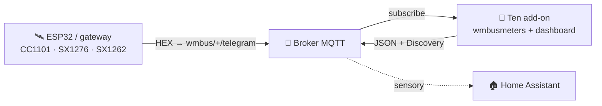
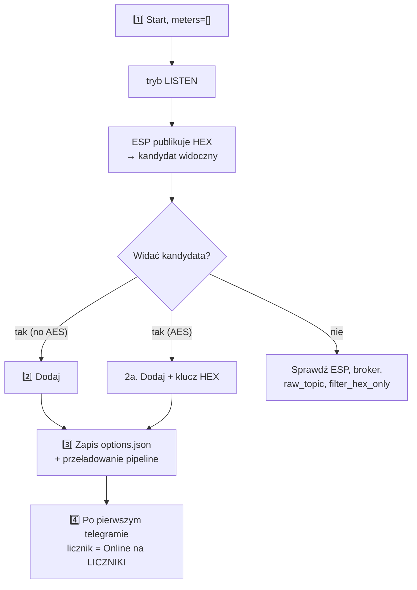

> 🌐 [EN](README.en.md) | [**PL**](README.pl.md) | [DE](README.de.md) | [CS](README.cs.md) | [SK](README.sk.md)

# wMBus MQTT Bridge — dokumentacja użytkownika (PL)

> Przewodnik dla użytkownika: instalacja, dodawanie liczników, czytanie panelu,
> rozwiązywanie problemów. **Jak to działa w środku** (architektura, pliki
> runtime, soft-reload, kontrakt diagnostyki ESP) opisuje
> [`ARCHITECTURE.md`](ARCHITECTURE.md).

---

## Spis treści

1. [Co to robi](#1-co-to-robi)
2. [Wymagania](#2-wymagania)
3. [Szybki start — Home Assistant](#3-szybki-start--home-assistant)
4. [Szybki start — Docker standalone](#4-szybki-start--docker-standalone)
5. [WebUI — co widzisz](#5-webui--co-widzisz)
6. [Typowy workflow: od pustki do działającego licznika](#6-typowy-workflow-od-pustki-do-działającego-licznika)
7. [Tryb SEARCH — gdy słychać za dużo cudzych liczników](#7-tryb-search--gdy-słychać-za-dużo-cudzych-liczników)
8. [Opcje konfiguracji](#8-opcje-konfiguracji)
9. [Język interfejsu](#9-język-interfejsu)
10. [Rozwiązywanie problemów](#10-rozwiązywanie-problemów)
11. [Jak to działa głębiej](#11-jak-to-działa-głębiej)
12. [Licencja i projekty bazowe](#12-licencja-i-projekty-bazowe)

---

## 1. Co to robi

> **W jednym zdaniu:** dekoduje telegramy Wireless M-Bus (wodomierze, liczniki
> ciepła, prądu) **bez lokalnego dongla USB** — surowe ramki HEX dostarcza Ci
> dowolny zewnętrzny odbiornik (ESP32, gateway) przez MQTT.

- **Ty** masz odbiornik radiowy tam, gdzie jest zasięg (np. ESP32 z anteną).
- **Odbiornik** publikuje surowe ramki HEX do MQTT (`wmbus/<device>/telegram`).
- **Ten add-on** podpina się do brokera, dokarmia `wmbusmeters`, dekoduje i
  publikuje wynik z powrotem do MQTT + **Home Assistant Discovery**.

Efekt: **Twoje liczniki pojawiają się jako sensory w HA, bez żadnego sprzętu
radiowego po stronie HA.**



> 🤝 Typowo używany z firmware **[esphome-wmbus-bridge-rawonly](https://github.com/Kustonium/esphome-wmbus-bridge-rawonly)**
> (ESP32 + CC1101/SX1276/SX1262, publikuje RAW HEX). Oba projekty są niezależne —
> add-on przyjmuje hex z dowolnego źródła publikującego na `raw_topic`.

---

## 2. Wymagania

- **Broker MQTT** (Mosquitto, EMQX…) osiągalny z HA / z hosta.
- **Odbiornik** publikujący ramki HEX na `wmbus/<device>/telegram`.
- Home Assistant (tryb add-onu) **albo** Docker + compose (standalone).

> ⚠️ Nie instaluj równolegle oficjalnego add-onu `wmbusmeters` — ten projekt ma
> własną instancję i będą się dublować.

---

## 3. Szybki start — Home Assistant

1. **Dodaj repozytorium:** Settings → Add-ons → Add-on Store → ⋮ → Repositories:
   ```
   https://github.com/Kustonium/homeassistant-wmbus-mqtt-bridge
   ```
2. **Zainstaluj** „wMBus MQTT Bridge", kliknij **Start** (domyślnie `meters: []`
   → add-on wchodzi w **tryb LISTEN** i tylko nasłuchuje).
3. **Otwórz WebUI** (Info → OPEN WEB UI).
4. Wejdź w **ODBIERANE / SZUKAJ**, znajdź swój licznik wśród wykrytych
   kandydatów i kliknij **Dodaj** (modal: ID, sterownik, nazwa, opcjonalny klucz
   AES). Po zapisie pipeline przeładowuje się sam (bez restartu kontenera).

Pełny przebieg w [§6](#6-typowy-workflow-od-pustki-do-działającego-licznika).

---

## 4. Szybki start — Docker standalone

Dla wszystkich poza HA (DietPi, Ubuntu, Raspberry Pi OS, NAS…).

```bash
git clone https://github.com/Kustonium/homeassistant-wmbus-mqtt-bridge.git
mkdir -p /home/wmbus
cp -a homeassistant-wmbus-mqtt-bridge/docker/examples/* /home/wmbus/
cd /home/wmbus
docker compose up -d --build
docker compose logs -f wmbus
```

Konfiguracja w `./config/options.json` (referencja pól w [§8](#8-opcje-konfiguracji)):

```json
{
  "raw_topic": "wmbus/+/telegram",
  "discovery_enabled": true,
  "state_prefix": "wmbusmeters",
  "mqtt_mode": "external",
  "external_mqtt_host": "192.168.1.10",
  "external_mqtt_port": 1883,
  "external_mqtt_username": "user",
  "external_mqtt_password": "pass",
  "meters": []
}
```

Po edycji: `docker compose restart wmbus`. WebUI: wystaw port `8099` w
`docker-compose.yml` i otwórz `http://<host-ip>:8099/`.

> 💡 W Dockerze globalny przycisk restartu nie zadziała (brak Supervisora) —
> użyj `docker restart <container>`.

---

## 5. WebUI — co widzisz

Dostępny w **5 językach** (EN/PL/DE/CS/SK) — przełącznik w prawym górnym rogu.

| Zakładka | Po co |
|---|---|
| **PANEL** | Dashboard: pipeline ESP→MQTT→wmbusmeters→HA (klikalne kafelki) + statystyki. |
| **LICZNIKI** | Twoje skonfigurowane liczniki: wartość, ostatni telegram, **ODBIÓR**. |
| **ODBIERANE / SZUKAJ** | Wykryci kandydaci + skonfigurowane w eterze; tu dodajesz/usuwasz liczniki. |
| **LOGI / LOGI ESP** | Zdarzenia runtime i diagnostyka odbiorników ESP. |
| **USTAWIENIA / O PROJEKCIE** | Aktywna konfiguracja, info. |

### Kolumna ODBIÓR (co oznaczają znaczki)

Najedź na **ⓘ** przy nagłówku ODBIÓR — masz legendę. W skrócie:

- **status + słupki** — czy licznik dochodzi: *online* / *spóźniony* / **cisza**.
  Próg jest **adaptacyjny** do rytmu danego licznika (jego średniego interwału).
  Długa cisza to stan **neutralny** (szary), nie czerwony alarm — licznik bywa
  cichy nocą/po wyjeździe/przy słabej baterii, więc nie krzyczymy alarmem.
- **📡 ESP** — licznik jest zaznaczony (highlight) na którymś ESP.
- **📶 nazwa N% · liczba** — % odbioru i liczba telegramów **na danym ESP**
  (z opcjonalnej diagnostyki). Przy kilku ESP widać, który odbiornik łapie licznik
  i jak dobrze. Kolor: zielony ≥90 · bursztyn ≥50 · czerwony <50.

> Surowy % i liczba telegramów **nie są** miarą czułości płytek (licznik
> kumulatywny od startu, różne uptime). Realna czułość to **pokrycie** — które
> liczniki dana płytka w ogóle słyszy.

### Dodawanie / usuwanie liczników (ODBIERANE)

- Kandydaci bez AES dekodują się automatycznie — w kolumnie **Wartość** widać
  podgląd na żywo bez konfigurowania.
- **Dodaj** zapisuje licznik do konfiguracji i przeładowuje pipeline.
- **Usuń zaznaczone** — zaznacz checkboxy i usuń kilka naraz (przycisk nad tabelą).

---

## 6. Typowy workflow: od pustki do działającego licznika



1. **Start** z `meters: []` → tryb LISTEN, w logach `No meters configured -> LISTEN MODE`.
2. **Dodaj** kandydata (bez AES — od razu; z AES — wpisz 32-znakowy klucz HEX).
3. Zapis trafia do `options.json`, pipeline DECODE przeładowuje się **bez pełnego
   restartu kontenera**.
4. Po **następnym telegramie** tego licznika (od kilkudziesięciu sekund do
   kilkunastu minut, zależnie od licznika) pojawia się on jako **Online** na
   LICZNIKI, a HA Discovery tworzy encje `sensor.<id>_total_m3` itd.

Zanim przyjdzie pierwszy telegram, dashboard pokazuje sekcję **„czeka na pierwszy
telegram"**. Pełny restart dodatku jest tylko awaryjnym fallbackiem.

---

## 7. Tryb SEARCH — gdy słychać za dużo cudzych liczników

W bloku odbiornik łapie dziesiątki cudzych liczników. SEARCH znajduje Twój,
**porównując wskazanie m³ z wyświetlacza** z dekodami wszystkich kandydatów.

1. Wejdź na `#search`, wpisz **aktualny stan** z wyświetlacza (np. `23.93`) i
   **tolerancję** (domyślnie `0.05` = 50 l; w bloku nie zwiększaj).
2. Włącz SEARCH. Add-on dekoduje kandydatów wszystkimi sterownikami i szuka
   dopasowania `total_m3 ≈ wskazanie ± tolerancja`.
3. Po dopasowaniu w logach pojawia się `SEARCH MATCH: id=… driver=…` — dodaj ten
   licznik z ODBIERANE.
4. **Wyłącz `search_mode`** po skończeniu (tymczasowe liczniki SEARCH nie tworzą
   encji w HA).

---

## 8. Opcje konfiguracji

Z [`config.yaml`](../config.yaml).

### MQTT — wejście / wyjście

| Pole | Typ | Domyślnie | Opis |
|---|---|---|---|
| `raw_topic` | str | `wmbus/+/telegram` | Topic z surowymi HEX-ami. `+` = wildcard (nazwa ESP w diagnostyce) |
| `filter_hex_only` | bool | `true` | Ignoruj wiadomości niewyglądające jak HEX |
| `mqtt_mode` | enum | `auto` | `auto` / `ha` (wymuś HA) / `external` (zawsze zewnętrzny) |
| `external_mqtt_host/port/username/password` | str/int | — | Broker zewnętrzny (gdy `external`) |

### Discovery i wyjście

| Pole | Typ | Domyślnie | Opis |
|---|---|---|---|
| `discovery_enabled` | bool | `true` | Publikuje HA Discovery |
| `discovery_prefix` | str | `homeassistant` | Prefix Discovery |
| `discovery_retain` | bool | `true` | Discovery jako retained |
| `state_prefix` | str | `wmbusmeters` | Prefix tematu wartości |
| `state_retain` | bool | `false` | Retained dla stanu |
| `verify_ha_entities` | bool | `false` | (Opt-in) pyta HA Core API, czy encje faktycznie powstały. Włączenie nadaje read-only dostęp do HA Core API. |

### Tryb SEARCH

| Pole | Typ | Domyślnie | Opis |
|---|---|---|---|
| `search_mode` | bool | `false` | Włącza SEARCH ([§7](#7-tryb-search--gdy-słychać-za-dużo-cudzych-liczników)) |
| `search_expected_value_m3` | float | `0` | Oczekiwane wskazanie m³ |
| `search_tolerance_m3` | float | `0.05` | Tolerancja — w bloku nie zwiększaj |
| `search_delta_mode` / `search_min_delta_m3` | bool/float | `false` / `0.001` | (Eksperymentalne) porównanie delty |
| `search_topic` | str | `wmbus/search/candidates` | Topic wyników SEARCH |

### Debug

| Pole | Typ | Domyślnie | Opis |
|---|---|---|---|
| `loglevel` | enum | `normal` | `normal` / `verbose` / `debug` |
| `debug_every_n` | int | `0` | Co N-ty telegram dodatkowa diagnostyka |

### Liczniki — `meters[]`

| Pole | Typ | Wymagane | Opis |
|---|---|---|---|
| `id` | str | tak | Twoja etykieta (nazwa sensora HA) |
| `meter_id` | str | tak | Numer seryjny licznika (HEX, z LISTEN) |
| `type` | str | tak | **Nazwa sterownika wmbusmeters** (np. `hydrodigit`, `amiplus`, `izarv2`) **lub `auto`/`other`**. Dowolny string — wmbusmeters waliduje sterownik przy dekodowaniu (świadomie nie enum, żeby nowe sterowniki nie były odrzucane). |
| `type_other` | str? | gdy `type=other` | Niestandardowa nazwa sterownika |
| `key` | str? | gdy szyfrowany | 32-znakowy klucz AES (HEX) |

Najczęstsze sterowniki: woda — `multical21`, `iperl`, `hydrodigit`, `hydrus`,
`mkradio3`, `izarv2`; ciepło — `kamheat`, `hydrocalm3`, `vario451`; prąd — `amiplus`.

---

## 9. Język interfejsu

5 języków (en/pl/de/cs/sk). Wybór: `?lang=pl` w URL → cookie `wmbus_lang` →
nagłówek `Accept-Language` → domyślnie `en`. Przełącznik w prawym górnym rogu.

---

## 10. Rozwiązywanie problemów

### „Nie widzę żadnych telegramów" (RAW count = 0)
1. Odbiornik publikuje na `wmbus/<cokolwiek>/telegram`? Test: `mosquitto_sub -h <broker> -t 'wmbus/#' -v`.
2. Bridge połączony i subskrybuje? Logi: `mqtt: connected` + `subscribed to wmbus/+/telegram`.
3. `filter_hex_only` nie odrzuca? Włącz `loglevel: verbose` i sprawdź `dropped (not HEX)` — jeśli ESP wysyła base64/JSON, zmień format.
4. Broker osiągalny? Sprawdź błędy połączenia (`mqtt_mode`).

### „Dodałem licznik, ale nie pojawia się w LICZNIKI"
Pojawi się dopiero **po kolejnym telegramie** tego ID (od kilkudziesięciu s do
kilkunastu min). Jeśli dalej nie ma — sprawdź `meter_id`, sterownik, klucz AES i
logi.

### „Licznik znika po aktualizacji dodatku" (np. Diehl/Izar `izarv2`)
Naprawione od wersji **1.5.33**. Wcześniej lista dozwolonych sterowników nie
zawierała nowszych (np. `izarv2`), więc Supervisor odrzucał zapis i licznik
ginął przy restarcie. **Zaktualizuj dodatek do ≥1.5.33**, usuń i dodaj licznik
ponownie — zostanie.

### „Status pokazuje «cisza», nie czerwone «offline»"
Tak ma być (honest-witness): licznik jest pasywny, więc długa cisza jest
niejednoznaczna (noc/wyjazd/bateria) — pokazujemy neutralny stan, nie fałszywy
alarm. Próg liczy się z **rytmu danego licznika**, nie ze sztywnych 15/60 min.

### „Wartość tylko rośnie, nie jest chwilowa"
Jako wartość główną pokazujemy **stan licznika** (`total_m3`,
`total_energy_consumption_kwh`). Wodomierze wystawiające tylko `total_m3` (np.
`hydrodigit`, `itron`, `apator162`) nie mają pola chwilowego przepływu —
aktualne/okresowe zużycie policz w HA pomocnikiem **Utility Meter** (dobowy/
miesięczny, przeżywa restarty) lub **Derivative** (m³/h). `total_m3` jest
publikowane jako `device_class: water` + `state_class: total_increasing`, więc
wchodzi do statystyk wody/Energii HA.

### „HA nie pokazuje aktualizacji dodatku"
HA wykrywa nową wersję tylko gdy zmieni się `version:` w `config.yaml`.
Wymuszenie: Settings → System → ⋮ → Reload albo `ha supervisor restart`.

### „Mam licznik szyfrowany, skąd klucz AES?"
Od dostawcy liczników (administrator budynku / dostawca wody/ciepła), z naklejki
lub dokumentacji. Bez klucza nie zdekodujesz szyfrowanych telegramów.

### „Dodaj licznik nic nie zrobił" (Docker)
Katalog `./config/` musi być **zapisywalny** (nie `:ro`). W logach po dodaniu
powinno być potwierdzenie zapisu do `options.json`. W razie czego `docker
restart <container>`.

---

## 11. Jak to działa głębiej

Architektura, model procesów, pliki runtime w `/data`, soft-reload, kontrakt
diagnostyki ESP, model dashboardu i przepływ wydań dev→stable — wszystko w
**[`ARCHITECTURE.md`](ARCHITECTURE.md)** (po angielsku, dla maintainerów i
współtwórców).

---

## 12. Licencja i projekty bazowe

**GNU GPL-3.0.** Projekt zawiera i modyfikuje kod z `wmbusmeters-ha-addon`
(GPL-3.0); cały — w tym `webui.py`, `i18n.py`, przepisany `bridge.sh` — jest pod
GPL-3.0.

- **wmbusmeters** — https://github.com/wmbusmeters/wmbusmeters (Fredrik Öhrström, GPL-3.0)
- **wmbusmeters-ha-addon** — https://github.com/wmbusmeters/wmbusmeters-ha-addon (GPL-3.0)

Fork rozwijany przez **Kustonium**: wejście MQTT zamiast lokalnego dongla, WebUI
w 5 językach, workflow LISTEN → ADD → SEARCH przez UI.

---

Pytania / błędy → [GitHub Issues](https://github.com/Kustonium/homeassistant-wmbus-mqtt-bridge/issues).
