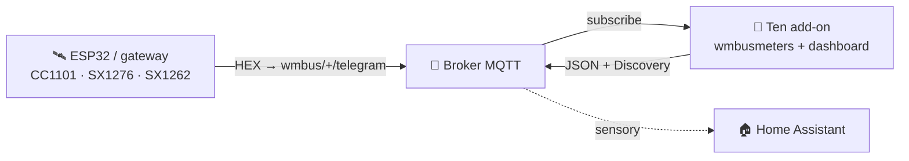
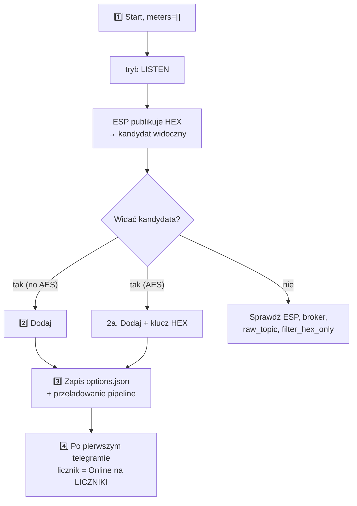

> 🌐 [EN](README.en.md) | [**PL**](README.pl.md) | [DE](README.de.md) | [CS](README.cs.md) | [SK](README.sk.md)

# wMBus MQTT Bridge — dokumentacja użytkownika (PL)

> Przewodnik dla użytkownika: instalacja, dodawanie liczników, czytanie panelu,
> rozwiązywanie problemów. **Jak to działa w środku** (architektura, pliki
> runtime, soft-reload, kontrakt diagnostyki ESP) opisuje
> [`ARCHITECTURE.md`](ARCHITECTURE.md).

---

## Spis treści

1. [Co to robi](#1-co-to-robi)
2. [Wymagania](#2-wymagania)
3. [Szybki start — Home Assistant](#3-szybki-start--home-assistant)
4. [Szybki start — Docker standalone](#4-szybki-start--docker-standalone)
5. [WebUI — co widzisz](#5-webui--co-widzisz)
6. [Typowy workflow: od pustki do działającego licznika](#6-typowy-workflow-od-pustki-do-działającego-licznika)
7. [Filtr wartości — gdy słychać za dużo cudzych liczników](#7-filtr-wartości--gdy-słychać-za-dużo-cudzych-liczników)
8. [Opcje konfiguracji](#8-opcje-konfiguracji)
9. [Język interfejsu](#9-język-interfejsu)
10. [Rozwiązywanie problemów](#10-rozwiązywanie-problemów)
11. [Jak to działa głębiej](#11-jak-to-działa-głębiej)
12. [Licencja i projekty bazowe](#12-licencja-i-projekty-bazowe)

---

## 1. Co to robi

> **W jednym zdaniu:** dekoduje telegramy Wireless M-Bus (wodomierze, liczniki
> ciepła, prądu) **bez lokalnego dongla USB** — surowe ramki HEX dostarcza Ci
> dowolny zewnętrzny odbiornik (ESP32, gateway) przez MQTT.

- **Ty** masz odbiornik radiowy tam, gdzie jest zasięg (np. ESP32 z anteną).
- **Odbiornik** publikuje surowe ramki HEX do MQTT (`wmbus/<device>/telegram`).
- **Ten add-on** podpina się do brokera, dokarmia `wmbusmeters`, dekoduje i
  publikuje wynik z powrotem do MQTT + **Home Assistant Discovery**.

Efekt: **Twoje liczniki pojawiają się jako sensory w HA, bez żadnego sprzętu
radiowego po stronie HA.**



> 🤝 Typowo używany z firmware **[esphome-wmbus-bridge-rawonly](https://github.com/Kustonium/esphome-wmbus-bridge-rawonly)**
> (ESP32 + CC1101/SX1276/SX1262, publikuje RAW HEX). Oba projekty są niezależne —
> add-on przyjmuje hex z dowolnego źródła publikującego na `raw_topic`.

> 🌉 **Całościowo ESP (odbiornik radiowy) i ten add-on (dekoder) tworzą
> rozproszony _gateway wM-Bus → Home Assistant_** — radio stoi tam, gdzie jest
> zasięg, a dekodowanie (deszyfracja i zestaw driverów z przypiętego buildu
> `wmbusmeters`) działa na HA. W odróżnieniu od monolitycznych bramek wM-Bus (radio + dekoder w jednym
> pudełku) nie wymaga lokalnego dongla USB i skaluje się przez dostawianie
> tanich węzłów ESP.
>
> **Każdą połowę można też używać samodzielnie i są wymienne:** ESP karmi dowolny backend MQTT (Node-RED, własny skrypt, własny dekoder), a add-on dekoduje hex z dowolnego źródła na `raw_topic` (ten ESP, rtl-wmbus, inny gateway, narzędzie replay) — współpracują, ale żadna nie zależy od drugiej.

---

## 2. Wymagania

- **Broker MQTT** (Mosquitto, EMQX…) osiągalny z HA / z hosta.
- **Odbiornik** publikujący ramki HEX na `wmbus/<device>/telegram`.
- Home Assistant (tryb add-onu) **albo** Docker + compose (standalone).

> ⚠️ Nie instaluj równolegle oficjalnego add-onu `wmbusmeters` — ten projekt ma
> własną instancję i będą się dublować.

> 🧱 **Granica odpowiedzialności.** Projekt dostarcza dwóch klientów MQTT — firmware ESP (radio → MQTT) i ten add-on (MQTT → dekodowanie → HA); jego zakres kończy się na temacie MQTT. **Sam broker — uwierzytelnianie, ACL, TLS, ekspozycja sieciowa oraz ewentualny mostek broker-broker dla instalacji zdalnych/rozproszonych (lokalizacja A → internet → lokalizacja B) — jest odpowiedzialnością operatora.** Zalecane: trzymaj broker w LAN; do dostępu zdalnego użyj tunelu/VPN albo mostka brokera z TLS; nie wystawiaj portu 1883 ani WebUI (8099) wprost do internetu. Uwaga: dla liczników z AES payload pozostaje zaszyfrowany przez licznik end-to-end, niezależnie od transportu brokera.

> ⚠️ **Początkujący? Przeczytaj, zanim cokolwiek wystawisz.** **Nie** przekierowuj na domowym routerze portu brokera (1883) ani Home Assistanta do internetu — wystawiony broker może odczytać i wykorzystać ktokolwiek. Do dostępu z zewnątrz użyj gotowego, bezpiecznego rozwiązania: **Home Assistant Cloud (Nabu Casa)** albo dodatków **Tailscale** / **Cloudflare Tunnel**. Nie masz pewności? Zostaw wszystko w sieci domowej — add-on do działania nie potrzebuje internetu.

---

## 3. Szybki start — Home Assistant

1. **Dodaj repozytorium:** Settings → Add-ons → Add-on Store → ⋮ → Repositories:
   ```
   https://github.com/Kustonium/homeassistant-wmbus-mqtt-bridge
   ```
2. **Zainstaluj** „wMBus MQTT Bridge", kliknij **Start** (domyślnie `meters: []`
   → add-on wchodzi w **tryb LISTEN** i tylko nasłuchuje).
3. **Otwórz WebUI** (Info → OPEN WEB UI).
4. Wejdź w **ODBIERANE / SZUKAJ**, znajdź swój licznik wśród wykrytych
   kandydatów i kliknij **Dodaj** (modal: ID, sterownik, nazwa, opcjonalny klucz
   AES). Po zapisie pipeline przeładowuje się sam (bez restartu kontenera).

Pełny przebieg w [§6](#6-typowy-workflow-od-pustki-do-działającego-licznika).

---

## 4. Szybki start — Docker standalone

Dla wszystkich poza HA (DietPi, Ubuntu, Raspberry Pi OS, NAS…).

```bash
git clone https://github.com/Kustonium/homeassistant-wmbus-mqtt-bridge.git
mkdir -p /home/wmbus
cp -a homeassistant-wmbus-mqtt-bridge/docker/examples/* /home/wmbus/
cd /home/wmbus
docker compose pull
docker compose up -d
docker compose logs -f wmbus
```

Obraz `wmbus` jest wieloarchitekturowy (amd64 + aarch64) — `pull` sam ściąga
wariant pasujący do hosta, bez lokalnej kompilacji.

Konfiguracja w `./config/options.json` (referencja pól w [§8](#8-opcje-konfiguracji)):

```json
{
  "raw_topic": "wmbus/+/telegram",
  "discovery_enabled": true,
  "state_prefix": "wmbusmeters",
  "mqtt_mode": "external",
  "external_mqtt_host": "192.168.1.10",
  "external_mqtt_port": 1883,
  "external_mqtt_username": "user",
  "external_mqtt_password": "pass",
  "meters": []
}
```

Po edycji: `docker compose restart wmbus`. WebUI: wystaw port `8099` w
`docker-compose.yml` i otwórz `http://<host-ip>:8099/`.

> 💡 W Dockerze globalny przycisk **Restart** działa, jeśli kontener ma ustawioną
> politykę restartu (przykładowy plik Compose używa `restart: unless-stopped`).
> Bez niej przycisk zatrzyma kontener; uruchom go ponownie poleceniem
> `docker start <container>`.

---

## 5. WebUI — co widzisz

Dostępny w **5 językach** (EN/PL/DE/CS/SK) — przełącznik w prawym górnym rogu.

| Zakładka | Po co |
|---|---|
| **PANEL** | Dashboard: pipeline ESP→MQTT→wmbusmeters→HA (klikalne kafelki) + statystyki. |
| **LICZNIKI** | Twoje skonfigurowane liczniki: wartość, ostatni telegram, **ODBIÓR**. |
| **ODBIERANE / SZUKAJ** | Wykryci kandydaci + skonfigurowane w eterze; tu dodajesz/usuwasz liczniki i filtrujesz pokazane wartości. |
| **LOGI / LOGI ESP** | Zdarzenia runtime i diagnostyka odbiorników ESP. |
| **USTAWIENIA / O PROJEKCIE** | Aktywna konfiguracja, info. |

### Kolumna ODBIÓR (co oznaczają znaczki)

Najedź na **ⓘ** przy nagłówku ODBIÓR — masz legendę. W skrócie:

- **status + słupki** — czy licznik dochodzi: *online* / *spóźniony* / **cisza**.
  Próg jest **adaptacyjny** do rytmu danego licznika (jego średniego interwału).
  Długa cisza to stan **neutralny** (szary), nie czerwony alarm — licznik bywa
  cichy nocą/po wyjeździe/przy słabej baterii, więc nie krzyczymy alarmem.
- **📡 ESP** — licznik jest zaznaczony (highlight) na którymś ESP.
- **📶 nazwa N% · liczba** — % odbioru i liczba telegramów **na danym ESP**
  (z opcjonalnej diagnostyki). Przy kilku ESP widać, który odbiornik łapie licznik
  i jak dobrze. Kolor: zielony ≥90 · bursztyn ≥50 · czerwony <50.

> Surowy % i liczba telegramów **nie są** miarą czułości płytek (licznik
> kumulatywny od startu, różne uptime). Realna czułość to **pokrycie** — które
> liczniki dana płytka w ogóle słyszy.

### Dodawanie / usuwanie liczników (ODBIERANE)

- Kandydaci bez AES dekodują się automatycznie — w kolumnie **Wartość** widać
  podgląd na żywo bez konfigurowania.
- **Dodaj** zapisuje licznik do konfiguracji i przeładowuje pipeline.
- **Porównaj** w modalu **Dodaj** lub **Driver…** dekoduje ostatni telegram dwoma
  driverami bez zapisywania zmian. Wybierz driver w polu **Sterownik**, wpisz
  klucz AES jeśli licznik jest szyfrowany i kliknij **Porównaj**. Lewa kolumna to
  driver zapisany albo auto-detekcja `wmbusmeters`, prawa kolumna to driver
  wybrany przez Ciebie. Zielone wiersze oznaczają dodatkowe pola, żółte — inną
  wartość; więcej pól **nie** znaczy automatycznie poprawnie, więc porównaj
  wartości z wyświetlaczem licznika.
- **Zgłoszenie…** używa zapisanego 32-znakowego klucza AES dla tego samego ID,
  jeśli taki klucz istnieje, dzięki czemu `wmbusmeters --analyze` może pokazać
  dane po deszyfracji. Sam klucz nigdy nie trafia do raportu, ale mogą znaleźć
  się w nim odczyty licznika — sprawdź raport przed publicznym wklejeniem.
- **Usuń zaznaczone** — zaznacz checkboxy i usuń kilka naraz (przycisk nad tabelą).

---

## 6. Typowy workflow: od pustki do działającego licznika



1. **Start** z `meters: []` → tryb LISTEN, w logach `No meters configured -> LISTEN MODE`.
2. **Dodaj** kandydata (bez AES — od razu; z AES — wpisz 32-znakowy klucz HEX).
3. Zapis trafia do `options.json`, pipeline DECODE przeładowuje się **bez pełnego
   restartu kontenera**.
4. Po **następnym telegramie** tego licznika pojawia się on jako **Online** na
   LICZNIKI, a HA Discovery tworzy encje dla liczbowych pól zwróconych przez
   `wmbusmeters`, np. `total_m3`. Końcowy `entity_id` nadaje Home Assistant;
   bridge nie ustala go na sztywno.

Zanim przyjdzie pierwszy telegram, dashboard pokazuje sekcję **„czeka na pierwszy
telegram"**. Pełny restart dodatku jest tylko awaryjnym fallbackiem.

**Niewspierany licznik?** Jeśli kandydat nigdy się nie dekoduje (nieznany driver
/ „unknown format signature"), użyj przycisku **Zgłoszenie…** w jego wierszu:
add-on buduje gotowy do wklejenia blok zgłoszenia do projektu wmbusmeters
(surowy telegram + wynik `wmbusmeters --analyze`). Telegram zawiera numer
seryjny licznika. Klucz AES nigdy nie jest dołączany; jeśli zapisany klucz
został użyty do analizy, zdekodowany wynik może zawierać odczyty licznika.

---

## 7. Filtr wartości — gdy słychać za dużo cudzych liczników

Aktualny workflow w WebUI to pasek **Filtruj po wartości** w ODBIERANE / SZUKAJ:

1. Poczekaj, aż skonfigurowane liczniki lub kandydaci pokażą liczbę w kolumnie
   **Wartość**.
2. Wpisz odczyt z fizycznego wyświetlacza i tolerancję (domyślnie `0.05`).
3. Przeglądarka pozostawi wiersze mieszczące się w tolerancji i ukryje wiersze
   z inną albo brakującą wartością.

Filtr porównuje wyłącznie wartości już pokazane w WebUI. Nie uruchamia kolejnych
dekoderów, nie próbuje innych driverów i nie zmienia konfiguracji. Do zestawienia
dwóch driverów dla tej samej ramki służy osobno przycisk **Porównaj**.

Starszy backend `search_mode` nadal istnieje dla zastosowań zaawansowanych pod
ukrytą trasą `#search`. Po włączeniu LISTEN zapisuje tylko kandydatów zgłoszonych
jako nieszyfrowane wodomierze wraz z jednym sugerowanym driverem. Dopiero kolejny
restart ładuje zapisanych kandydatów jako tymczasowe liczniki i sprawdza liczbowe
pola, których nazwa zawiera `m3` albo `total_volume`. Mechanizm **nie** próbuje
wszystkich driverów. Tymczasowe liczniki SEARCH są wyłączone z HA Discovery.

---

## 8. Opcje konfiguracji

Z [`config.yaml`](../config.yaml).

### MQTT — wejście / wyjście

| Pole | Typ | Domyślnie | Opis |
|---|---|---|---|
| `raw_topic` | str | `wmbus/+/telegram` | Topic z surowymi HEX-ami. `+` = wildcard (nazwa ESP w diagnostyce) |
| `filter_hex_only` | bool | `true` | Ignoruj wiadomości niewyglądające jak HEX |
| `mqtt_mode` | enum | `auto` | `auto` (kolejność: `external_mqtt_host` jeśli wpisany → broker HA z usługi Supervisora → sonda znanych brokerów-add-onów `core-mosquitto`/`a0d7b954-emqx`, z danymi `external_mqtt_username/password` jeśli podane) / `ha` (wymuś HA) / `external` (zawsze zewnętrzny) |
| `external_mqtt_host/port/username/password` | str/int | `""` / `1883` / `""` / `""` | Broker zewnętrzny (gdy `external`) |

### Discovery i wyjście

| Pole | Typ | Domyślnie | Opis |
|---|---|---|---|
| `discovery_enabled` | bool | `true` | Publikuje HA Discovery |
| `discovery_prefix` | str | `homeassistant` | Prefix Discovery |
| `discovery_retain` | bool | `true` | Discovery jako retained |
| `state_prefix` | str | `wmbusmeters` | Prefix tematu wartości |
| `state_retain` | bool | `false` | Retained dla stanu |
| `verify_ha_entities` | bool | `false` | W trybie add-onu HA używa zadeklarowanego dla dodatku dostępu read-only do HA Core API, aby sprawdzić encję kontrolną. Docker nie ma tokenu Supervisora, więc ta weryfikacja jest tam niedostępna. |

Każda encja z Discovery ma **availability template**: gdy w ostatnim telegramie
licznika brakuje danego pola (niektóre liczniki wysyłają naprzemiennie ramki
krótkie i pełne), encja pokazuje `unavailable` zamiast przestarzałej lub
fałszywej wartości — i wraca automatycznie przy następnym telegramie
zawierającym to pole. Niezależnie od tego auto-strojony `expire_after`
(ok. 2× zaobserwowany interwał nadawania licznika, minimum 1 h) oznacza encje
jako `unavailable`, gdy licznik zamilknie.

Poza liczbowymi sensorami pomiarowymi każdy licznik raportujący pole `status`
dostaje też dwie encje **diagnostyczne** (w sekcji *Diagnostyka* urządzenia):
`sensor` z surowym tekstem statusu oraz `binary_sensor` (`device_class:
problem`), który włącza się, gdy status jest inny niż `OK`. Tekst jest
przekazywany 1:1 z `wmbusmeters`, więc jego dokładna treść zależy od wybranego
drivera upstream.

### Starszy tryb SEARCH

| Pole | Typ | Domyślnie | Opis |
|---|---|---|---|
| `search_mode` | bool | `false` | Włącza ukryty starszy backend SEARCH opisany w [§7](#7-filtr-wartości--gdy-słychać-za-dużo-cudzych-liczników) |
| `search_expected_value_m3` | float | `0` | Oczekiwane wskazanie m³ |
| `search_tolerance_m3` | float | `0.05` | Tolerancja — w bloku nie zwiększaj |
| `search_delta_mode` / `search_min_delta_m3` | bool/float | `false` / `0.001` | (Eksperymentalne) porównanie delty |
| `search_topic` | str | `wmbus/search/candidates` | Topic wyników SEARCH publikowany bez retain |

### Debug

| Pole | Typ | Domyślnie | Opis |
|---|---|---|---|
| `loglevel` | enum | `normal` | `normal` / `verbose` / `debug` |
| `debug_every_n` | int | `0` | Co N-ty telegram dodatkowa diagnostyka |

### Liczniki — `meters[]`

| Pole | Typ | Wymagane | Opis |
|---|---|---|---|
| `id` | str | tak | Twoja etykieta licznika, używana w nazwach MQTT Discovery i generowanej konfiguracji |
| `meter_id` | str | tak | Numer seryjny licznika (HEX, z LISTEN) |
| `type` | str | tak | **Nazwa sterownika wmbusmeters** (np. `hydrodigit`, `amiplus`, `izarv2`) **lub `auto`/`other`**. Dowolny string — wmbusmeters waliduje sterownik przy dekodowaniu (świadomie nie enum, żeby nowe sterowniki nie były odrzucane). |
| `type_other` | str? | gdy `type=other` | Niestandardowa nazwa sterownika |
| `key` | str? | gdy szyfrowany | 32-znakowy klucz AES (HEX) |

Lista driverów w WebUI jest generowana z przypiętego buildu `wmbusmeters` i jego
źródeł XMQ. Korzystaj z tego katalogu zamiast ręcznej listy w dokumentacji.

---

## 9. Język interfejsu

5 języków (en/pl/de/cs/sk). Wybór: `?lang=pl` w URL → cookie `wmbus_lang` →
nagłówek `Accept-Language` → domyślnie `en`. Przełącznik w prawym górnym rogu.

---

## 10. Rozwiązywanie problemów

### „Telegramy docierają do brokera, ale w HA nie ma encji"

Uruchom **Discovery Doctor** (widok USTAWIENIA): checklista jednym kliknięciem
pokazuje bieżący stan MQTT bridge'a, ustawienia Discovery oraz liczbę retained
configów sensorów dla każdego skonfigurowanego licznika, razem z przykładowym
payloadem. Odebrany komunikat birth HA potwierdza właściwy broker i prefiks;
jego brak niczego nie rozstrzyga, bo ten komunikat nie zawsze jest retained.
Mocniejszym sprawdzeniem jest opcjonalna encja kontrolna przez HA Core API.
Okno ma również przycisk **Wymuś ponowne discovery**.

### „Chcę zacząć od zera — usuń wszystkie liczniki"

W widoku USTAWIENIA przycisk **Wyzeruj add-on** usuwa WSZYSTKIE skonfigurowane
liczniki, kasuje ich encje w Home Assistant (publikuje puste retained configi
discovery, więc encje znikają) i czyści stan runtime (kandydaci, lista
ignorowanych, statystyki). Add-on wraca do stanu jak po instalacji. Operacja
jest nieodwracalna i wymaga potwierdzenia.

### „Chcę zmieniać opcje bez wychodzenia z WebUI"

Widok USTAWIENIA ma edytowalny formularz **Konfiguracja** dla opcji skalarnych
ze schematu add-onu, z opisem „po co są" przy każdej. Liczniki są zarządzane
osobno w ODBIERANE / SZUKAJ. Zapis trafia przez Supervisor API w trybie add-onu
HA, a w samodzielnym Dockerze
bezpośrednio do `/config/options.json`. Hasło MQTT jest tylko do zapisu (zostaw
puste, by zachować obecną wartość). Opcje rdzenne wchodzą w życie po pełnym
restarcie add-onu lub kontenera.

### „Mój licznik szyfruje telegramy — co dalej?"

Gdy LISTEN jawnie zgłosi szyfrowanie, kandydat ma odznakę **AES req.**. Bez
indywidualnego 128-bitowego klucza AES (32 znaki hex) jego payloadu nie da się
zdekodować. Skąd wziąć klucz: **zarządca
budynku / spółdzielnia**, **dostawca medium**, który rozlicza licznik, albo
**instalator licznika**. Licznik możesz dodać bez klucza i uzupełnić go później
przyciskiem **Driver…**. Gdy `wmbusmeters` wypisze rozpoznane ostrzeżenie o
brakującym lub błędnym kluczu, bridge zapisuje je i pokazuje odpowiedni czerwony
status przy liczniku. Po poprawieniu klucza pipeline się przeładowuje i czeka na
następny telegram.

### „Nie widzę żadnych telegramów" (RAW count = 0)
1. Odbiornik publikuje na `wmbus/<cokolwiek>/telegram`? Test: `mosquitto_sub -h <broker> -t 'wmbus/#' -v`.
2. Sprawdź rzeczywiste linie startowe: `MQTT: <host>:<port> topic=<raw_topic>` oraz `MQTT broker ready`.
3. Przy `filter_hex_only: true` payloady niebędące HEX-em albo mające nieparzystą długość są po cichu odrzucane przed licznikiem RAW. Jeśli ESP wysyła base64/JSON, zmień format nadawcy albo świadomie wyłącz filtr.
4. Broker osiągalny? Sprawdź błędy połączenia (`mqtt_mode`).

### „Dodałem licznik, ale nie pojawia się w LICZNIKI"
Pojawi się dopiero **po kolejnym telegramie** tego ID (od kilkudziesięciu s do
kilkunastu min). Jeśli dalej nie ma — sprawdź `meter_id`, sterownik, klucz AES i
logi.

### „Brakuje drivera w formularzu licznika"
Aktualny schemat zapisuje `type` jako dowolny string; nie ma stałego enum z
dozwolonymi driverami. Katalog WebUI powstaje z driverów wbudowanych i XMQ z
przypiętego buildu `wmbusmeters`, a build obrazu kończy się błędem, jeśli brakuje
wbudowanego drivera `izar`. Sprawdź aktywne opcje i wybierz driver ponownie z
tego katalogu.

### „Status pokazuje «cisza», nie czerwone «offline»"
Tak ma być (honest-witness): licznik jest pasywny, więc długa cisza jest
niejednoznaczna (noc/wyjazd/bateria) — pokazujemy neutralny stan, nie fałszywy
alarm. Próg liczy się z **rytmu danego licznika**, nie ze sztywnych 15/60 min.

### „Wartość tylko rośnie, nie jest chwilowa"
Jako wartość główną pokazujemy **stan licznika** (`total_m3`,
`total_energy_consumption_kwh`). Jeśli JSON dekodera zawiera `total_m3`, ale nie
zawiera pola chwilowego przepływu, bridge go nie tworzy. Aktualne/okresowe
zużycie policz w HA pomocnikiem **Utility Meter** (dobowy/
miesięczny, przeżywa restarty) lub **Derivative** (m³/h). `total_m3` jest
publikowane jako `device_class: water` + `state_class: total_increasing`, więc
wchodzi do statystyk wody/Energii HA.

### „Mam licznik szyfrowany, skąd klucz AES?"
Od dostawcy liczników (administrator budynku / dostawca wody/ciepła), z naklejki
lub dokumentacji. Bez klucza nie zdekodujesz szyfrowanych telegramów.

### „Dodaj licznik nic nie zrobił" (Docker)
Katalog `./config/` musi być **zapisywalny** (nie `:ro`). W logach po dodaniu
powinno być potwierdzenie zapisu do `options.json`. W razie czego `docker
restart <container>`.

---

## 11. Jak to działa głębiej

**Dlaczego dekodowanie na serwerze, a nie na ESP?** Projekty, które wbudowują
dekoder w firmware ESP, wpadają wciąż w te same klasy problemów: każdy nowy
model licznika wymaga aktualizacji firmware, każde wydanie ESPHome/toolchaina
może zepsuć kompilację wbudowanego dekodera, a cała flota urządzeń kończy
przypięta do starej wersji ESPHome tylko po to, żeby jeden komponent dalej się
kompilował. Tutaj ESP w ogóle nie wozi dekodera, więc:

- dodanie lub zmiana licznika to edycja w WebUI — **nigdy reflash**;
- aktualizacje ESPHome nie mogą zepsuć dekodowania — na chipie nie ma dekodera,
  który mógłby się zepsuć;
- klucze AES zostają na serwerze — ESP nigdy nie widzi materiału kryptograficznego;
- firmware jest identyczny dla każdego i nie rośnie wraz z liczbą liczników.

Uczciwy koszt: potrzebny jest stale działający host i broker MQTT — czyli to,
co instalacja Home Assistant i tak już ma. Pełne uzasadnienie, z tabelą klas
awarii, znajdziesz w
[`ARCHITECTURE.md`](ARCHITECTURE.md#why-decode-centrally).

Granica integracji z `wmbusmeters`, przepływ telegramu, model procesów, pliki
runtime, soft-reload, kontrakt ESP i dane panelu są opisane w
**[`ARCHITECTURE.md`](ARCHITECTURE.md)**. Budowanie, CI, aktualizacje dekodera i
granicę między repozytoriami dev i stable opisuje
**[`DEVELOPMENT.md`](DEVELOPMENT.md)**.

---

## 12. Licencja i projekty bazowe

**GNU GPL-3.0.** Projekt zawiera i modyfikuje kod z `wmbusmeters-ha-addon`
(GPL-3.0); cały — w tym `webui.py`, `i18n.py`, przepisany `bridge.sh` — jest pod
GPL-3.0.

- **wmbusmeters** — https://github.com/wmbusmeters/wmbusmeters (Fredrik Öhrström, GPL-3.0)
- **wmbusmeters-ha-addon** — https://github.com/wmbusmeters/wmbusmeters-ha-addon (GPL-3.0)

Fork rozwijany przez **Kustonium**: wejście MQTT zamiast lokalnego dongla, WebUI
w 5 językach, LISTEN/ADD, filtrowanie wartości i porównywanie driverów.

---

Pytania / błędy → [GitHub Issues](https://github.com/Kustonium/homeassistant-wmbus-mqtt-bridge/issues).
