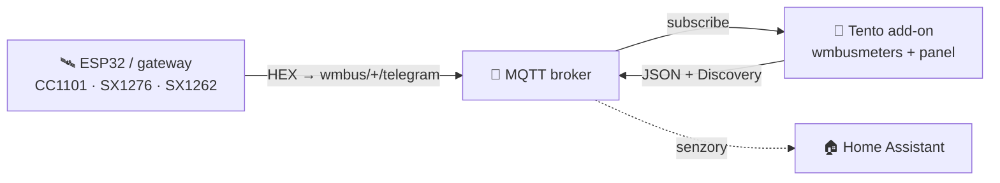
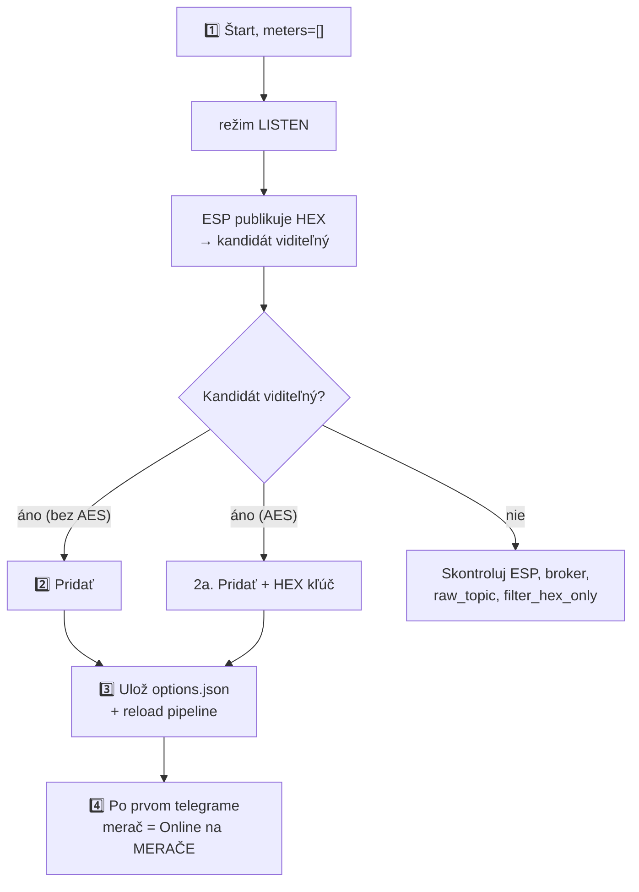

> 🌐 [EN](README.en.md) | [PL](README.pl.md) | [DE](README.de.md) | [CS](README.cs.md) | [**SK**](README.sk.md)

# wMBus MQTT Bridge — používateľská príručka (SK)

> Príručka pre používateľa: inštalácia, pridávanie meračov, čítanie panelu,
> riešenie problémov. **Ako to funguje vnútri** (architektúra, runtime súbory,
> soft-reload, kontrakt ESP diagnostiky) je v [`ARCHITECTURE.md`](ARCHITECTURE.md).

---

## Obsah

1. [Čo to robí](#1-čo-to-robí)
2. [Požiadavky](#2-požiadavky)
3. [Rýchly štart — Home Assistant](#3-rýchly-štart--home-assistant)
4. [Rýchly štart — Docker standalone](#4-rýchly-štart--docker-standalone)
5. [WebUI — čo vidíš](#5-webui--čo-vidíš)
6. [Typický postup: od prázdna k funkčnému meraču](#6-typický-postup-od-prázdna-k-funkčnému-meraču)
7. [Filtrovanie podľa hodnoty — keď je počuť priveľa cudzích meračov](#7-filtrovanie-podľa-hodnoty--keď-je-počuť-priveľa-cudzích-meračov)
8. [Možnosti konfigurácie](#8-možnosti-konfigurácie)
9. [Jazyk rozhrania](#9-jazyk-rozhrania)
10. [Riešenie problémov](#10-riešenie-problémov)
11. [Ako to funguje pod kapotou](#11-ako-to-funguje-pod-kapotou)
12. [Licencia a upstream](#12-licencia-a-upstream)

---

## 1. Čo to robí

> **Jednou vetou:** dekóduje telegramy Wireless M-Bus (vodomery, merače tepla,
> elektromery) **bez lokálneho USB donglu** — surové HEX rámce dodáva ľubovoľný
> externý prijímač (ESP32, gateway) cez MQTT.

- **Ty** umiestniš rádiový prijímač tam, kde je signál (napr. ESP32 s anténou).
- **Prijímač** publikuje surové HEX rámce na MQTT (`wmbus/<device>/telegram`).
- **Tento add-on** sa pripojí k brokeru, kŕmi `wmbusmeters`, dekóduje telegramy a
  publikuje výsledok späť na MQTT + **Home Assistant Discovery**.

Výsledok: **tvoje merače sa objavia ako senzory v HA, bez akéhokoľvek rádiového hardvéru na strane HA.**



> 🤝 Typicky sa používa s firmvérom **[esphome-wmbus-bridge-rawonly](https://github.com/Kustonium/esphome-wmbus-bridge-rawonly)**
> (ESP32 + CC1101/SX1276/SX1262, publikuje RAW HEX). Oba projekty sú nezávislé —
> add-on prijíma hex z ľubovoľného zdroja publikujúceho na `raw_topic`.

> 🌉 **Ako celok tvoria ESP (RF prijímač) a tento add-on (dekodér)
> distribuovaný _wM-Bus → Home Assistant gateway_** — rádio je tam, kde je
> signál, a dekódovanie (dešifrovanie a sada ovládačov z pripnutého zostavenia
> `wmbusmeters`) beží na HA.
> Na rozdiel od monolitických wM-Bus gateway (rádio + dekodér v jednej krabičke)
> nepotrebuje lokálny USB dongle a škáluje pridávaním lacných ESP uzlov.
>
> **Každá polovica funguje aj samostatne a sú zameniteľné:** ESP kŕmi ľubovoľný MQTT backend (Node-RED, vlastný skript, vlastný dekodér) a add-on dekóduje hex z ľubovoľného zdroja na `raw_topic` (tento ESP, rtl-wmbus, iný gateway, replay nástroj) — spolupracujú, ale ani jedna nezávisí od druhej.

---

## 2. Požiadavky

- **MQTT broker** (Mosquitto, EMQX…) dosiahnuteľný z HA / z hostiteľa.
- **Prijímač** publikujúci HEX rámce na `wmbus/<device>/telegram`.
- Home Assistant (režim add-onu) **alebo** Docker + compose (standalone).

> ⚠️ Neprevádzkuj paralelne oficiálny add-on `wmbusmeters` — tento projekt má vlastnú
> inštanciu a navzájom by sa zdvojovali.

> 🧱 **Hranica zodpovednosti.** Projekt poskytuje dvoch MQTT klientov — firmware ESP (rádio → MQTT) a tento add-on (MQTT → dekódovanie → HA); jeho rozsah končí pri MQTT téme. **Samotný broker — autentifikácia, ACL, TLS, sieťová expozícia a prípadný bridging broker-broker pre vzdialené/distribuované inštalácie (lokalita A → internet → lokalita B) — je zodpovednosťou prevádzkovateľa.** Odporúčané: broker drž v LAN; pre vzdialený prístup použi tunel/VPN alebo bridging brokera s TLS; nevystavuj port 1883 ani WebUI (8099) priamo do internetu. Pozn.: pri meračoch s AES ostáva payload šifrovaný meračom end-to-end, nezávisle od transportu brokera.

> ⚠️ **Začiatočník? Prečítaj si to, než niečo vystavíš.** **Nepresmerovávaj** na domácom routeri port brokera (1883) ani Home Assistant do internetu — vystavený broker môže čítať a zneužiť ktokoľvek. Pre prístup zvonku použi hotové bezpečné riešenie: **Home Assistant Cloud (Nabu Casa)** alebo add-ony **Tailscale** / **Cloudflare Tunnel**. Nie si si istý? Nechaj všetko v domácej sieti — add-on na svoju funkciu internet nepotrebuje.

---

## 3. Rýchly štart — Home Assistant

1. **Pridaj repozitár:** Settings → Add-ons → Add-on Store → ⋮ → Repositories:
   ```
   https://github.com/Kustonium/homeassistant-wmbus-mqtt-bridge
   ```
2. **Nainštaluj** „wMBus MQTT Bridge", klikni **Start** (s predvoleným `meters: []`
   add-on prejde do **režimu LISTEN** a iba počúva).
3. **Otvor WebUI** (Info → OPEN WEB UI).
4. Choď na **PRÍJEM / HĽADANIE**, nájdi svoj merač medzi detegovanými kandidátmi a
   klikni **Pridať** (modal: ID, ovládač, názov, voliteľný AES kľúč). Po uložení sa
   pipeline sama prenačíta (bez reštartu kontajnera).

Celý postup v [§6](#6-typický-postup-od-prázdna-k-funkčnému-meraču).

---

## 4. Rýchly štart — Docker standalone

Pre všetko mimo HA (DietPi, Ubuntu, Raspberry Pi OS, NAS…).

```bash
git clone https://github.com/Kustonium/homeassistant-wmbus-mqtt-bridge.git
mkdir -p /home/wmbus
cp -a homeassistant-wmbus-mqtt-bridge/docker/examples/* /home/wmbus/
cd /home/wmbus
docker compose pull
docker compose up -d
docker compose logs -f wmbus
```

Image `wmbus` je multi-arch (amd64 + aarch64) — `pull` sám stiahne variantu
zodpovedajúcu tvojmu hostu, bez lokálnej kompilácie.

Konfigurácia v `./config/options.json` (referencia polí v [§8](#8-možnosti-konfigurácie)):

```json
{
  "raw_topic": "wmbus/+/telegram",
  "discovery_enabled": true,
  "state_prefix": "wmbusmeters",
  "mqtt_mode": "external",
  "external_mqtt_host": "192.168.1.10",
  "external_mqtt_port": 1883,
  "external_mqtt_username": "user",
  "external_mqtt_password": "pass",
  "meters": []
}
```

Po úprave: `docker compose restart wmbus`. WebUI: vystav port `8099` v
`docker-compose.yml` a otvor `http://<host-ip>:8099/`.

> 💡 V Dockeri globálne tlačidlo **Reštart** funguje, ak má kontajner nastavenú
> politiku reštartu (ukážkový súbor Compose používa
> `restart: unless-stopped`). Bez nej tlačidlo kontajner zastaví; znova ho
> spustite pomocou `docker start <container>`.

---

## 5. WebUI — čo vidíš

Dostupné v **5 jazykoch** (EN/PL/DE/CS/SK) — prepínač vpravo hore.

| Záložka | Na čo |
|---|---|
| **PANEL** | Dashboard: pipeline ESP→MQTT→wmbusmeters→HA (klikateľné dlaždice) + štatistiky. |
| **MERAČE** | Tvoje nakonfigurované merače: hodnota, posledný telegram, **PRÍJEM**. |
| **PRÍJEM / HĽADANIE** | Detegovaní kandidáti + nakonfigurované „v éteri"; tu pridáš/odoberieš merače a filtruješ zobrazené hodnoty. |
| **LOGY / ESP LOGY** | Runtime udalosti a diagnostika ESP prijímačov. |
| **NASTAVENIA / O PROJEKTE** | Aktívna konfigurácia, info. |

### Stĺpec PRÍJEM (čo znamenajú odznaky)

Nájdi kurzorom na **ⓘ** pri hlavičke PRÍJEM — máš legendu. Stručne:

- **stav + stĺpce** — či merač dochádza: *online* / *oneskorený* / **ticho**. Prah je
  **adaptívny** podľa rytmu daného merača (jeho priemerného intervalu). Dlhšie ticho je
  **neutrálne** (sivé), nie červený alarm — merač môže byť v noci / pri neprítomnosti /
  pri slabej batérii tichý, takže nehlásime planý poplach.
- **📡 ESP** — merač je označený (highlight) na niektorom z ESP.
- **📶 názov N% · počet** — % príjmu a počet telegramov **na danom ESP** (z voliteľnej
  diagnostiky). Pri viacerých ESP vidíš, ktorý prijímač merač počuje a ako dobre. Farba:
  zelená ≥90 · jantárová ≥50 · červená <50.

> Surové % a počet **nie sú** mierou citlivosti dosky (kumulatívny počet od bootu,
> rôzne uptime). Skutočná citlivosť je **pokrytie** — ktoré merače doska vôbec počuje.

### Pridávanie / odoberanie meračov (PRÍJEM)

- Kandidáti bez AES sa dekódujú automaticky — stĺpec **Hodnota** ukazuje živý náhľad
  bez konfigurácie.
- **Pridať** uloží merač a prenačíta pipeline.
- **Porovnať** v modale **Pridať** alebo **Driver…** dekóduje posledný telegram dvoma
  drivermi bez uloženia zmien. Vyber driver v poli **Driver**, pri šifrovanom
  merači zadaj AES kľúč a klikni na **Porovnať**. Ľavý stĺpec je uložený driver
  alebo auto-detekcia `wmbusmeters`, pravý stĺpec je tebou vybraný driver. Zelené
  riadky sú ďalšie polia, žlté riadky iné hodnoty; viac polí **neznamená**
  automaticky správne — over hodnoty na displeji merača.
- **Hlásenie…** môže pri rovnakom ID použiť uložený 32-znakový AES kľúč, aby
  `wmbusmeters --analyze` ukázal užitočný výstup. Samotný kľúč sa do hlásenia
  nikdy neprikladá, ale dešifrovaná analýza môže obsahovať odpočty merača.
- **Odstrániť vybrané** — zaškrtni checkboxy a odober viac naraz (tlačidlo nad tabuľkou).

---

## 6. Typický postup: od prázdna k funkčnému meraču



1. **Štart** s `meters: []` → režim LISTEN, log ukáže `No meters configured -> LISTEN MODE`.
2. **Pridaj** kandidáta (bez AES — hneď; AES — zadaj 32-znakový HEX kľúč).
3. Uloženie ide do `options.json` a DECODE pipeline sa prenačíta **bez plného reštartu
   kontajnera**.
4. Po **ďalšom telegrame** tohto merača (od desiatok sekúnd po pár minút, podľa merača)
   sa objaví ako **Online** na MERAČE a HA Discovery odošle konfigurácie senzorov.
   Konečné `entity_id` prideľuje Home Assistant.

Kým príde prvý telegram, dashboard ukazuje panel **„čaká na prvý telegram"**. Plný
reštart add-onu je len núdzová záloha.

**Nepodporovaný merač?** Ak sa kandidát nikdy nedekóduje (neznámy driver /
„unknown format signature"), použite tlačidlo **Hlásenie…** v jeho riadku:
add-on zostaví hotový blok hlásenia pre upstream projekt wmbusmeters (surový
telegram + výstup `wmbusmeters --analyze`). Telegram obsahuje sériové číslo
merača. Uložený AES kľúč môže byť použitý na analýzu rovnakého ID, ale samotný
kľúč sa nikdy neprikladá. Dešifrovaný výstup môže obsahovať odpočty merača.

---

## 7. Filtrovanie podľa hodnoty — keď je počuť priveľa cudzích meračov

Aktuálny postup vo WebUI používa panel **Filtrovať podľa hodnoty** v zobrazení
PRÍJEM / HĽADANIE:

1. Odpíš aktuálnu číselnú hodnotu z fyzického displeja merača.
2. Zadaj ju do filtra; predvolená tolerancia je `0.05`.
3. WebUI skryje riadky, ktorých už zobrazené číselné hodnoty sú mimo tolerancie.

Filter pracuje iba na hodnotách, ktoré už WebUI prijalo pre nakonfigurované
merače a kandidátov. Nespúšťa ďalšie dekódovanie, neskúša všetky ovládače a
nemení konfiguráciu.

Starší backend SEARCH ostáva dostupný pre pokročilú konfiguráciu, ale jeho
záložka je v navigácii skrytá. Po zapnutí `search_mode` režim LISTEN ukladá iba
výslovne nešifrované vodné kandidáty a jeden ovládač navrhnutý LISTEN. Až ďalší
reštart načíta tieto dočasné merače; porovnávajú sa číselné polia, ktorých názov
obsahuje `m3` alebo `total_volume`. Dočasné merače SEARCH sú vynechané z HA Discovery.

---

## 8. Možnosti konfigurácie

Z [`config.yaml`](../config.yaml).

### MQTT — vstup / výstup

| Pole | Typ | Predvolené | Popis |
|---|---|---|---|
| `raw_topic` | str | `wmbus/+/telegram` | Topic so surovými HEX rámcami. `+` = wildcard (názov ESP v diagnostike) |
| `filter_hex_only` | bool | `true` | Ignoruj správy, ktoré nevyzerajú ako HEX |
| `mqtt_mode` | enum | `auto` | `auto` (poradie: `external_mqtt_host`, ak je vyplnený → HA broker zo služby Supervisora → sonda známych broker add-onov `core-mosquitto`/`a0d7b954-emqx`, s údajmi `external_mqtt_username/password`, ak sú zadané) / `ha` (vynútiť HA) / `external` (vždy externý) |
| `external_mqtt_host/port/username/password` | str/int | `""` / `1883` / `""` / `""` | Externý broker (pri `external`) |

### Discovery a výstup

| Pole | Typ | Predvolené | Popis |
|---|---|---|---|
| `discovery_enabled` | bool | `true` | Publikuj HA Discovery |
| `discovery_prefix` | str | `homeassistant` | Prefix Discovery |
| `discovery_retain` | bool | `true` | Discovery ako retained |
| `state_prefix` | str | `wmbusmeters` | Prefix topicu s hodnotami |
| `state_retain` | bool | `false` | Retained stav |
| `verify_ha_entities` | bool | `false` | V režime HA add-onu použije deklarovaný read-only prístup add-onu k HA Core API na overenie testovacej entity. Docker nemá token Supervisora, takže tam overenie nie je dostupné. |

Každá entita z Discovery má **availability template**: ak v poslednom telegrame
merača chýba dané pole (niektoré merače striedajú krátke a plné rámce), entita
zobrazí `unavailable` namiesto zastaranej alebo falošnej hodnoty — a
automaticky sa obnoví s ďalším telegramom, ktorý pole obsahuje. Nezávisle od
toho automaticky ladené `expire_after` (cca 2× pozorovaný interval vysielania
merača, minimálne 1 h) označí entity ako `unavailable`, keď merač stíchne.

Okrem číselných meracích senzorov každý merač, ktorý hlási pole `status`,
dostane aj dve **diagnostické** entity (v sekcii *Diagnostika* zariadenia):
`sensor` so surovým textom stavu a `binary_sensor` (`device_class: problem`),
ktorý sa zapne vždy, keď je stav iný než `OK`. Text sa preberá doslovne z
wmbusmeters, takže jeho presný obsah závisí od vybraného ovládača upstreamu.

### Starší režim SEARCH

| Pole | Typ | Predvolené | Popis |
|---|---|---|---|
| `search_mode` | bool | `false` | Zapína skrytý starší backend SEARCH opísaný v [§7](#7-filtrovanie-podľa-hodnoty--keď-je-počuť-priveľa-cudzích-meračov) |
| `search_expected_value_m3` | float | `0` | Očakávaný stav m³ |
| `search_tolerance_m3` | float | `0.05` | Tolerancia porovnania — v dome nezvyšuj |
| `search_delta_mode` / `search_min_delta_m3` | bool/float | `false` / `0.001` | (Experimentálne) porovnanie delty |
| `search_topic` | str | `wmbus/search/candidates` | Topic výsledkov SEARCH publikovaný bez retain |

### Debug

| Pole | Typ | Predvolené | Popis |
|---|---|---|---|
| `loglevel` | enum | `normal` | `normal` / `verbose` / `debug` |
| `debug_every_n` | int | `0` | Extra diagnostika každý N-tý telegram |

> 💡 Všetky vyššie uvedené možnosti sa dajú upraviť aj priamo vo WebUI v **Nastavenia → Konfigurácia** (s popisom pri každej); kľúčové možnosti sa prejavia po reštarte doplnku.

### Merače — `meters[]`

| Pole | Typ | Povinné | Popis |
|---|---|---|---|
| `id` | str | áno | Tvoj štítok merača, použitý v názvoch MQTT Discovery a generovanej konfigurácii |
| `meter_id` | str | áno | Sériové číslo merača (HEX, z LISTEN) |
| `type` | str | áno | **Názov ovládača wmbusmeters** (napr. `hydrodigit`, `amiplus`, `izarv2`) **alebo `auto`/`other`**. Voľný reťazec — wmbusmeters overí ovládač pri dekódovaní (zámerne nie enum, aby nové ovládače neboli odmietané). |
| `type_other` | str? | pri `type=other` | Vlastný názov ovládača |
| `key` | str? | pri šifrovaní | 32-znakový AES kľúč (HEX) |

Zoznam ovládačov vo WebUI sa generuje z pripnutého zostavenia `wmbusmeters` a
jeho XMQ zdrojov. Používajte tento katalóg namiesto ručne udržiavaného zoznamu
v návode.

---

## 9. Jazyk rozhrania

5 jazykov (en/pl/de/cs/sk). Výber: `?lang=sk` v URL → cookie `wmbus_lang` →
hlavička `Accept-Language` → predvolene `en`. Prepínač vpravo hore.

---

## 10. Riešenie problémov

### „Telegramy dorazia na broker, ale v HA nie sú entity"

Spusti **Discovery Doctor** (pohľad NASTAVENIA): checklist jedným kliknutím
ukáže aktuálny stav MQTT bridge, či je Discovery zapnuté a retained, a koľko
retained konfigurácií senzorov existuje pre každý nakonfigurovaný merač,
vrátane ukážky payloadu. Prijatá birth správa HA potvrdzuje, že HA používa daný
broker a prefix; jej neprítomnosť nič nedokazuje, pretože správa často nie je
retained. Voliteľné overenie testovacej entity cez HA Core API je silnejšia
kontrola. Dialóg obsahuje aj tlačidlo **Vynútiť re-discovery**.

### „Chcem začať odznova — odstrániť všetky merače"

V zobrazení NASTAVENIA tlačidlo **Resetovať doplnok** odstráni VŠETKY
nakonfigurované merače, vymaže ich entity v Home Assistante (publikuje prázdne
retained discovery configy, takže entity zmiznú) a vyčistí behový stav
(kandidáti, zoznam ignorovaných, štatistiky). Doplnok sa vráti do stavu po
inštalácii. Akcia je nezvratná a najprv vyžaduje potvrdenie.

### „Chcem zmeniť možnosti bez opustenia WebUI"

V zobrazení NASTAVENIA je upraviteľný formulár **Konfigurácia** pre skalárne
možnosti zo schémy add-onu, s popisom každej z nich. Merače sa spravujú osobitne
v PRÍJEM / HĽADANIE. Uloženie v režime HA add-onu zapisuje možnosti cez
Supervisor API, v samostatnom Dockeri priamo do
`/config/options.json`. MQTT heslo je iba na zápis (prázdne pole zachová
súčasnú hodnotu). Základné možnosti sa prejavia po úplnom reštarte
add-onu/kontajnera.

### „Môj merač šifruje telegramy — čo teraz?"

Keď LISTEN výslovne ohlási šifrovanie, kandidát má odznak **AES req.**. Bez
individuálneho 128-bitového AES kľúča (32 hex znakov) jeho payload nemožno
dekódovať. Kde kľúč získať: **správca budovy / družstvo**,
**dodávateľ média**, ktorý merač fakturuje, alebo **inštalatér merača**. Merač
môžeš pridať bez kľúča a doplniť ho neskôr tlačidlom **Driver…**. Keď
`wmbusmeters` vypíše rozpoznané varovanie o chýbajúcom alebo neplatnom kľúči,
bridge ho zaznamená a na riadku merača ukáže zodpovedajúci červený stav. Po
oprave kľúča sa pipeline prenačíta a čaká na ďalší telegram.

### „Nevidím žiadne telegramy" (RAW count = 0)
1. Publikuje prijímač na `wmbus/<čokoľvek>/telegram`? Test: `mosquitto_sub -h <broker> -t 'wmbus/#' -v`.
2. Skontroluj skutočné štartovacie riadky: `MQTT: <host>:<port> topic=<raw_topic>` a `MQTT broker ready`.
3. Pri `filter_hex_only: true` sa ne-HEX alebo nepárne payloady ticho zahodia ešte pred RAW počítadlom. Ak ESP posiela base64/JSON, zmeň formát odosielateľa alebo filter vedome vypni.
4. Je broker dosiahnuteľný? Skontroluj chyby pripojenia (`mqtt_mode`).

### „Pridal som merač, ale neobjavuje sa v MERAČE"
Objaví sa až **po ďalšom telegrame** pre toto ID (desiatky sekúnd až pár minút).
Ak nie — skontroluj `meter_id`, ovládač, AES kľúč a logy.

### „Vo formulári merača chýba ovládač"
Aktuálna schéma ukladá `type` ako voľný reťazec; nemá pevný enum povolených
ovládačov. Katalóg WebUI sa generuje zo vstavaných a XMQ ovládačov pripnutého
zostavenia `wmbusmeters` a zostavenie obrazu zlyhá, ak chýba vstavaný ovládač
`izar`. Skontroluj aktívne možnosti a vyber ovládač z tohto katalógu znova.

### „Stav ukazuje «ticho», nie červené «offline»"
Tak je to zámerne (honest-witness): merač je pasívny, dlhšie ticho je teda
nejednoznačné (noc/neprítomnosť/batéria) — ukazujeme neutrálny stav, nie planý poplach.
Prah vychádza z **rytmu** každého merača, nie z pevných 15/60 min.

### „Hodnota len rastie, nie je okamžitá"
Hlavná zobrazená hodnota je **stav merača** (`total_m3`,
`total_energy_consumption_kwh`). Ak JSON dekodéra obsahuje `total_m3`, ale nie
pole okamžitého prietoku, bridge žiadne nevytvára. Aktuálnu/periodickú spotrebu
spočítaj v HA pomocníkom **Utility Meter** (denný/mesačný, prežije reštarty)
alebo **Derivative** (m³/h). `total_m3` je publikované ako `device_class: water` +
`state_class: total_increasing`, takže ide aj do štatistík vody/Energie HA.

### „Mám šifrovaný merač — kde vziať AES kľúč?"
Od dodávateľa meračov (správca budovy / dodávateľ vody/tepla), z nálepky alebo
dokumentácie merača. Bez kľúča šifrované telegramy nedekóduješ.

### „Pridať merač nič neurobilo" (Docker)
Adresár `./config/` musí byť **zapisovateľný** (nie `:ro`). Po pridaní by mal log
potvrdiť zápis do `options.json`. V núdzi `docker restart <container>`.

---

## 11. Ako to funguje pod kapotou

**Prečo sa dekóduje na serveri, a nie na ESP?** Projekty, ktoré vstavajú
dekodér do firmvéru ESP, narážajú stále na tie isté triedy problémov: každý
nový model merača znamená aktualizáciu firmvéru, každé vydanie
ESPHome/toolchainu môže rozbiť build vstavaného dekodéra a celá flotila
zariadení nakoniec ostane pripnutá na starej verzii ESPHome len preto, aby sa
jedna komponenta ďalej kompilovala. Tu ESP žiadny dekodér nenesie, takže:

- pridanie alebo zmena merača je úprava vo WebUI — **nikdy reflash**;
- aktualizácie ESPHome nemôžu rozbiť dekódovanie — na čipe nie je dekodér,
  ktorý by sa mohol rozbiť;
- AES kľúče ostávajú na serveri — ESP nikdy nevidí kľúčový materiál;
- firmvér je pre všetkých rovnaký a nerastie s počtom meračov.

Poctivá cena: potrebujete stále bežiaci hostiteľ a MQTT broker — čo inštalácia
Home Assistant už aj tak má. Úplné zdôvodnenie vrátane tabuľky tried zlyhaní je v
[`ARCHITECTURE.md`](ARCHITECTURE.md#why-decode-centrally).

Hranica integrácie s `wmbusmeters`, tok telegramu, model procesov, runtime
súbory, soft-reload, kontrakt ESP a stav dashboardu sú v
**[`ARCHITECTURE.md`](ARCHITECTURE.md)**. Build, CI, aktualizácie dekodéra a hranica
medzi repozitármi dev a stable sú v **[`DEVELOPMENT.md`](DEVELOPMENT.md)**.

---

## 12. Licencia a upstream

**GNU GPL-3.0.** Tento projekt obsahuje a upravuje kód z `wmbusmeters-ha-addon`
(GPL-3.0); celok — vrátane `webui.py`, `i18n.py`, prepísaného `bridge.sh` — je
distribuovaný pod GPL-3.0.

- **wmbusmeters** — https://github.com/wmbusmeters/wmbusmeters (Fredrik Öhrström, GPL-3.0)
- **wmbusmeters-ha-addon** — https://github.com/wmbusmeters/wmbusmeters-ha-addon (GPL-3.0)

Fork vyvíjaný **Kustonium**: MQTT vstup namiesto lokálneho donglu, WebUI v 5 jazykoch,
LISTEN/ADD, filtrovanie hodnôt a porovnanie ovládačov.

---

Otázky / chyby → [GitHub Issues](https://github.com/Kustonium/homeassistant-wmbus-mqtt-bridge/issues).
