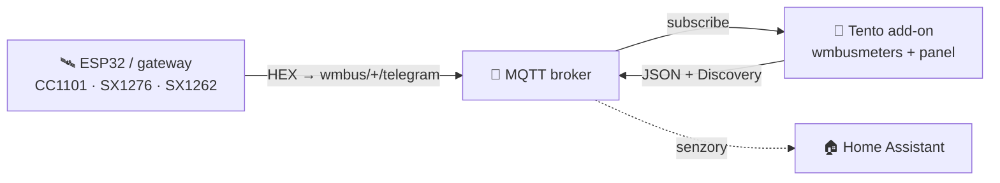
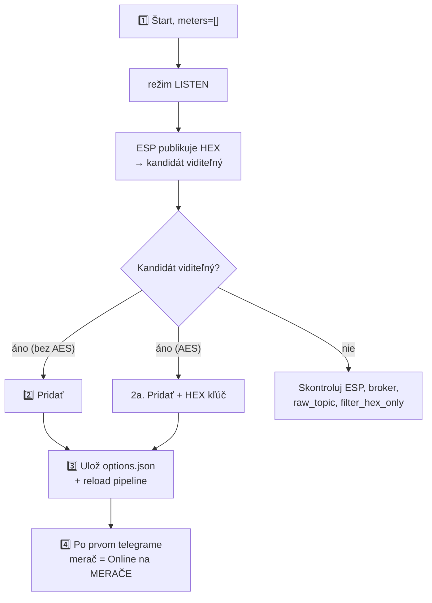

> 🌐 [EN](README.en.md) | [PL](README.pl.md) | [DE](README.de.md) | [CS](README.cs.md) | [**SK**](README.sk.md)

# wMBus MQTT Bridge — používateľská príručka (SK)

> Príručka pre používateľa: inštalácia, pridávanie meračov, čítanie panelu,
> riešenie problémov. **Ako to funguje vnútri** (architektúra, runtime súbory,
> soft-reload, kontrakt ESP diagnostiky) je v [`ARCHITECTURE.md`](ARCHITECTURE.md).

---

## Obsah

1. [Čo to robí](#1-čo-to-robí)
2. [Požiadavky](#2-požiadavky)
3. [Rýchly štart — Home Assistant](#3-rýchly-štart--home-assistant)
4. [Rýchly štart — Docker standalone](#4-rýchly-štart--docker-standalone)
5. [WebUI — čo vidíš](#5-webui--čo-vidíš)
6. [Typický postup: od prázdna k funkčnému meraču](#6-typický-postup-od-prázdna-k-funkčnému-meraču)
7. [Režim SEARCH — keď je počuť priveľa cudzích meračov](#7-režim-search--keď-je-počuť-priveľa-cudzích-meračov)
8. [Možnosti konfigurácie](#8-možnosti-konfigurácie)
9. [Jazyk rozhrania](#9-jazyk-rozhrania)
10. [Riešenie problémov](#10-riešenie-problémov)
11. [Ako to funguje pod kapotou](#11-ako-to-funguje-pod-kapotou)
12. [Licencia a upstream](#12-licencia-a-upstream)

---

## 1. Čo to robí

> **Jednou vetou:** dekóduje telegramy Wireless M-Bus (vodomery, merače tepla,
> elektromery) **bez lokálneho USB donglu** — surové HEX rámce dodáva ľubovoľný
> externý prijímač (ESP32, gateway) cez MQTT.

- **Ty** umiestniš rádiový prijímač tam, kde je signál (napr. ESP32 s anténou).
- **Prijímač** publikuje surové HEX rámce na MQTT (`wmbus/<device>/telegram`).
- **Tento add-on** sa pripojí k brokeru, kŕmi `wmbusmeters`, dekóduje telegramy a
  publikuje výsledok späť na MQTT + **Home Assistant Discovery**.

Výsledok: **tvoje merače sa objavia ako senzory v HA, bez akéhokoľvek rádiového hardvéru na strane HA.**



> 🤝 Typicky sa používa s firmvérom **[esphome-wmbus-bridge-rawonly](https://github.com/Kustonium/esphome-wmbus-bridge-rawonly)**
> (ESP32 + CC1101/SX1276/SX1262, publikuje RAW HEX). Oba projekty sú nezávislé —
> add-on prijíma hex z ľubovoľného zdroja publikujúceho na `raw_topic`.

---

## 2. Požiadavky

- **MQTT broker** (Mosquitto, EMQX…) dosiahnuteľný z HA / z hostiteľa.
- **Prijímač** publikujúci HEX rámce na `wmbus/<device>/telegram`.
- Home Assistant (režim add-onu) **alebo** Docker + compose (standalone).

> ⚠️ Neprevádzkuj paralelne oficiálny add-on `wmbusmeters` — tento projekt má vlastnú
> inštanciu a navzájom by sa zdvojovali.

---

## 3. Rýchly štart — Home Assistant

1. **Pridaj repozitár:** Settings → Add-ons → Add-on Store → ⋮ → Repositories:
   ```
   https://github.com/Kustonium/homeassistant-wmbus-mqtt-bridge
   ```
2. **Nainštaluj** „wMBus MQTT Bridge", klikni **Start** (s predvoleným `meters: []`
   add-on prejde do **režimu LISTEN** a iba počúva).
3. **Otvor WebUI** (Info → OPEN WEB UI).
4. Choď na **PRÍJEM / HĽADANIE**, nájdi svoj merač medzi detegovanými kandidátmi a
   klikni **Pridať** (modal: ID, ovládač, názov, voliteľný AES kľúč). Po uložení sa
   pipeline sama prenačíta (bez reštartu kontajnera).

Celý postup v [§6](#6-typický-postup-od-prázdna-k-funkčnému-meraču).

---

## 4. Rýchly štart — Docker standalone

Pre všetko mimo HA (DietPi, Ubuntu, Raspberry Pi OS, NAS…).

```bash
git clone https://github.com/Kustonium/homeassistant-wmbus-mqtt-bridge.git
mkdir -p /home/wmbus
cp -a homeassistant-wmbus-mqtt-bridge/docker/examples/* /home/wmbus/
cd /home/wmbus
docker compose up -d --build
docker compose logs -f wmbus
```

Konfigurácia v `./config/options.json` (referencia polí v [§8](#8-možnosti-konfigurácie)):

```json
{
  "raw_topic": "wmbus/+/telegram",
  "discovery_enabled": true,
  "state_prefix": "wmbusmeters",
  "mqtt_mode": "external",
  "external_mqtt_host": "192.168.1.10",
  "external_mqtt_port": 1883,
  "external_mqtt_username": "user",
  "external_mqtt_password": "pass",
  "meters": []
}
```

Po úprave: `docker compose restart wmbus`. WebUI: vystav port `8099` v
`docker-compose.yml` a otvor `http://<host-ip>:8099/`.

> 💡 V Dockeri globálne tlačidlo reštartu nič neurobí (žiadny Supervisor) — použi
> `docker restart <container>`.

---

## 5. WebUI — čo vidíš

Dostupné v **5 jazykoch** (EN/PL/DE/CS/SK) — prepínač vpravo hore.

| Záložka | Na čo |
|---|---|
| **PANEL** | Dashboard: pipeline ESP→MQTT→wmbusmeters→HA (klikateľné dlaždice) + štatistiky. |
| **MERAČE** | Tvoje nakonfigurované merače: hodnota, posledný telegram, **PRÍJEM**. |
| **PRÍJEM / HĽADANIE** | Detegovaní kandidáti + nakonfigurované „v éteri"; tu pridáš/odoberieš merače. |
| **LOGY / ESP LOGY** | Runtime udalosti a diagnostika ESP prijímačov. |
| **NASTAVENIA / O PROJEKTE** | Aktívna konfigurácia, info. |

### Stĺpec PRÍJEM (čo znamenajú odznaky)

Nájdi kurzorom na **ⓘ** pri hlavičke PRÍJEM — máš legendu. Stručne:

- **stav + stĺpce** — či merač dochádza: *online* / *oneskorený* / **ticho**. Prah je
  **adaptívny** podľa rytmu daného merača (jeho priemerného intervalu). Dlhšie ticho je
  **neutrálne** (sivé), nie červený alarm — merač môže byť v noci / pri neprítomnosti /
  pri slabej batérii tichý, takže nehlásime planý poplach.
- **📡 ESP** — merač je označený (highlight) na niektorom z ESP.
- **📶 názov N% · počet** — % príjmu a počet telegramov **na danom ESP** (z voliteľnej
  diagnostiky). Pri viacerých ESP vidíš, ktorý prijímač merač počuje a ako dobre. Farba:
  zelená ≥90 · jantárová ≥50 · červená <50.

> Surové % a počet **nie sú** mierou citlivosti dosky (kumulatívny počet od bootu,
> rôzne uptime). Skutočná citlivosť je **pokrytie** — ktoré merače doska vôbec počuje.

### Pridávanie / odoberanie meračov (PRÍJEM)

- Kandidáti bez AES sa dekódujú automaticky — stĺpec **Hodnota** ukazuje živý náhľad
  bez konfigurácie.
- **Pridať** uloží merač a prenačíta pipeline.
- **Odstrániť vybrané** — zaškrtni checkboxy a odober viac naraz (tlačidlo nad tabuľkou).

---

## 6. Typický postup: od prázdna k funkčnému meraču



1. **Štart** s `meters: []` → režim LISTEN, log ukáže `No meters configured -> LISTEN MODE`.
2. **Pridaj** kandidáta (bez AES — hneď; AES — zadaj 32-znakový HEX kľúč).
3. Uloženie ide do `options.json` a DECODE pipeline sa prenačíta **bez plného reštartu
   kontajnera**.
4. Po **ďalšom telegrame** tohto merača (od desiatok sekúnd po pár minút, podľa merača)
   sa objaví ako **Online** na MERAČE a HA Discovery vytvorí entity ako `sensor.<id>_total_m3`.

Kým príde prvý telegram, dashboard ukazuje panel **„čaká na prvý telegram"**. Plný
reštart add-onu je len núdzová záloha.

---

## 7. Režim SEARCH — keď je počuť priveľa cudzích meračov

V bytovom dome prijímač zachytí desiatky cudzích meračov. SEARCH nájde ten tvoj
**porovnaním stavu m³ z tvojho fyzického displeja** s dekódmi všetkých kandidátov.

1. Otvor `#search`, zadaj **aktuálny stav** z displeja (napr. `23.93`) a **toleranciu**
   (predvolene `0.05` = 50 l; v dome nezvyšuj).
2. Zapni SEARCH. Add-on dekóduje kandidátov všetkými ovládačmi a hľadá zhodu
   `total_m3 ≈ stav ± tolerancia`.
3. Pri zhode log ukáže `SEARCH MATCH: id=… driver=…` — pridaj ten merač z PRÍJEM.
4. **Vypni `search_mode`** po dokončení (dočasné SEARCH merače nevytvárajú HA entity).

---

## 8. Možnosti konfigurácie

Z [`config.yaml`](../config.yaml).

### MQTT — vstup / výstup

| Pole | Typ | Predvolené | Popis |
|---|---|---|---|
| `raw_topic` | str | `wmbus/+/telegram` | Topic so surovými HEX rámcami. `+` = wildcard (názov ESP v diagnostike) |
| `filter_hex_only` | bool | `true` | Ignoruj správy, ktoré nevyzerajú ako HEX |
| `mqtt_mode` | enum | `auto` | `auto` / `ha` (vynútiť HA) / `external` (vždy externý) |
| `external_mqtt_host/port/username/password` | str/int | — | Externý broker (pri `external`) |

### Discovery a výstup

| Pole | Typ | Predvolené | Popis |
|---|---|---|---|
| `discovery_enabled` | bool | `true` | Publikuj HA Discovery |
| `discovery_prefix` | str | `homeassistant` | Prefix Discovery |
| `discovery_retain` | bool | `true` | Discovery ako retained |
| `state_prefix` | str | `wmbusmeters` | Prefix topicu s hodnotami |
| `state_retain` | bool | `false` | Retained stav |
| `verify_ha_entities` | bool | `false` | (Opt-in) opýtaj sa HA Core API, či entity skutočne vznikli. Zapnutie udelí read-only prístup k HA Core API. |

### Režim SEARCH

| Pole | Typ | Predvolené | Popis |
|---|---|---|---|
| `search_mode` | bool | `false` | Zapína SEARCH ([§7](#7-režim-search--keď-je-počuť-priveľa-cudzích-meračov)) |
| `search_expected_value_m3` | float | `0` | Očakávaný stav m³ |
| `search_tolerance_m3` | float | `0.05` | Tolerancia porovnania — v dome nezvyšuj |
| `search_delta_mode` / `search_min_delta_m3` | bool/float | `false` / `0.001` | (Experimentálne) porovnanie delty |
| `search_topic` | str | `wmbus/search/candidates` | Topic výsledkov SEARCH |

### Debug

| Pole | Typ | Predvolené | Popis |
|---|---|---|---|
| `loglevel` | enum | `normal` | `normal` / `verbose` / `debug` |
| `debug_every_n` | int | `0` | Extra diagnostika každý N-tý telegram |

### Merače — `meters[]`

| Pole | Typ | Povinné | Popis |
|---|---|---|---|
| `id` | str | áno | Tvoj štítok (názov senzora HA) |
| `meter_id` | str | áno | Sériové číslo merača (HEX, z LISTEN) |
| `type` | str | áno | **Názov ovládača wmbusmeters** (napr. `hydrodigit`, `amiplus`, `izarv2`) **alebo `auto`/`other`**. Voľný reťazec — wmbusmeters overí ovládač pri dekódovaní (zámerne nie enum, aby nové ovládače neboli odmietané). |
| `type_other` | str? | pri `type=other` | Vlastný názov ovládača |
| `key` | str? | pri šifrovaní | 32-znakový AES kľúč (HEX) |

Bežné ovládače: voda — `multical21`, `iperl`, `hydrodigit`, `hydrus`, `mkradio3`,
`izarv2`; teplo — `kamheat`, `hydrocalm3`, `vario451`; elektrina — `amiplus`.

---

## 9. Jazyk rozhrania

5 jazykov (en/pl/de/cs/sk). Výber: `?lang=sk` v URL → cookie `wmbus_lang` →
hlavička `Accept-Language` → predvolene `en`. Prepínač vpravo hore.

---

## 10. Riešenie problémov

### „Nevidím žiadne telegramy" (RAW count = 0)
1. Publikuje prijímač na `wmbus/<čokoľvek>/telegram`? Test: `mosquitto_sub -h <broker> -t 'wmbus/#' -v`.
2. Je bridge pripojený a subscribed? Log: `mqtt: connected` + `subscribed to wmbus/+/telegram`.
3. Nezahadzuje to `filter_hex_only`? Nastav `loglevel: verbose` a hľadaj `dropped (not HEX)` — ak ESP posiela base64/JSON, zmeň formát.
4. Je broker dosiahnuteľný? Skontroluj chyby pripojenia (`mqtt_mode`).

### „Pridal som merač, ale neobjavuje sa v MERAČE"
Objaví sa až **po ďalšom telegrame** pre toto ID (desiatky sekúnd až pár minút).
Ak nie — skontroluj `meter_id`, ovládač, AES kľúč a logy.

### „Merač po aktualizácii add-onu zmizne" (napr. Diehl/Izar `izarv2`)
Opravené v **1.5.33**. Predtým zoznam povolených ovládačov neobsahoval novšie (napr.
`izarv2`), takže Supervisor odmietol uloženie a merač sa pri reštarte stratil.
**Aktualizuj add-on na ≥1.5.33**, merač odober a pridaj znova — zostane.

### „Stav ukazuje «ticho», nie červené «offline»"
Tak je to zámerne (honest-witness): merač je pasívny, dlhšie ticho je teda
nejednoznačné (noc/neprítomnosť/batéria) — ukazujeme neutrálny stav, nie planý poplach.
Prah vychádza z **rytmu** každého merača, nie z pevných 15/60 min.

### „Hodnota len rastie, nie je okamžitá"
Hlavná zobrazená hodnota je **stav merača** (`total_m3`,
`total_energy_consumption_kwh`). Vodomery, ktoré dávajú len `total_m3` (napr.
`hydrodigit`, `itron`, `apator162`), nemajú pole okamžitého prietoku — aktuálnu/periodickú
spotrebu spočítaj v HA pomocníkom **Utility Meter** (denný/mesačný, prežije reštarty)
alebo **Derivative** (m³/h). `total_m3` je publikované ako `device_class: water` +
`state_class: total_increasing`, takže ide aj do štatistík vody/Energie HA.

### „HA neukazuje aktualizáciu add-onu"
HA deteguje novú verziu len keď sa zmení `version:` v `config.yaml`. Vynútenie:
Settings → System → ⋮ → Reload alebo `ha supervisor restart`.

### „Mám šifrovaný merač — kde vziať AES kľúč?"
Od dodávateľa meračov (správca budovy / dodávateľ vody/tepla), z nálepky alebo
dokumentácie merača. Bez kľúča šifrované telegramy nedekóduješ.

### „Pridať merač nič neurobilo" (Docker)
Adresár `./config/` musí byť **zapisovateľný** (nie `:ro`). Po pridaní by mal log
potvrdiť zápis do `options.json`. V núdzi `docker restart <container>`.

---

## 11. Ako to funguje pod kapotou

Architektúra, model procesov, runtime súbory v `/data`, soft-reload, kontrakt ESP
diagnostiky, model dashboardu a tok vydaní dev→stable — všetko v
**[`ARCHITECTURE.md`](ARCHITECTURE.md)** (referencia pre maintainerov/prispievateľov).

---

## 12. Licencia a upstream

**GNU GPL-3.0.** Tento projekt obsahuje a upravuje kód z `wmbusmeters-ha-addon`
(GPL-3.0); celok — vrátane `webui.py`, `i18n.py`, prepísaného `bridge.sh` — je
distribuovaný pod GPL-3.0.

- **wmbusmeters** — https://github.com/wmbusmeters/wmbusmeters (Fredrik Öhrström, GPL-3.0)
- **wmbusmeters-ha-addon** — https://github.com/wmbusmeters/wmbusmeters-ha-addon (GPL-3.0)

Fork vyvíjaný **Kustonium**: MQTT vstup namiesto lokálneho donglu, WebUI v 5 jazykoch,
workflow LISTEN → ADD → SEARCH z UI.

---

Otázky / chyby → [GitHub Issues](https://github.com/Kustonium/homeassistant-wmbus-mqtt-bridge/issues).
